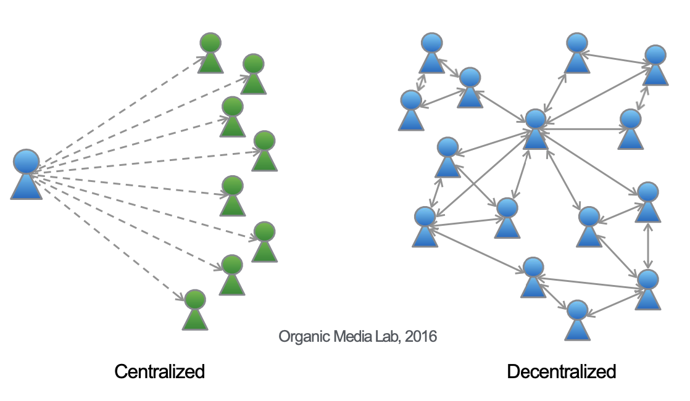
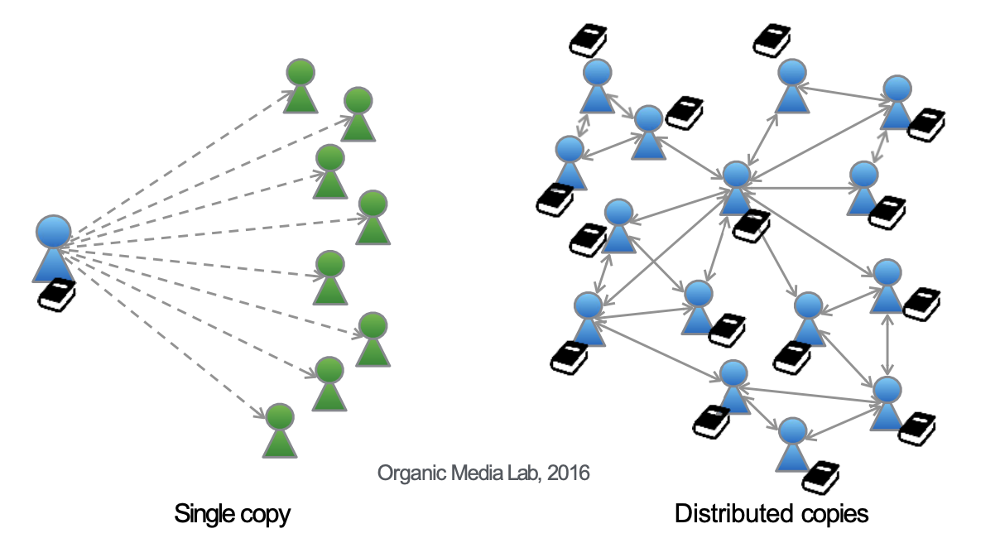
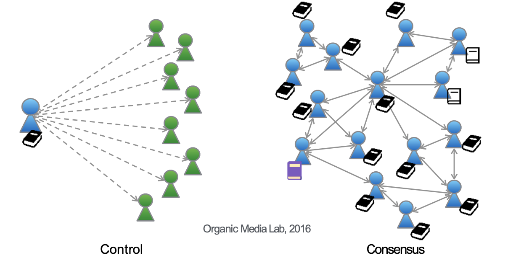
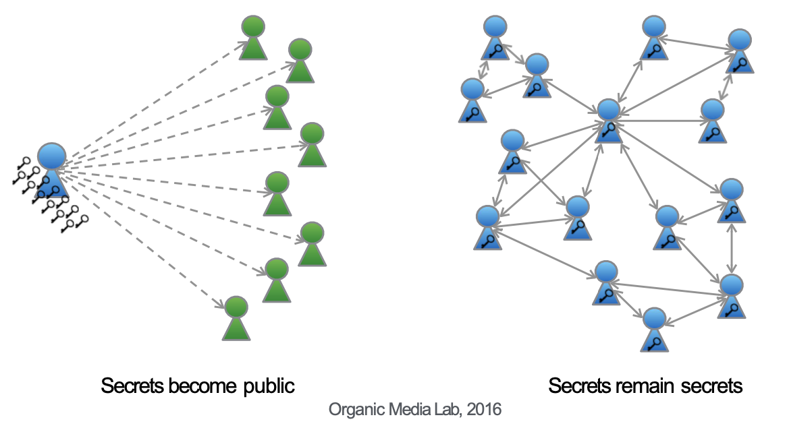
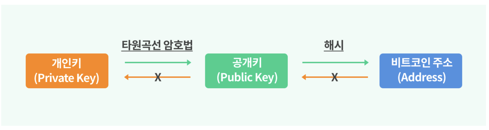

# Blockchain 의 개요 (1)

다오(DAO) 란 **탈중앙화** 된 자율 조직(Decentralized Autonomous Organization)이라는 뜻으로, 2016년 5월 일부 이더리움 사용자들이 벤처 캐피털 펀드 개념으로 제안한 프로젝트입니다. 이론적으로는 중앙기관이 없기 때문에 관리 비용이 절감되며 투자자들에게 관리 권한과 접근 권한이 제공됩니다.     

비트코인은 DAO, 즉 탈중앙화된 자율 조직의 방법을 따르는 **데이터 분산 처리 기술** 을 의미합니다.

## 블록체인이란? 🤔

블록체인을 이해하기 위해 블록체인의 핵심 기술 네 가지를 살펴보겠습니다.

### 1. No center (P2P: Peer to Peer)

 

블록체인의 가장 핵심은 **탈중앙화** 입니다.    

한 사람이 관리하는 중앙화 (Centralized) 시스템과 다르게 탈중앙화 (Decentralized) 시스템에서는 모든 사람과 사람을 직접 연결합니다. 블록체인은 CS (Clinet-Server) 구조를 채택하지 않습니다. 이미 Server 라는 말이 '중앙'화 의 의미를 내포하기 때문입니다. 

CS 는 중앙에서 이익을 가져가고 손해를 보는 시스템이지만 P2P 는 사용자들이 알아서 서버를 자청하며 생태계를 구축하기 때문에 돈이 들어가지 않습니다. 0원이 될 수도 있는 비트코인을 보상으로 줄테니 P2P를 유지하라는 것이 비트코인의 블록체인 개념이며, 사람들은 비트코인을 얻기 위해 자신의 PC를 기꺼이 P2P에 참여시킵니다.

P2P는 막강한 **보안** 능력을 가집니다. 모든 컴퓨터가 서버-클라이언트 역할을 하며 상대방의 컴퓨터를 감시하기 때문입니다. 누군가의 컴퓨터가 잘못된 연산을 하거나 장애가 발생하더라도 대다수의 컴퓨터가 올바른 판단을 내려 서비스에 지장이 가지 않게 합니다.

그러나 매우 강력한 단점이 존재합니다. CS의 서버 역할을 해 줄 사람이 없다면 서비스를 이용할 수 없습니다. 본인이 이용한 만큼 본인도 그 댓가를 지불하게 되는 원리이기 때문에 댓가를 지불하기 싫은 사람이 많을 수록 점점 서비스의 퀄리티가 떨어질 수 있습니다. 또한 회선이 느린 노드가 존재하면 전체 네트워크의 속도를 저하시킬 수 있습니다. 

 

### 2. Everybody has copies

 

블록체인에서 '블록'은 개인과 개인의 거래(P2P) 의 데이터가 기록되는 **장부** 입니다. 이런 블록들은 형성된 후 시간의 흐름에 따라 순차적으로 연결된 '체인'의 구조를 가집니다. 모든 사용자가 거래 내역을 보유하고 있어 거래 내역을 확인할 때는 모든 사용자가 보유한 장부를 대조하고 확인해야 합니다. 이 때문에 블록체인은 **공공 거래장부** 또는 **분산 거래장부** 라고 불립니다.

 

### 3. Everybody decidess (Concensus mechanism)

 

블록체인의 데이터는 중앙화된 서버 대신 전 세계에 흩어져 있는 수 많은 노드에 보관됩니다. 따라서 각각의 노드들은 블록에 기록하는 데이터가 위조/변조되지 않은 원본이라는 것을 상호간에 **합의** 하는 과정이 필요합니다. 네트워크 장애가 발생하더라도 다수의 노드들이 상호 검증을 거쳐 올바른 블록 생성을 이끌어내는 프로세스와 알고리즘을 Consensus(합의) 라고 합니다. 

어떤 Consensus 알고리즘을 사용하는지는 블록체인의 기술력과 경쟁력으로 여겨집니다. 가장 기본적으로는 PoW(Proof-of-Work: 작업 증명 방식), PoS(Proof-of-Stake: 지분 증명 방식), DPoS(Delegated Proof-of-Stake: 위임된 지분 증명 방식) 이 있습니다. 

 

### 4. Secrets never shared (Public key encryption)

 

중앙 관리자가 없는 블록체인은 데이터를 안전하게 전달하고, 거래 당사자를 인증하는데 **공개키 암호화 방식** 을 사용합니다. 그래서 블록체인 기반의 가상 화폐를 **암호 화폐** (Crypto Currency) 라고 부르고, 이 기술은 웹 보안 프로토콜과 공인인증서에서 많이 사용됩니다. 

### 공개키 암호화 방식이란❓

블록체인 내에서는 디지털키, 비트코인 주소, 디지털 서명을 통해 비트코인의 소유권이 성립됩니다. 모든 비트코인 거래에는 블록 상의 장부에 기록되기 위해 유효한 서명(signiture) 이 필요합니다. 이러한 서명은 디지털 키가 있어야 생성되는데, 그 키는 개인키(Private Key) 와 공개키(Public Key) 로 구성됩니다. 

 

1. 개인키

개인키를 통해 공개키를 생성하고 공개키를 통해 비트코인 주소를 생성합니다. (공개키에서 개인키를 알아내거나 비트코인 주소에서 공개키를 알아내는 것은 불가능합니다.)

> 비트코인 주소란 공개키로부터 생성된 계좌번호라고 할 수 있다.

개인키로부터 공개키와 비트코인 주소 모두 생성이가능하기에 개인키가 가장 중요한 핵심입니다. 

2. 공개키

누구에게나 공개된 키라 노출이 되어도 상관이 없는 데이터입니다. 이 공개키는 비트코인을 전송받을 때 사용되며 비트코인 거래 내역의 유효성 (거래가 참인지 거짓인지) 판별을 가능하게 합니다. 

3. 비트코인 주소

돈의 수취와 관련된 정보를 요약해 보여 줌으로써 비트코인 거래 시 송금처를 마음대로 지정할 수 있게 합니다. 비트코인 주소의 데이터를 가지고 비트코인 어디에든 보낼 수 있게 하므로 어떤 누구와도 공유가 가능합니다. 
