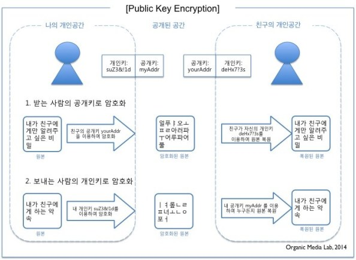
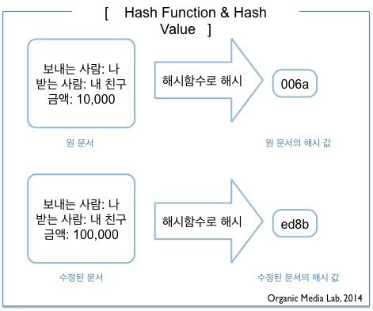
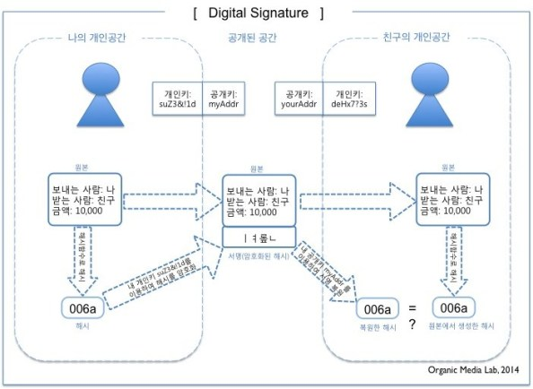
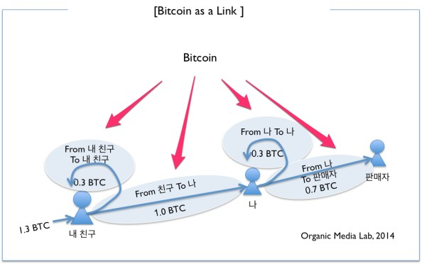
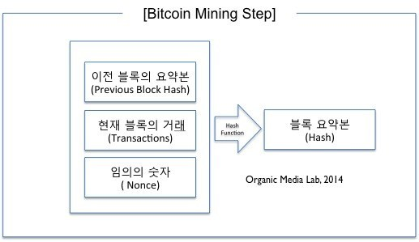

# Blockchain 의 개요 (2)

> https://youtu.be/bBC-nXj3Ng4 정말 이해하기 쉽게 설명해준 유튜브 자료.. 매우 추천.

비트코인은 **디지털 서명 (digital signature)** 에 기반한 화폐입니다. 따라서 비트코인의 개념과 거래를 제대로 이해하려면 디지털 서명에 대한 이해가 필수입니다. 디지털 서명은 **공개키 암호화** 와 **해시**를 사용합니다. 

## Public Key Encryption (공개키 암호화 방식)

공개키 암호화는 공개키(public key) 와 개인키(private key) 로 이루어져 있습니다. 공개키로 잠근 문서는 개인키로만 열 수 있고, 개인 키로 잠근 문서는 공개키로만 열 수 있습니다. 

1번은 받는 사람의 공개키로 암호화 하는 방식입니다. 이 문서는 받는 사람의 개인키로만 열 수 있으므로 문서가 다른 사람 손에 넘어간다고 하더라도 열어볼 수 없습니다. 단일키 암호화 방식과는 다르게 개인키는 아무와도 공유되지 않으므로 기존의 방식에 비에 훨씬 안전합니다.

2번은 보내는 사람의 개인키로 문서를 암호화 하여 보내는 방식입니다. 이 암호화된 문서는 누구든지 내용을 열어볼 수 있으므로 암호화로서는 의미가 없습니다. 그러나 열어본 사람은 나(보낸 사람) 이 이 문서를 보냈다는 것을 확신할 수 있다는 장점이 있습니다. 

 

## Hash (해시)

해시는 원본의 고정된 길이의 요약본(fixed length value) 입니다. 비트코인에서 해시는 채굴시 작업의 증거(proof of works) 를 제시하거나 블록체인이 변경되었는지 쉽게 확인하는 용도로 주로 사용됩니다.

해시는 해시함수(hash function) 을 이용하여 만듭니다. 일반적으로 원본으로 해시를 만드는 것은 쉽지만 반대로 해시로부터 원본을 만들어 내는 것은 불가능합니다. (역함수가 존재하지 않습니다.) 따라서 특정한 해시값을 만들어내는 원본을 찾기 위해서는 모든 경우의 수를 확인하는 방법 밖에 없습니다.

> 이 경우의 수는 어마어마하게 크므로(2의 256승) 사실상 불가능합니다.

위 그림과 같이 원본이 조금만 변형되어도 해시값은 완전히 다르게 나옵니다. 따라서 두 문서의 원본을 대조하지 않고 해시만 대조하더라도 그 문서가 같은지 여부를 확인할 수 있습니다. 

 

## Digital Signature (디지털 서명)

디지털 서명은 메세지 보낸 사람을 수학적으로 확인하는 방법입니다. 

메세지를 보낼 때 보낸 사람의 개인키로 메세지를 암호화하고 이를 메세지에 덧붙여 보내면, 받은 사람은 덧붙여진 암호화된 메세지를 보낸 사람의 공개키로 열어서 이를 메세지와 대조합니다. 두 메세지가 같다면 보낸 사람을 확신할 수 있습니다.

그러나 보내는 문서가 매우 크면 전체 문서를 개인키로 서명할 때 매우 비효율적입니다. 따라서 위 그림과 같이 전체 문서의 해시를 만들어 이를 개인키로 잠그고, 잠근 해시(서명 부분) 를 원본 문서에 덧붙여 보내면 효율적으로 서명이 가능합니다. 받은 사람은 자신이 직접 계산한 원본 문서의 해시값과 서명 부분을 보낸 사람의 공개키로 열어서 복원한 해시값이 같은지 확인하면 됩니다. 

 

## Bitcoin Transaction

### Bitcoin as a Link

비트코인은 항상 송신자와 수신자 관계를 내포하며, 비트코인을 보낸다(지불한다)는 것은 신규의 비트코인을 2번 발행 (수신자, 나) 하는 것과 같습니다. 비트코인은 From 과 To 를 내포하는 **링크** 입니다.

위는 내가 1비트코인을 가지고 있는데 판매자에게 0.7 비트코인을 지불하는 경우입니다. 비트코인은 이 거래를 완료하기 위해 두 개의 코인이 새로 만들어지는 구조입니다. 하나는 내가 판매자에게 보내는 0.7 비트코인입니다. 다른 하나는 내가 나에게 보내는 0.3 비트코인입니다. 이 거래가 이뤄지면 내가 가지고 있던 1비트코인은 폐기됩니다.

이 때 0.7비트코인은 수신자와 송신자 관계를 반드시 내포합니다. 그러므로 비트코인에서는 금액이 같다고 해도 같은 코인이 아닙니다. 이에 따라 코인은 **보내는 비트코인 주소와 받는 비트코인 주소를 연결하는 링크** 라고 정의될 수 있습니다. 

 

## Mining (채굴)

비트코인 거래가 일어나면 이 거래는 비트코인 네트워크에 참여하는 노드들에게 알려집니다. 이렇게 알려진 거래를 기록하고 공식화 하는 과정이 비트코인 **채굴(Mining)** 입니다. 이 과정은 블록 단위로 일어납니다. 블록(Block)은 비트코인 거래를 약 10분 단위로 모은 것입니다. 블록체인(Block Chain)은 현재까지의 블록이 모두 이어진 것으로, 모든 비트코인의 거래가 시간순으로 기록된 장부입니다.

새로운 블록은 채굴자들이 처리를 하게 되며 가장 먼저 처리를 끝낸 채굴자가 처리의 증거 (**Proof of Work**) 와 함께 '이것이 원본이다' 라고 이웃 채굴자에게 알리고, 이를 다른 채굴자들이 확인하고 받아들이는 과정을 거칩니다. 이렇게 받아들여진 블록은 기존의 블록체인을 이어갑니다. 

비트코인 채굴은 블록의 요약본(hash) 값이 주어진 숫자보다 작게 만드는 임의의 숫자 X를 찾는 것입니다.

> [이 영상]()(https://youtu.be/bBC-nXj3Ng4) 에서는 위 숫자 X를 '매직 넘버' 라고 표현합니다.

이 때 블록의 요약본은 이전 블록의 요약본에 현재 블록의 모든 거래(실제로는 모든 거래의 요약본)를 덧붙이고, 임의의 숫자 X를 덧붙인 문서를 요약(hashing) 하여 만듭니다. 

조건을 만족하는 X를 찾는 것은 모든 경우의 수를 대입해보는 방법 (brute force) 밖에 없습니다. 이 경우의 수가 10의 77승을 넘습니다. 이 때 주어진 요약본의 값이 작으면 작을 수록 (앞자리의 0의 수가 많을 수록) 조건을 맞는 X를 찾는 것이 기하급수적으로 어려워집니다.

