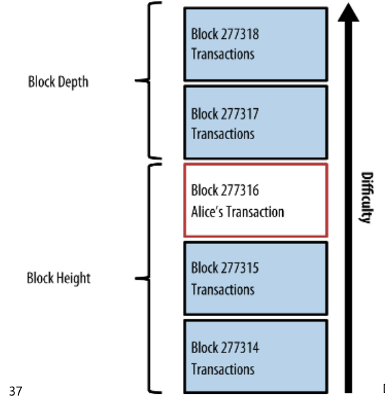
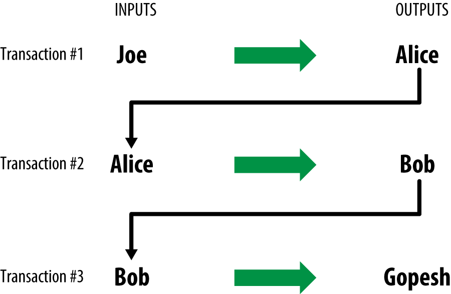

# Ch02. How Bitcoin Works

<p align="center"></p>

>  비트코인 시스템의 전반적인 구성 요소

<br/>

## 커피 한 잔 구매하기

<p align="center"></p>

Alice 는 Joe 로부터 0.1BTC 을 송금받았습니다.  Alice 는 이후 Bob 의 가게에서 커피 한 잔을 구매할 계획입니다.

이는 판매 시점 정보 관리(POS) 시스템에 비트코인 옵션을 추가하면서 가능해졌습니다. POS 시스템은 달러로 나와있는 총 주문 가격을 일반적인 시세에 따라 비트코인으로 전환한 후 두 가지 통화 단위에 대한 가격을 보여줍니다. 또한 이 거래에 대한 지불 요정 (Payment Request) 이 들어있는 QR 코드도 보여줍니다.

<p align="center"></p>

이 지불 요청 QR 코드는 아래 URL 을 encoding 한 것입니다.

```
bitcoin:1GdK9UzpHBzqzX2A9JFP3Di4weBwqgmoQA?
amount=0.015&
label=Bob%27s%20Cafe&
message=Purchase%20at%20Bob%27s%20Cafe

Components of the URL

A bitcoin address: "1GdK9UzpHBzqzX2A9JFP3Di4weBwqgmoQA"
The payment amount: "0.015"
A label for the recipient address: "Bob's Cafe"
A description for the payment: "Purchase at Bob's Cafe"
```

송금할 비트코인의 목적지 주소만 담겨있는 QR코드와 달리 위는 지불 요청 QR 코드로 인코딩 된 URL 로서 목적지 주소, 지불 금액 등 지불과 관련된 기본 내용을 담고 있습니다. 지불 요청을 통해 대금을 지불하는 데 사용되는 정보를 미리 넣어둘 수 있고, 동시에 사용자가 읽을 수 있는 설명도 제공합니다.

여기에서 비트코인 목적지 주소는 bob 의 bitcoin address 로서, bob의 wallet의 private key 로부터 생성되었습니다.

<br/>

## Transaction

Transaction 은 비트코인을 많이 보유한 소유자가 비트코인 일부를 다른 사람에게 전송하는 것을 승인한다고 네트워크에 말하는 것과 같습니다. 비트코인의 새로운 소유주는 또 다른 소유주에게 비트코인이 전송되는 것을 승인하는 다른 거래를 만드는 과정을 반복함으로써 매수한 비트코인을 소비할 수 있습니다. 

<p align="center"></p>

각 거래는 하나 이상의 **입력값(Input)** 과 **출력값(Output)** 으로 구성됩니다. 입력값과 출력값의 합계가 반드시 동일할 필요는 없습니다. 그러나 출력값의 총합은 입력값의 총합보다 약간 작아야 하며, 이 차이 값은 거래속에 포함된 **거래 수수료(implied transaction fee)** 가 됩니다.

> 거래 수수료란 공개 장부에 거래를 포함시킨 채굴자가 수거하는 소액의 지불금입니다.

또한 송금되는 비트코인의 금액 각각에 대한 소유권을 소유주의 디지털 서명을 통해 증명하는 과정이 거래에 포함되며, 누구든지 독립적으로 거래를 검증할 수 있습니다. **소비(Spending)** 란 이전 거래에서 송금되었던 돈이 비트코인 주소에 의해 확인된 새로운 소유주로 전송되는 거래에 서명을 함으로써 이루어지는 작업을 말합니다.


<p align="center"></p>

> 한 거래의 출력값이 새로운 거래의 입력값이 되는 chain 구조

거래를 통해 거래 입력값에서 거래 출력값으로 가치가 이동합니다. 입력값은 비트코인의 가치가 발생하는 지점으로, 주로 이전 거래의 출력값입니다. 거래 출력값은 키를 이용해서 새로운 소유주에게 비트코인의 가치를 넘겨줍니다.

즉 주소의 locking script, unlocking script 를 매칭시키는 것이 거래입니다.

### 거래 목록

1. Alice buying bitcoin from Joe with cash
2. Alice's payment to Bob's cafe uses UTXO from the previous transaction
3. Bob's payment to Gopesh uses UTXO from the precious transaction

<br/>

## Common Transaction

### Common Transaction Forms

<p align="center"></p>

가장 흔하게 볼 수  있는 거래 유형입니다. 하나의 주소에서 다른 주소로 단일 거래가 이루어지는 형태입니다. 이 경우 종종 원 소유주에게 돌려줘야 하는 '잔액' 이 존재하며, 이 때 하나의 입력값과 두개의 출력값이 발생합니다. (위의 거래목록 1에 해당)

<br/>

### Transaction aggregating funds

<p align="center"></p>

또 다른 일반 유형은 여러 개의 입력값을 하나의 출력값으로 합치는 거래입니다. 이 형태는 동전과 단위가 작은 지폐가 많이 있는 경우에 큰 단위의 지폐 한 장으로 교환하는 행위와 동일합니다. 지불 과정에서 잔액으로 받은 작은 단위의 금액을 정리하기 위해 이 유형의 거래가 시행됩니다.

### Distrubuting funds

<p align="center"></p>

하나의 입력값을 여러 명의 수신인에게 줄 수 있는 여러 개의 출력값으로 배분하는 형태입니다. 이 거래 유형은 기업체에서 다수의 직원들에게 급여를 지불하는 등 돈을 분배해야 할 경우에 사용됩니다.

<br/>

## Constructing a Transaction

### Getting the right inputs

앨리스의 지갑에서 밥에게 전송하기를 원하는 금액을 지불할 수 있도록 알맞은 입력값을 찾습니다. 지갑 대부분은 지갑 소유주가 보유한 키로 잠겨있는 **Unspent Transaction Output(UTXO)** 에 대한 DB 를 보유하고 있습니다. 따라서 앨리스의 지갑에는 현금과 비트코인을 교환했던 조 와의 거래에서 생성된 거래 출력값의 복사본이 포함되어 있습니다.


```
$ curl https://blockchain.info/unspent?active=1Cdid9KFAaatwczBwBttQcwXYCpvK8h7FK
```

> 앨리스의 비트코인 주소의 UTXO 를 전부 조사

위는 RESTful API 요청으로, 특정 비트코인 주소가 보유하고 있는 소비되지 않은(unspent) 거래 출력값 전부를 리턴하기 때문에 소비를 위해 필요한 거래 입력값을 생성하도록 필요한 정보를 제공합니다.

```
{

	"unspent_outputs":[

		{
			"tx_hash":"186f9f998a5...2836dd734d2804fe65fa35779",
			"tx_index":104810202,
			"tx_output_n": 0,
			"script":"76a9147f9b1a7fb68d60c536c2fd8aeaa53a8f3cc025a888ac",
			"value": 10000000,
			"value_hex": "00989680",
			"confirmations":0
		}

	]
}
```

> 검색 결과

위 검색 결과를 통해 앨리스는 UTXO 가 한 개 있다는 사실을 알 수 있습니다. 이 검색 결과에는 해당 결과에 대한 참조가 포함되며, UTXO 가 들어있고, 금액 (1000만 사토시 = 0.1비트코인) 이 들어있습니다.

<br/>

### Add the transaction to the ledger

이제 거래를 전송해야 합니다. 비트코인 네트워크는 P2P로 네트워크로, 거래 내역과 블록을 참여자 전원에게 전파합니다.

- bitcoin node : 어떠한 종류의 인터넷이든 연결만 되어 있다면 여러 비트코인 고객들에게 새로운 거래를 전송할 수 있습니다.
- **flooding** :  비트코인 네트워크 노드(다른 고객들)가 이전에는 없던 유효한 거래를 전송받면 즉시 연결되어 있는 다른 노드로 해당 거래를 전달합니다. 이런 과정을 통해 거래는 P2P 네트워크를 통해 급속도로 전파되어 몇 초 만에 비트코인 네트워크 내에 있는 노드 대부분에게 도달합니다.
- Bob's view : 앨리스의 새로운 transaction 이 밥의 wallet 에 도착합니다.

<br/>

## Bitcoin Mining

거래가 비트코인 네트워크 상에 전파는 되었지만 이 거래가 검증되고 채굴(mining) 과정을 거쳐 블록에 포함될 때까지는 공유 장부 (블록체인) 의 일부가 되지 못합니다.

각 거래들은 블록 단위로 묶여 있고, 입증해야 할 계산이 많지만, 입증된 후에는 검증을 위해서 그다지 많은 계산을 하지 않아도 됩니다. Mining 과정은 비트코인 시스템 내에서 두 가지 목적을 가집니다.

1. 유효하지 않거나 잘못된 거래를 거부함으로써 비트코인에 대한 보안을 제공합니다.
2. Mining 과정은 돈을 새로 발행하는 중앙 은행처럼 각 블록 내에서 새 비트코인을 생성합니다. 
   - 한 블록당 생성되는 비트코인의 양은 고정되어있고 시간이 지나면서 줄어듭니다.


### Mining Transactions in Blocks

새로운 trnasaction(거래) 가 들어오면 비트코인 네트워크 노드들은 이 상황을 지켜보다가 temporary pool(임시 풀)로 새로운 거래들을 추가합니다. 이 임시풀에는 미검증 거래들이 들어있습니다. (candidate block) 채굴자들은 새 블록을 만들면서 이 임시풀에서 새 블록으로 미검증 거래들을 추가한 후 새 블록의 유효성을 입증하기 위해 작업 인증을 풉니다.

거래들이 새 블록에 추가될 때 **거래 수수료가 가장 높은 거래 (highest fee)** 부터 우선 순위로 추가되고 몇몇 거래는 다른 기준을 바탕으로 추가됩니다. 각 채굴자는 네트워크로부터 이전 블록을 받게 되면 이전 경쟁에서 채굴에 실패했다는 사실을 알게 되고 바로 새 블록을 채굴하는 과정을 시작합니다.

각 채굴자는 자신의 블록 안에 특별한 거래 하나를 포함하는데, 이는 자신 소유의 비트코인 주소에 새롭게 생성된 비트코인을 보상으로 받는 거래입니다.

<p align="center"></p>

앨리스의 거래가 네트워크에서 선택되어 미검증 거래들로 이루어진 임시풀에 포함되었습니다. 징의 채굴하는 블록에 담겨서 징이 채굴에 성공해 블록 #277316 으로 발행함으로써 블록체인에 등록됩니다.

몇 분 후, 새 블록인 #277317 을 다른 채굴자가 채굴합니다. 이 새 블록은 앨리스의 거래가 들어있는 이전 블록을 기반으로 하기 때문에 앨리스의 거래가 포함된 블록 위에 좀 더 많은 연산이 추가됩니다. 앨리스의 거래가 들어있는 블록은 해당 거래에 대해 한 번의 **Confirmation(승인)** 을 보유하고 있다고 간주됩니다. 새로운 블록이 추가되면 추가 승인을 받습니다. 각 블록이 거래를 담고있는 블록의 상부에 거래를 철회하기가 기하급수적으로 어려워집니다. 따라서 해당 거래는 네트워크 상에서 더욱 더 신뢰도가 올라갑니다.

블록의 Height(높이) 가 높아지면 각 블록과 체인의 계산 난이도가 전반적으로 올라갑니다. 체인의 길이가 길어질수록 수학적 계산의 수가 급격하게 높아집니다. 관례상 6회 이상의 승인이 이루어진 블록은 취소가 불가능합니다. (Six confirmation)

<br/>

### Spending the Transaction

<p align="center"></p>

앨리스의 거래는 블록체인에 끼워져 있기 때문에 비트코인 분산 장부의 구성요소가 됩니다. 밥은 이렇게 생성된 output 을 참조해 입력값을 정한 후 새로운 소유권을 배정받고 나서 본인 소유의 거래를 생성합니다. 이 과정을 거치고 나면 이제 앨리스와의 거래 및 다른 거래로부터 나온 출력값을 소비할 수 있습니다. 