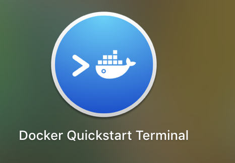
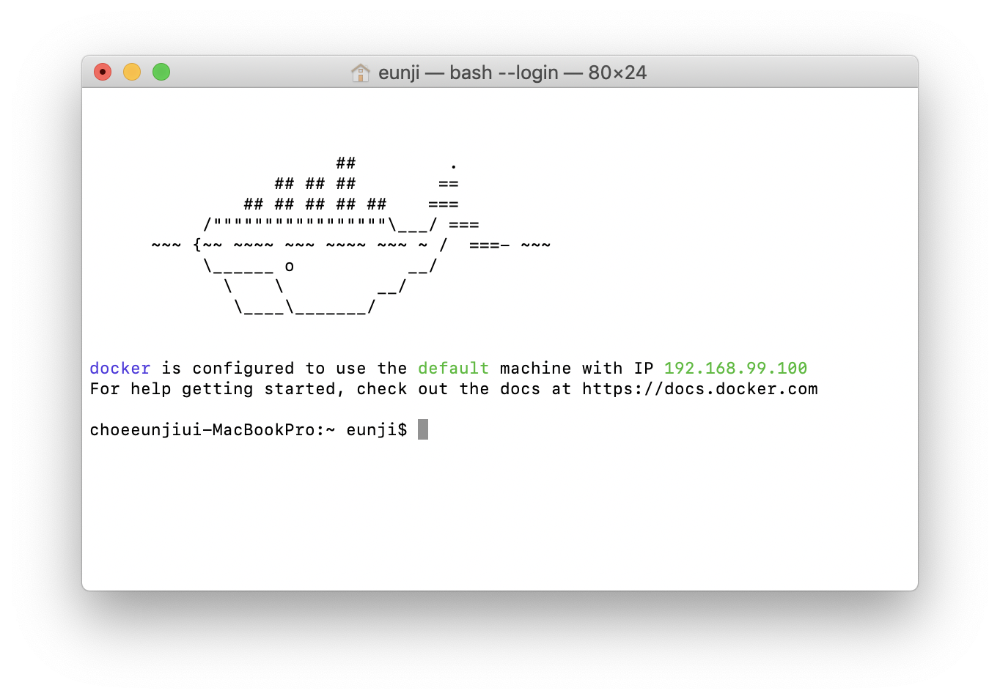
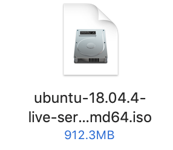
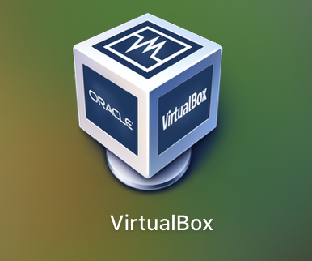
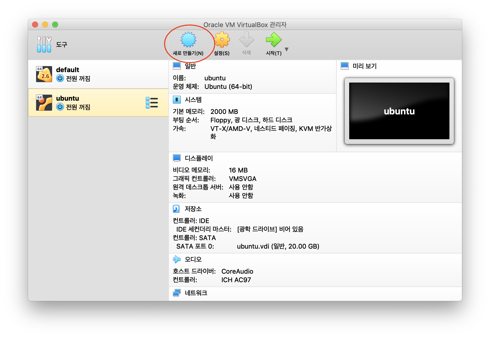
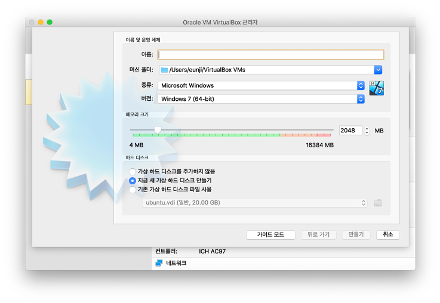
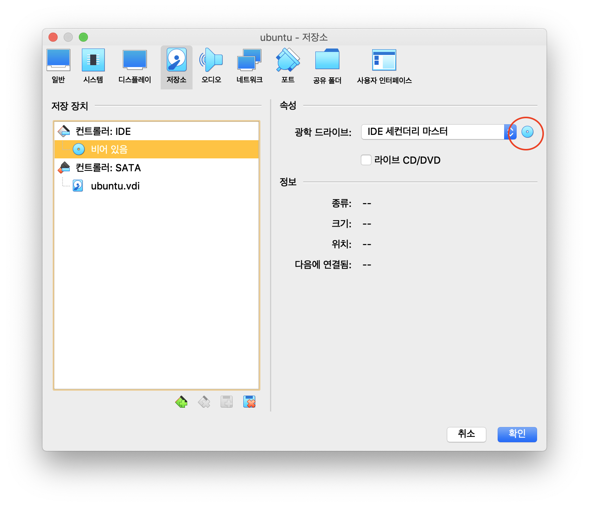
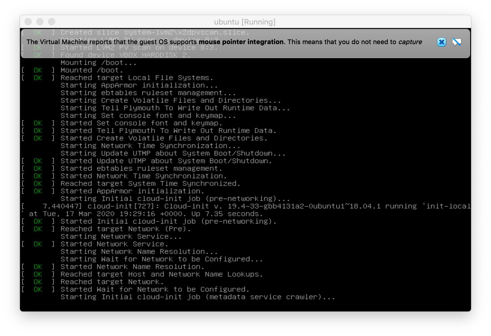

# Install Docker 🐳

### 📌 &nbsp; download DockerToolbox
[공식 문서](https://docs.docker.com/toolbox/toolbox_install_mac/) 를 참고해 docker toolbox 를 설치하였다.   
공식 문서에 나와있는 [사이트](https://github.com/docker/toolbox/releases) 에서 ``` DockerToolbox-19.03.1.pkg ```
파일을 다운로드 한 후, 실행해 보았다. 


 👈 launch pad 에서 이 아이콘을 클릭한다.



terminal 에 위와같은 고래와 메세지가 출력된다면 설치 완료다.
> 처음에 ``` Error getting IP Address : Host is not running ``` 메세지가 자꾸 떠서 삽질을 했는데,     
컴퓨터를 껐다 키니까 곧바로 해결이 되었다. 

<br/>

### 📌 &nbsp; download Ubuntu Server 

[이 사이트](https://ubuntu.com/download/server/thank-you?version=18.04.4&architecture=amd64) 에서 .iso 파일을 다운받아놓는다.   
 용량이 꽤 크다.

<br/>

### 📌 &nbsp; download and setting Virtual Box

[이 사이트](https://www.virtualbox.org) 에서 Virtual Box 를 다운받는다.

 👈 laungh pad 에 이 아이콘을 클릭한다.

    

기본 default 가상 머신 말고, 직접 가상 머신을 만들어보자.   
위 실행화면에서 새로 만들기를 클릭한다.

 

원하는 가상 머신의 이름을 입력하고 종류는 ```Linux```, 버전은 ```Ubuntu 64bit``` 로 설정한다.   
> 추가로 나는 원활한 실습을 위해 RAM 2GB, 하드디스크 20GB 로 지정해 주었다.



실습에 필요한 설정을 해 두자.    
설정 창에서 비어있음 CD 를 클릭한 후, CD 아이콘을 누르고 아까 다운받은 Ubuntu server 파일을 클릭한다. (.iso)

이제 virtual box를 실행시키기 위한 setting 을 완료했다❗️

<br/>

### 📌 &nbsp; install docker

[위 사이트](https://vincetory.com/27) 를 참고해 도커를 설치했다. (반드시 그대로 진행하자)    
사이트에 나와있는 그대로 진행한다. 디스크 삭제 경고를 ``` continue ``` 로 변경 후, ``` Reboot ``` 가 나올 때까지 진행한다.



이제 로그인 한 후 다음 도커 설치 명령어를 입력한다.


```
$ sudo apt update
$ sudo apt install docker.io
$ sudo apt install docker.compose
```

이제 도커 실습 환경 준비가 끝났다 🤩‼️‼️
