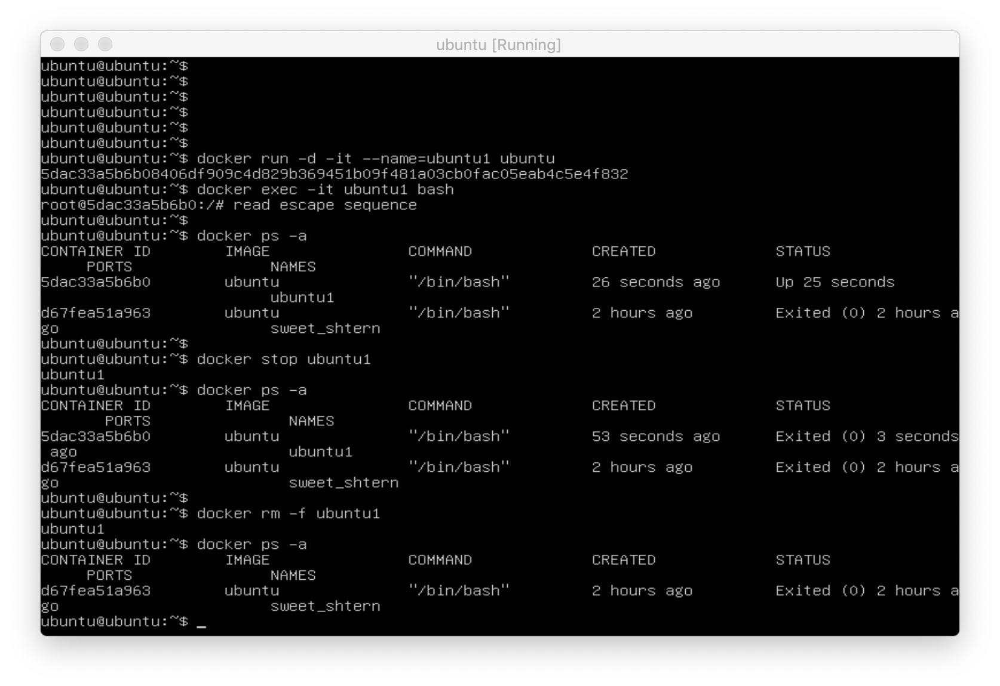
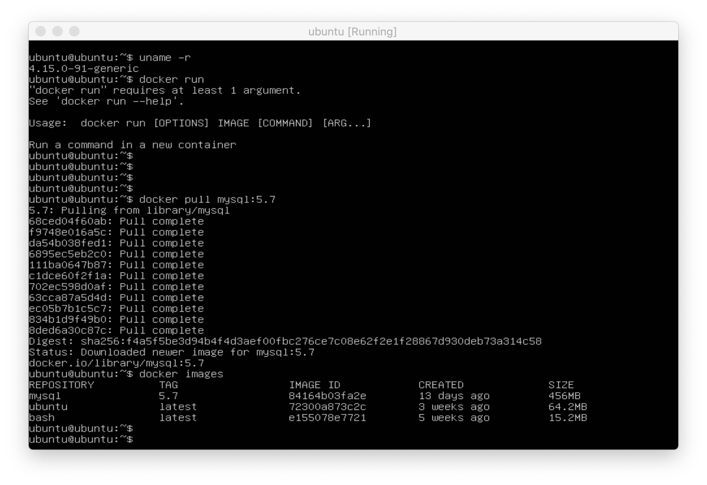
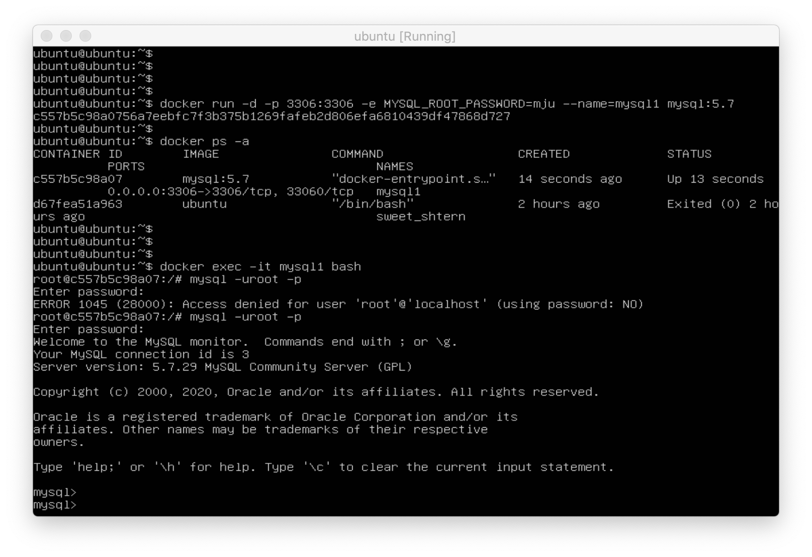
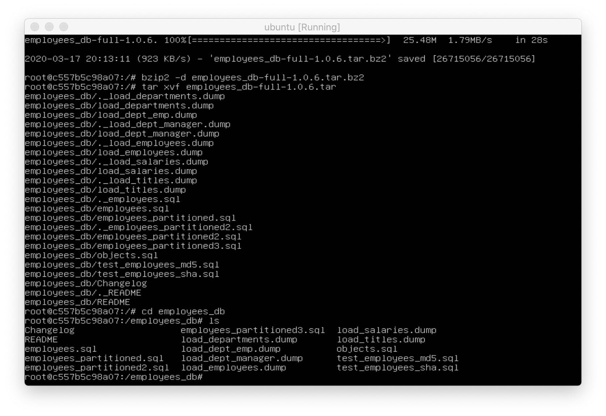
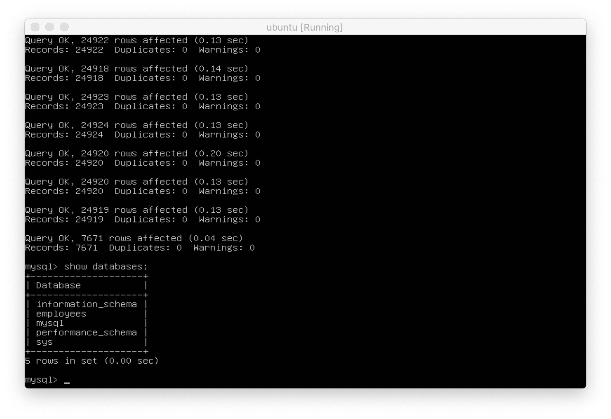
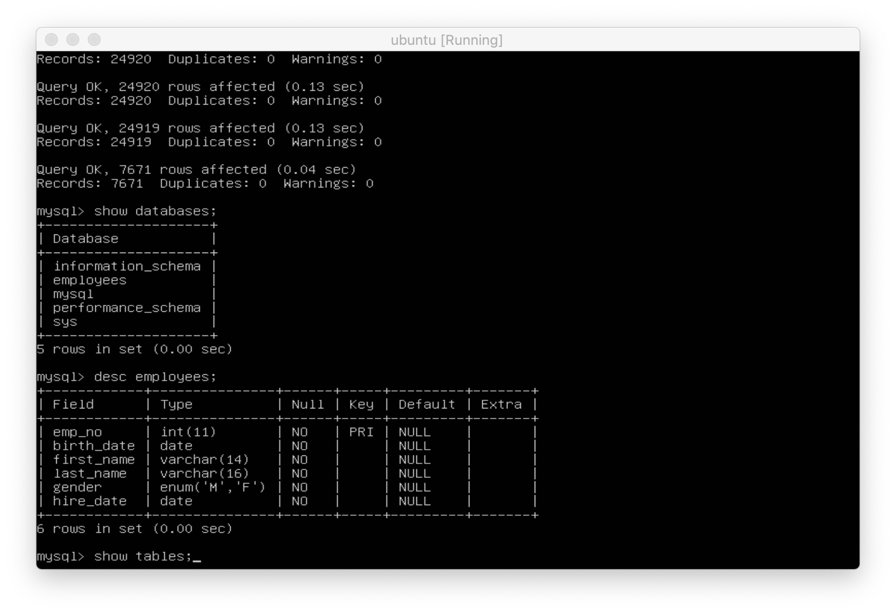
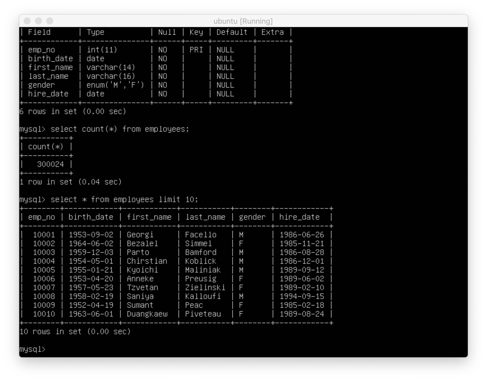

# Run Docker 🐳

[docker 실습 환경 구축](https://github.com/ChoiEunji0114/TIL/blob/master/DatabaseProject/01_install_docker.md)
이 끝났으면 실습을 시작해보자 👏

<br/>

### 📌 &nbsp; 버전 확인


```c++
$ cat /etc/issue 
$ uname -r
```

두 가지 명령어로 커널 버전 및 배포판을 확인할 수 있다. 

<br/>


### 📌 &nbsp; docker container 실습



```c++

$ docker run -d -it –name=ubuntu1 ubuntu // 컨테이너 생성
$ docker ps -a // 도커 컨테이너 리스트 출력. 컨테이너가 잘 생성되었는지 확인한다.
$ docker exec -it ubuntu1 bash // 컨테이너 접속
$ control+p+q // 컨테이너 정지 하지 않고 나옴

```

이 때 혹시 permission denied 가 발생하면 
```
$ sudo chmod 666 /var/run/docker.sock
```
으로 권한을 부여해준다.

<br/>

### 📌 &nbsp; docker 기반 MySQL 설치



```c++
$ docker pull mysql:5.7 // mysql docker image 다운로드
$ docker run -d -p 3306:3306 -e MYSQL_ROOT_PASSWORD=mju –name=mysql1 mysql:5.7 // mysql 컨테이너 생성
$ docker ps -a // 컨테이너가 잘 생성되었는지 확인한다
```



```c++
$ docker exec -it mysql1 bash // 컨테이터 접속

# mysql -uroot -p // mysql 접속

mysql> show databases; // database 리스트 보여줌
mysql> use mysql; // mysql database 사용

```

<br/>

### 📌 nbsp; Launchpad.net/test-db 설치하기



다음 명령어를 차례대로 입력한다.

```c++
$ docer exec -it mysql1 bash
# apt update
# apt install nano
# apt install bzip2
# apt install wget
# wget https://launchpad.net/test-db/employees-db-1/1.0.6/+download/employees_db-full-1.0.6.tar.bz2
# bzip2 -d employees_db-full-1.0.6.tar.bz2
# tar xvf employees_db-full-1.0.6.tar
# cd employees_db
# ls
```

<br/>

이제 제대로 설치가 완료되었는지 확인해보자.



testDB 내의 Employees 가 제대로 설치됨을 확인할 수 있다.

<br/>




간단한 실습을 진행해 보았다.

```
mysql> show databases;
mysql> desc employees;
mysql> select count(*) from employees;
mysql> select * from employees limit 10;
```

에러 없이 모두 잘 실행된다. 
