## SQL Tutorial with docker 🐳

> 참고 : [w3schools.com SQL Tutorial](https://www.w3schools.com/sql/default.asp)   
> 선수 환경 : [install docker](https://github.com/ChoiEunji0114/TIL/blob/master/DatabaseProject/01_install_docker.md), [docker SQL container](https://github.com/ChoiEunji0114/TIL/blob/master/DatabaseProject/02_run_docker.md)

### 📌 Run & Execute SQL Container 

```
$ sudo chmod 666 /var/run/docker.sock

$ docker start [SQL container name]

$ docker exec -it [SQL container name] bash

# mysql -uroot -p

# use [database name]
```

실습할 준비 완료❗️간단하게 SQL 실습을 진행해보자 

---

<br/>

### 📌 SELECT DISTINCT statement

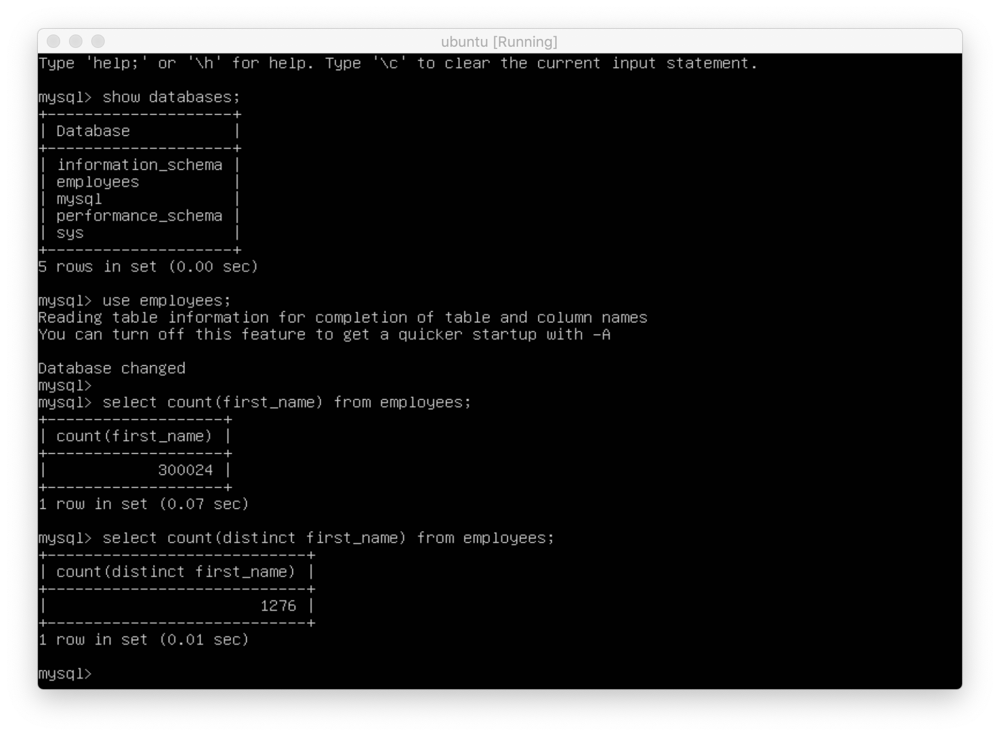

```sql
select count(first_name) from employees; -- 300024

select count(distinct first_name) from employees; -- 1276
```
column 앞에 ```distinct``` 키워드를 붙이면 고유한 값만 select 한다.

### 📌 SELECT WHERE statement

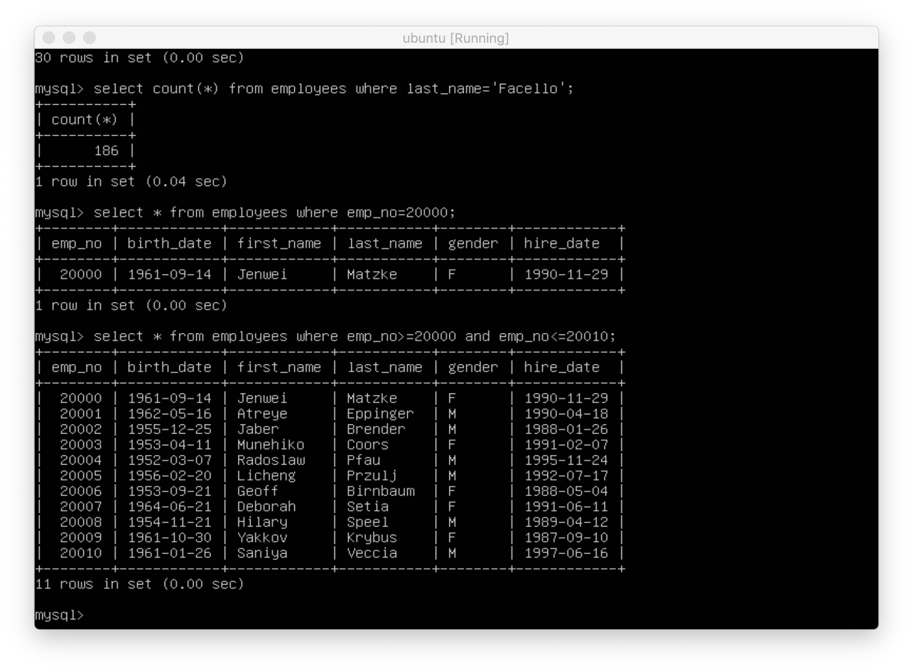

```sql
select count(*) from employees where last_name='Facello'; -- 186

select * from employees where emp_no=20000; -- 1

select * from employees where emep_no>=20000 and emp_no<=20010; --11
```
```where```절 뒤에 작성한 조건문에 해당하는 행들을 select 한다.

### 📌 ORDER BY statement

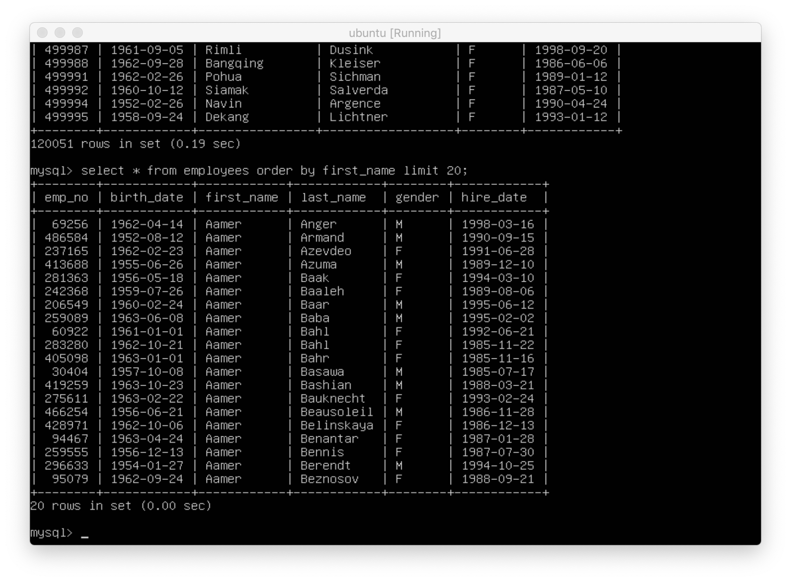

```sql
select * from employees order by first_name; -- 오름차순 정렬

select * from employees order by first_name desc; -- 내림차순 정렬
```
```order by``` 뒤에 적은 column의 오름차순으로 정렬해서 보여준다. 내림차순으로 정렬할 땐 뒤에 ```desc``` 을 붙인다.

### 📌 UPDATE statement

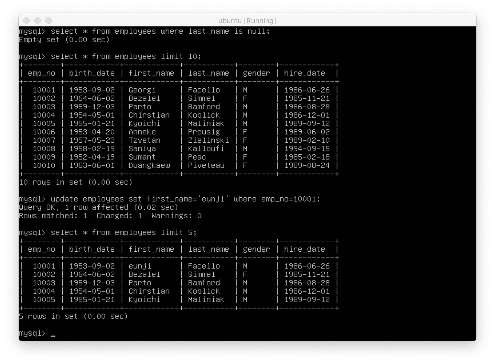

```sql
update employees 
set first_name='eunji' 
where emp_no='10001; -- first_name : Georgi -> eunji 바뀜
```
조건문에 해당하는 column의 값을 update 해준다.

### 📌 Min and Max statement

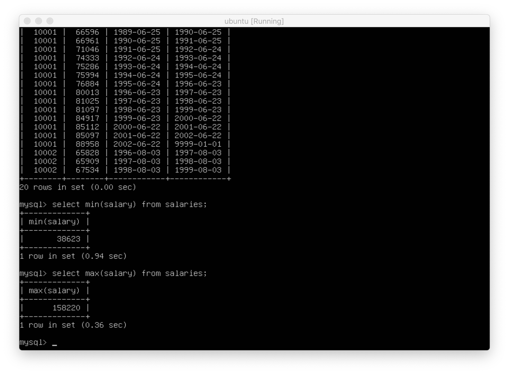

```sql
select min(salary) from salaries; -- 38623
select max(salary) from salaries; -- 158220
```
해당 column 의 min, max 값을 리턴한다.

### 📌 IN Operator

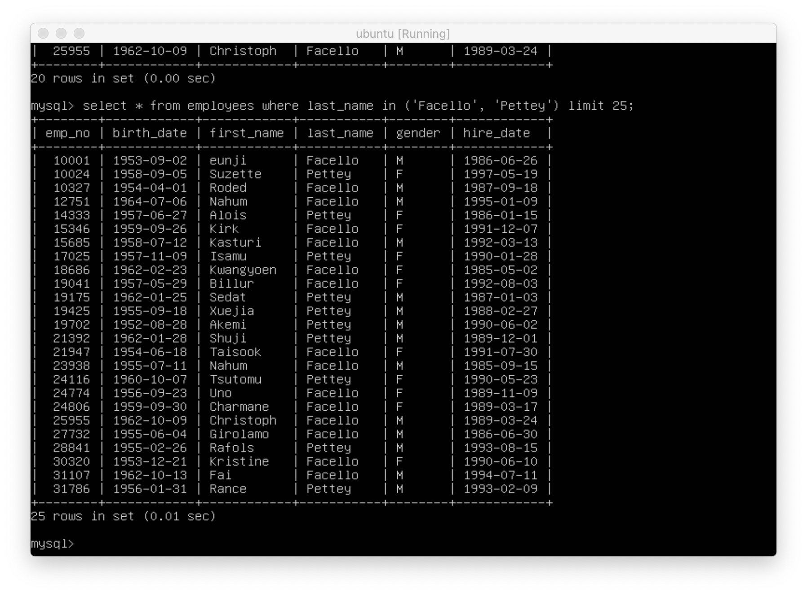

```sql
select *
from emeployees
where last_name in ('Facello', 'Pettey'); -- last_name 이 'Facello' 이거나 'Pettey' 인 행을 리턴
```
where 절에 해당하는 조건이 multiple 할 경우 사용한다. (OR 조건과 비슷하다)

### 📌 LIKE Operator

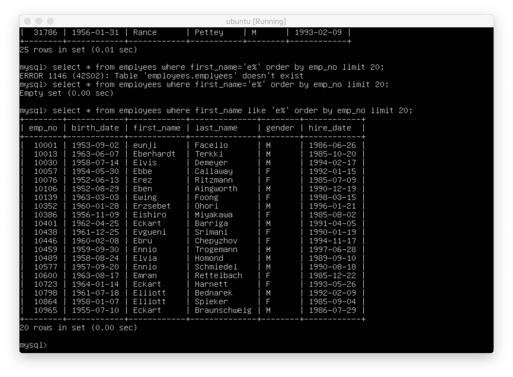

```sql
select * 
from employees
where first_name='e%'; -- first_name이 'e'로 시작하는 행 리턴
```
- % : 모든 문자열이 올 수 있음
- _ : 한 개의 character 만 올 수 있음

**Example** 

- 'a%' : ```a``` 로 시작하는 문자열    
- '%a' : ```a``` 로 끝나는 문자열   
- '%or%' : ```or``` 이 속해있는 문자열 (문자열의 자리는 상관 없음)   
- '_r%' : ```r``` 이 두번째에 속해있는 문자열   
- 'a_%' : ```a``` 로 시작하는 두 자리 이상의 문자열   
- 'a__%' : ```a``` 로 시작하는 세 자리 이상의 문자열  
- 'a%o' : ```a``` 로 시작해서 ```o``` 로 끝나는 문자열

### 📌 BETWEEN Operator

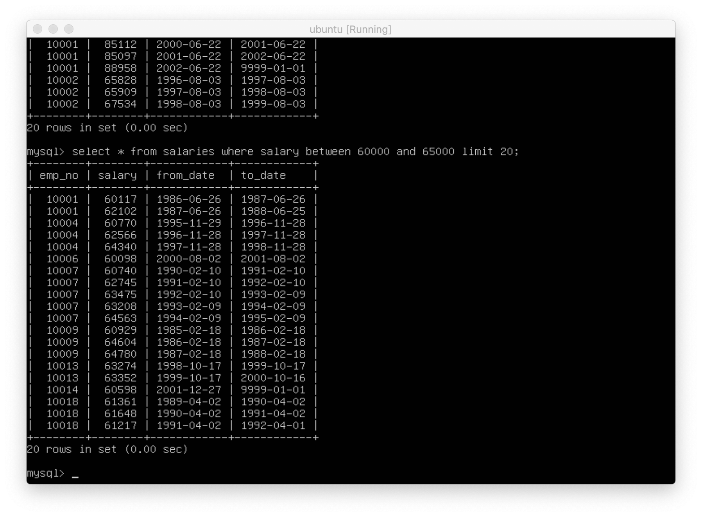

```sql
select *
from salaries
between 60000 and 65000; -- salary가 60000 이상 650000 이하인 행 리턴
```
between 사이에 속하는 행들을 리턴한다. (시작값과 끝값 포함됨)

### 📌 Aliases

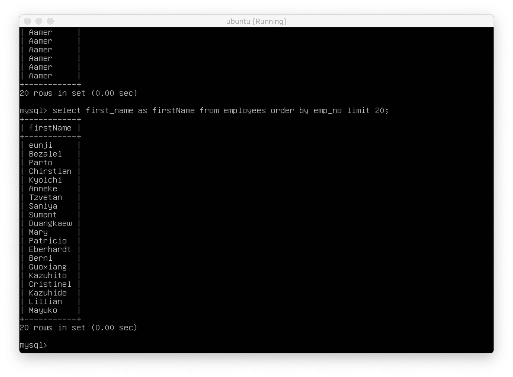

```sql
select first_name as firstName
from employees;
```
리턴하는 행의 이름을 cusotm 할 수 있다. 좀 더 가독성을 좋게 하는 데 활용한다.

### 📌 Join : Inner, left, right, full

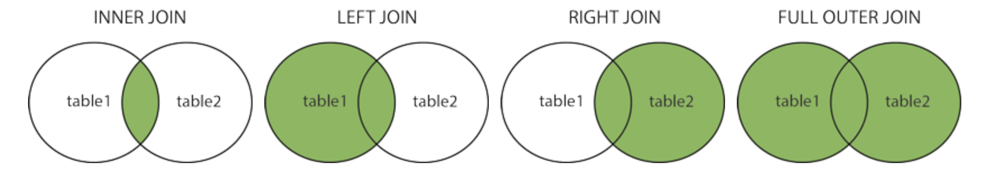

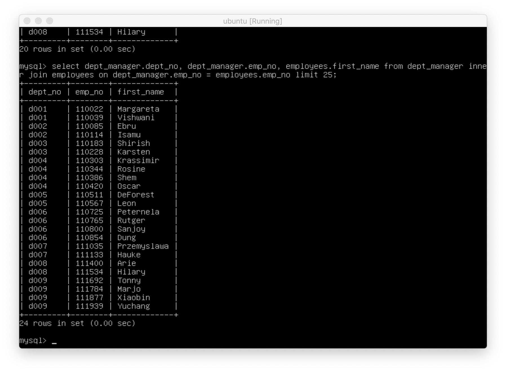

```sql
select dept_manager.dept_no, dept_manager.emp_no, employees.first_name
from dept_manager
join employees
on dept_manager.emp_no = employees.emp_no;
```

**inner join** 은 두 테이블의 교집합을 리턴한다. (두 테이블에 모두 값이 있음)   
위의 예시 코드의 경우 ```dept_manager``` 과 ```employees``` 에 모두 해당하는 사원을 리턴하므로 **부서 관리자** 를 리턴한다.

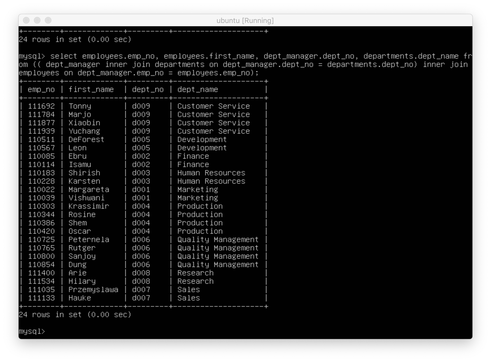

```sql
select employees.emp_no, employees.first_name, dept_manager.dept_no, departments.dept_name
from (( dept_manager
inner join departments
on dept_manager.dept_no = departments.dept_no)
inner join employees
on dept_manager.emp_no = employees.emp_no);
```

위의 예시는 3개의 테이블을 조인한 경우이다.   
3개 이상의 테이블을 조인하고 싶은 경우는 inner join 을 중첩해 작성한다.

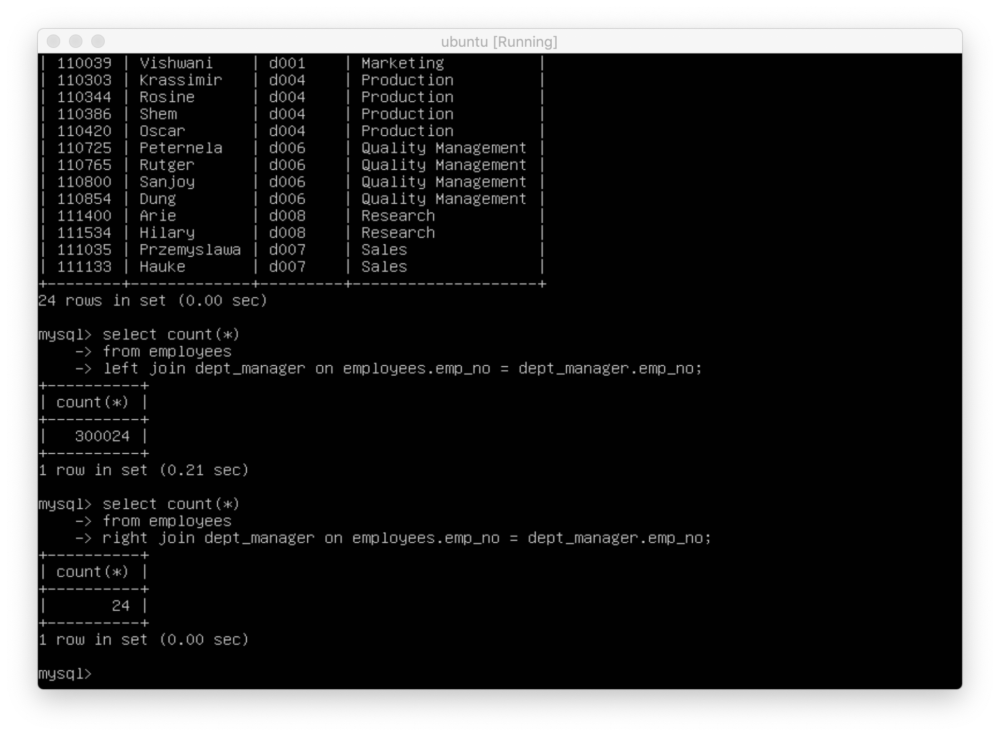

```sql
-- left join
select count(*)
from employees
left join dept_manager
on employees.emp_no = dept_manager.emp_no; -- 300024

-- right join
select count(*)
from employees
right join dept_manager
on employees.emp_no = dept_manager.emp_no; -- 24
```

### 📌 UNION Operator

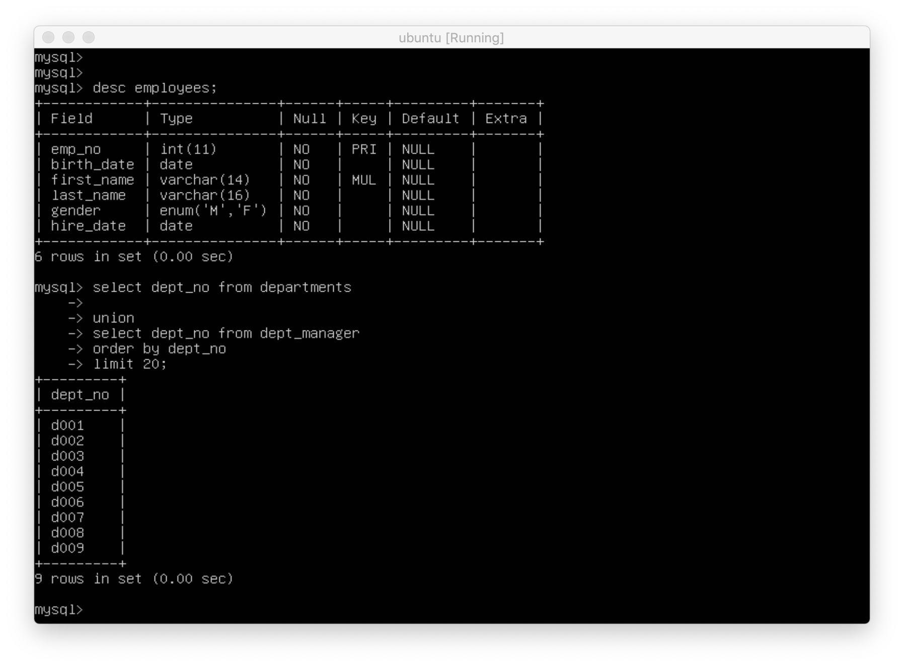

```sql
select dept_no from departments
union
select dept_no from dept_manager
order by dept_no;
```

```union``` 연산자는 2개 이상의 select 문을 distinct 하게 합칠 때 사용한다.
select 문이 리턴한 행의 개수, 행의 type 이 같아 한다.   
```union all``` 연산자의 경우 중복을 허용하며 합친다.

### 📌GROUP BY statement

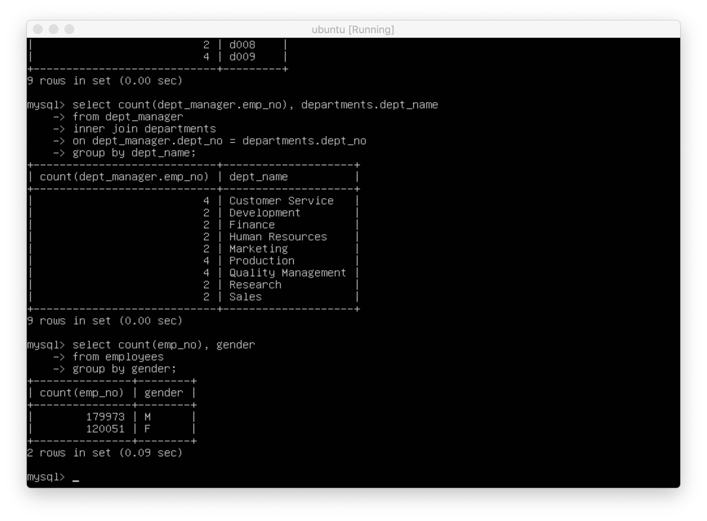

```sql
select count(emp_no), gender
from employees
group by gender; 
-- 같은 gender에 해당하는 사원의 수를 리턴한다.
-- M : 179973, F: 120051


select count(dept_manager.emp_no), departments.dept_name
from dept_manager
inner join departments
on dept_manager.dept_no = departments.dept_no
group by dept_name;
-- 같은 부서에 해당하는 관리자들의 수를 리턴한다
```

```group by``` 절은 중복된 값이 존재하는 행을 요약하기 위해 사용한다.   
보통 ```count```, ```max```, ```min```, ```sum```, ```avg``` 함수와 같이 사용된다.


### 📌 ANY, ALL Operators

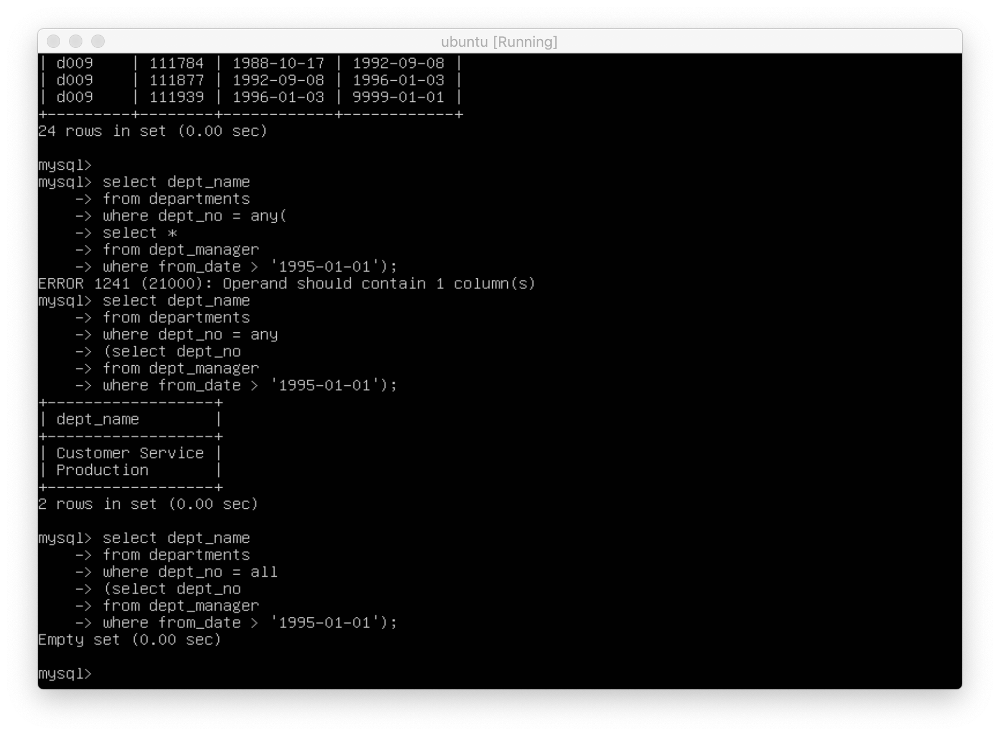

```sql
select dept_name
from departments
where dept_no = any(
select dept_no
from dept_manager
where from_date > '1995-01-01');
-- return true

select dept_name
from departments
where dept_no = all(
select dept_no
from dept_manager
where from_date > '1995-01-01');
-- return false
```
보통 ```where```, ```having``` 절과 같이 사용된다.   
any 연산자는 subquery 중 하나라도 true 인 행이 있다면 모두 리턴한다.   
all 연산자는 subquery 중 하나라도 false 인 행이 있다면 아무것도 리턴하지 않는다.   
 

### 📌 CASE Operators

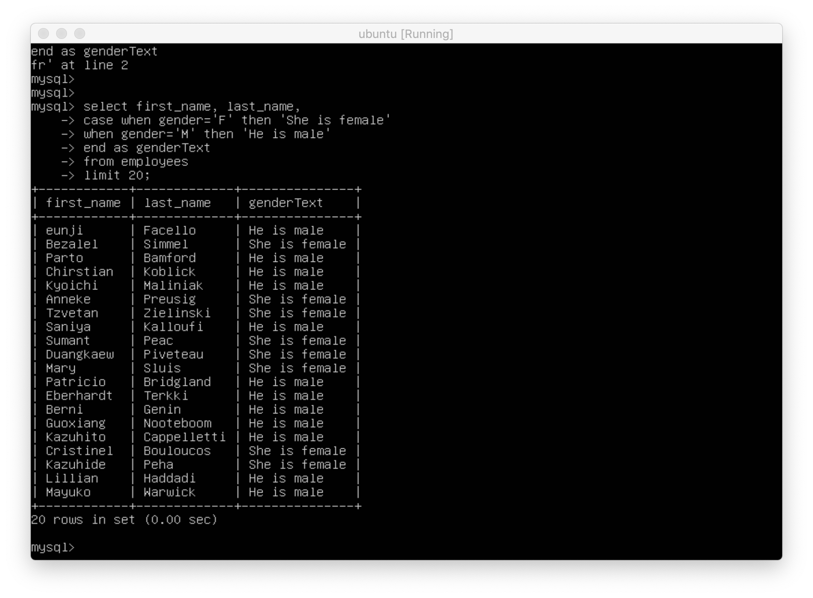

```sql
select first_name, last_name
case when gender='F' then 'She is female'
when gender'M' then 'He is male'
end as genderText
from employees;
```

```case``` 뒤 조건문을 만족한다면 ```then``` 이후 문장을 실행한다.    
```else``` 뒤 실행문을 작성하지 않았다면 ```null``` 을 리턴한다.


