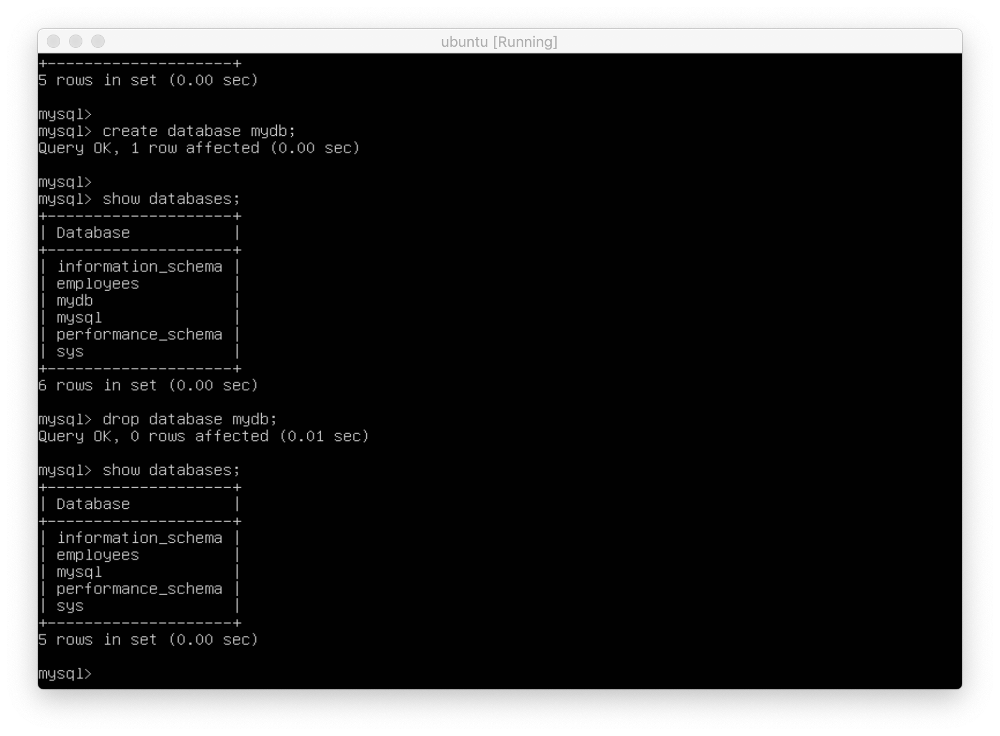

## SQL Databasse with docker 🐳

> 참고 : [w3schools.com SQL Tutorial](https://www.w3schools.com/sql/default.asp)   
> 선수 환경 : [실습 준비](https://github.com/ChoiEunji0114/TIL/blob/master/DatabaseProject/03_SQL_tutorial.md)

📌 Create & Drop DB

