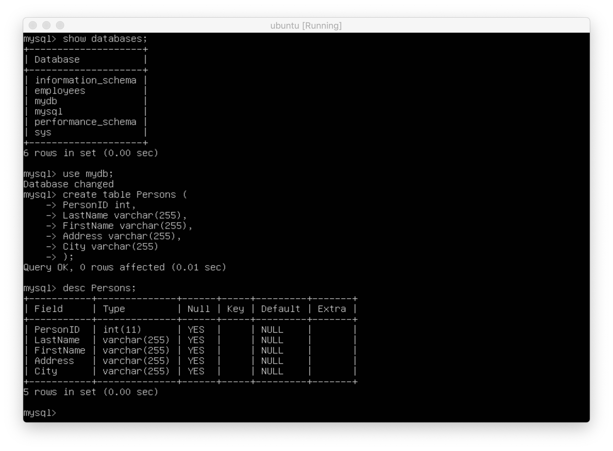
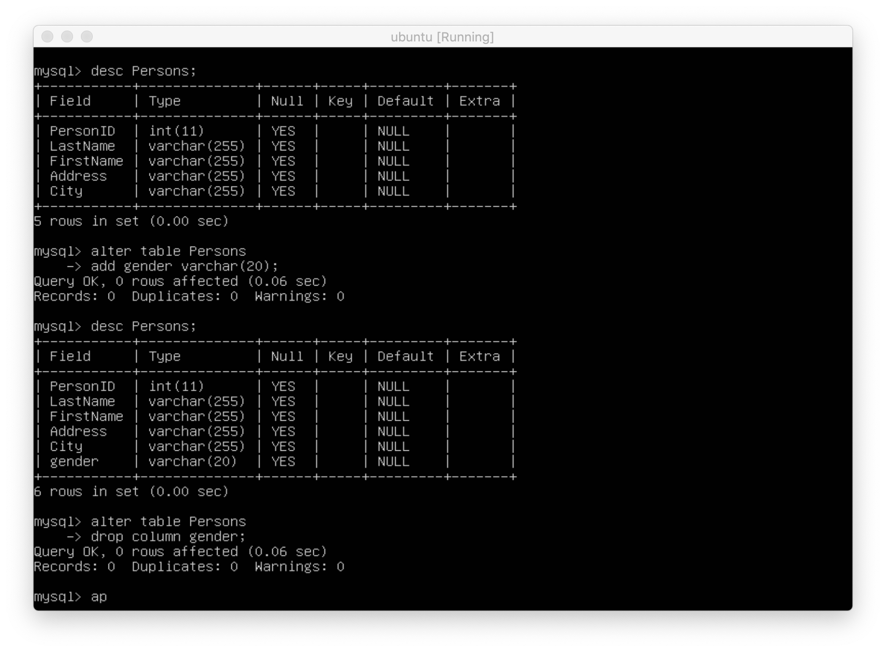
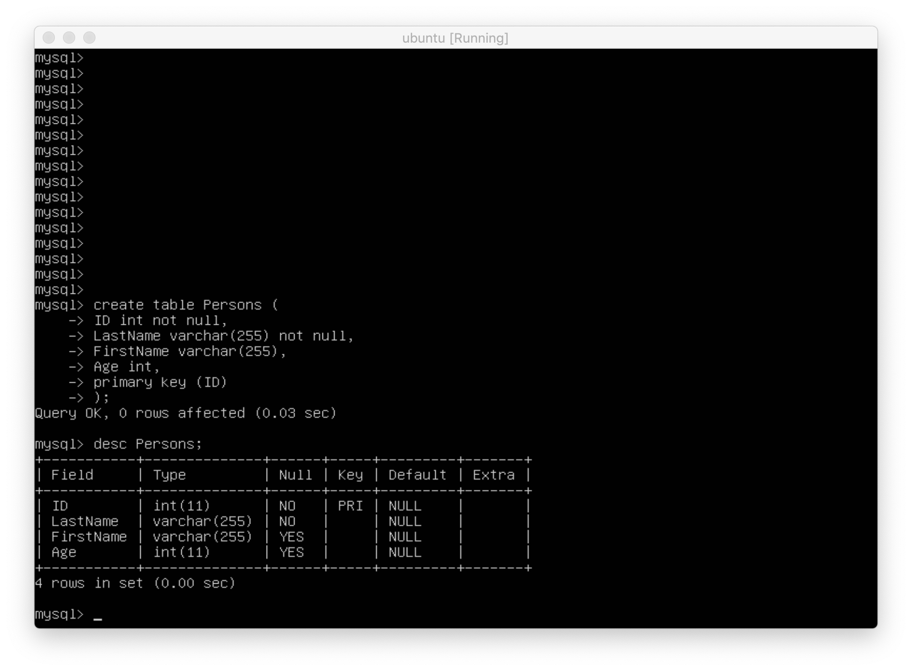
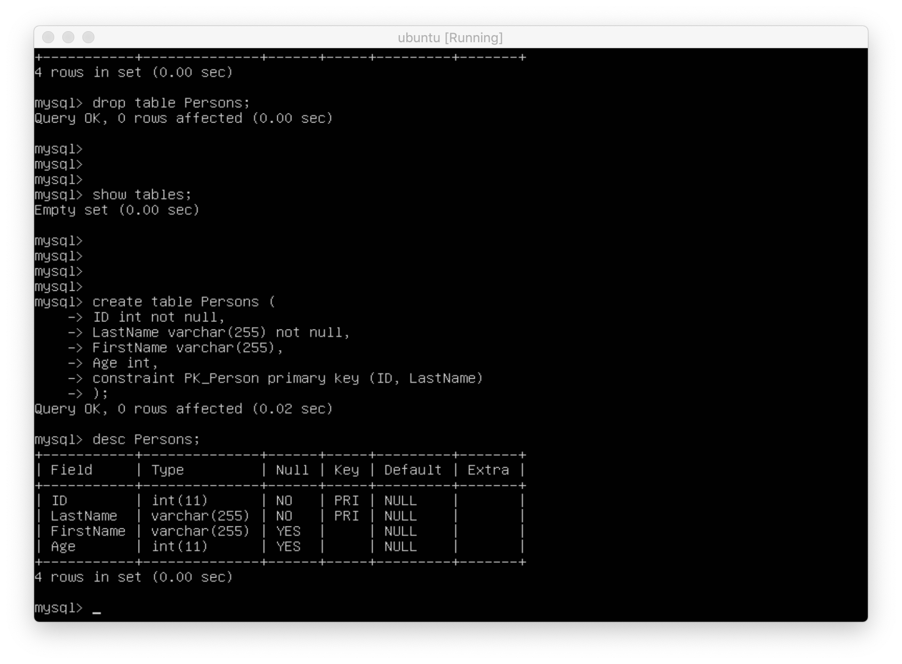
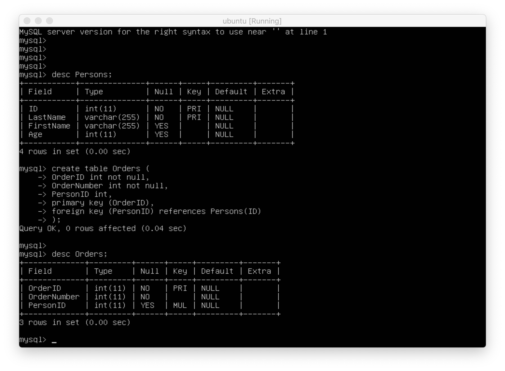
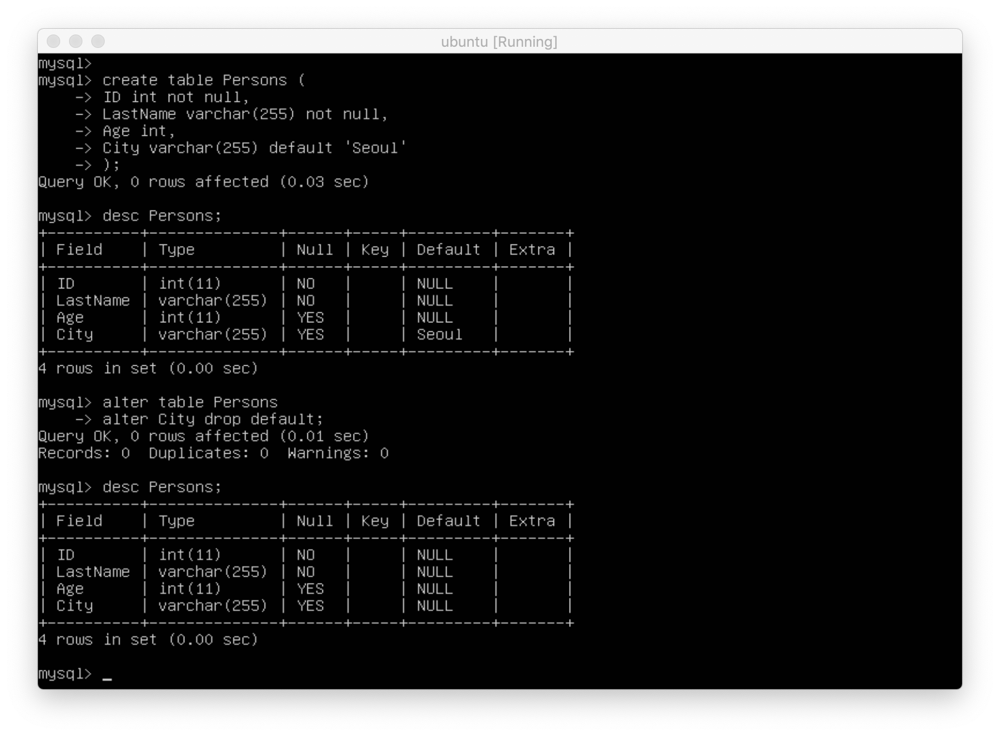
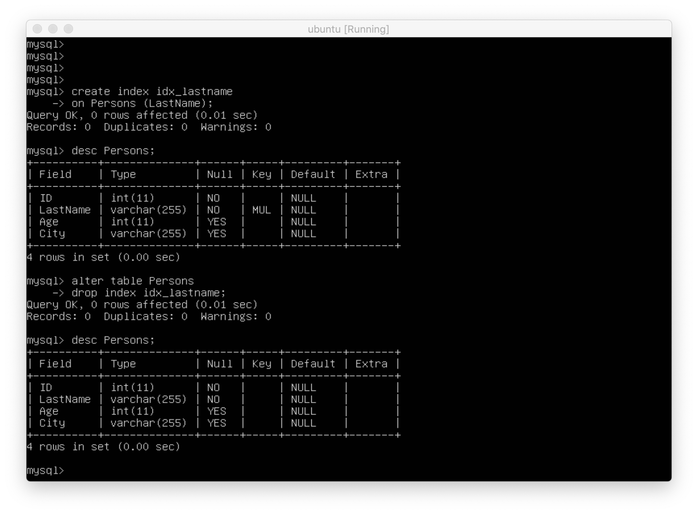
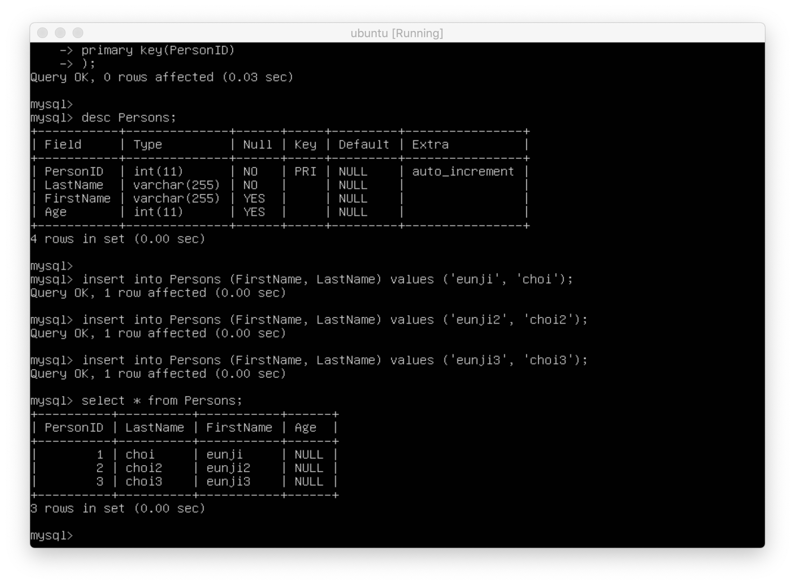
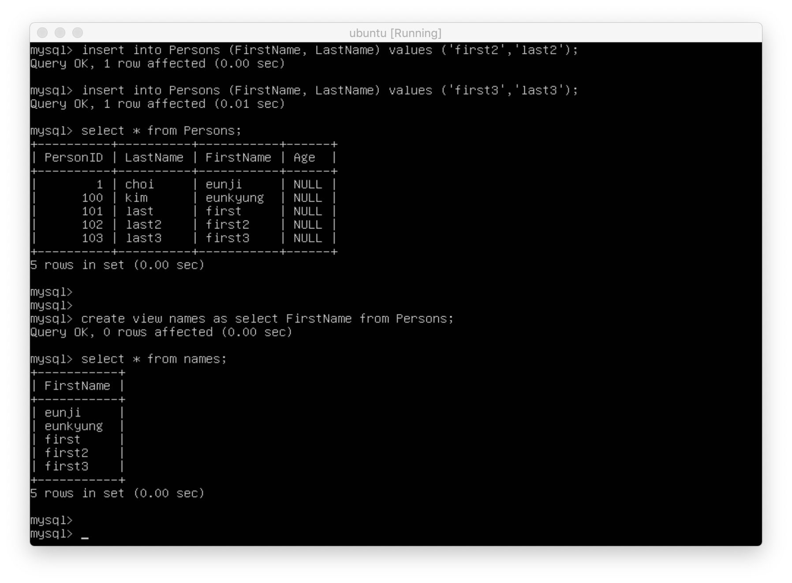

## SQL Databasse with docker 🐳

> 참고 : [w3schools.com SQL Tutorial](https://www.w3schools.com/sql/default.asp)   
> 선수 환경 : [실습 준비](https://github.com/ChoiEunji0114/TIL/blob/master/DatabaseProject/03_SQL_tutorial.md)

### 📌 Create & Drop DB


```sql
create database mydb; -- db 생성

drop database mydb; -- db 삭제
```
간단하 명령어로 database 를 create, drop 할 수 있다.

### 📌 Create Table



```sql
use mydb; -- db select

create table Persons (
PersonID int,
LastName varchar(255),
FirstName varchar(255),
Address varchar(255),
City varchar(255),
); -- create Persons table
```

위 명령어로 Pesons 테이블을 만들 수 있다. (가장 기본)

### 📌 Alter Table



```sql
alter table Persosns
add gender varchar (200); -- gender column 추가

alter table Persons
drop column gender; -- gender clumn 삭제
```

```alter``` 명령어로 새로운 행을 추가하거나 삭제할 수 있다. 

### 📌 Add Constraints on Table

```constraints``` 의 종류 👇

- ``` not null ``` : 해당 행은 null 값을 가질 수 없다.
- ``` unique ``` : 해당 행은 중복 값을 가질 수 없다.
- ``` primary key ``` : 해당 행은 ```not null```, ```unique``` 성질을 모두 갖는다. **각 행의 데이터를 유일하게 확인** 하는 데 사용된다.
- ``` foreign key ``` : 다른 테이블의 기본 키 필드를 가리키는 데이터의 참조 무결성(referential integrity)을 확인하기 위하여 사용된다. 즉, **허용된 데이터 값만 데이터베이스에 저장** 되는 것이다.
- ``` check ``` : 각 행이 무조건 만족해야 하는 조건이다.
- ``` index ``` : db의 데이터를 빠르게 생성하거나 가져올 때 사용한다.



```sql
create table Persons (
ID int not null,
LastName varchar(255) not null, 
FirstName varchar(255) not null,
Age int,
primary key (ID)
); -- ID 행이 pk
```



```sql
create table Persons (
ID int not null,
LastName varchar(255) not null,
FirstName varchar(255),
Age int,
constraint PK_Perosn primary key (ID, LastName)
); -- ID, LastName 쌍이 pk
```



```sql
create table Orders (
OrderID int not null,
OrderNumber int not null,
PersonID int,
primary key (OrderID),
foreign key (PersonID) references Perons(ID)
); -- pk는 OrderID, fk는 Persons 테이블의 ID 를 참조함
```


```sql
create table Persons (
ID int not null,
LastName varchar(255) not null,
FirstName varchar(255) not null,
Age int,
City varchar(255),
constraint CHK_Person check (Age>=18 and City='Sandnes')
); -- Age 는 18이상, City 는 Sandnes 여야만 한다는 조건 추가
```



```sql
create table Persons (
ID int not null,
LastName varchar(255) not null,
Age int,
City varchar(255) default 'Seoul'
);
-- City 행의 default 값을 Seoul 로 설정해 두었다.

alter table Persons
alter City drop default;
-- City 행의 default 값을 alter,drop 을 통해 없앴다.
```

### 📌 INDEX Statement



```sql
create index idx_lastname
on Persons (LastName); -- index 생성

alter table Persons
drop index idx_lastname; -- index 삭제
```

user 는 index를 볼 수 없지만, index를 사용하면 데이터를 쉽게 생성 및 조회가 가능하다.

### 📌 Auto Increment Field



```sql
create table Persons (
PersonID int not null auto_increment,
LastName varchar(255) not null,
FirstName varchar(255),
Age int,
primary key (PersonID)
);

insert into Persons (FirstName, LastName) values ('eunji','choi');
insert into Persons (FirstName, LastName) values ('eunji2','choi2');
insert into Persons (FirstName, LastName) values ('eunji3','choi3');

select * from persons;
```

```auto_increments``` 키워드를 붙이면 table에 insert 할 때 자동으로 값이 1씩 추가되는 것을 확인할 수 있다. 

### 📌 Views



```sql
create view names as
select FirstName from persons; -- view 생성

select * from names; -- view 조회 
```

``` view ``` 는 sql query문의 실행 결과를 저장하는 데 쓰인다. (실제 table 처럼 쓰인다.)   
유저가 실행할 때마다 최신 데이터를 보여준다.

