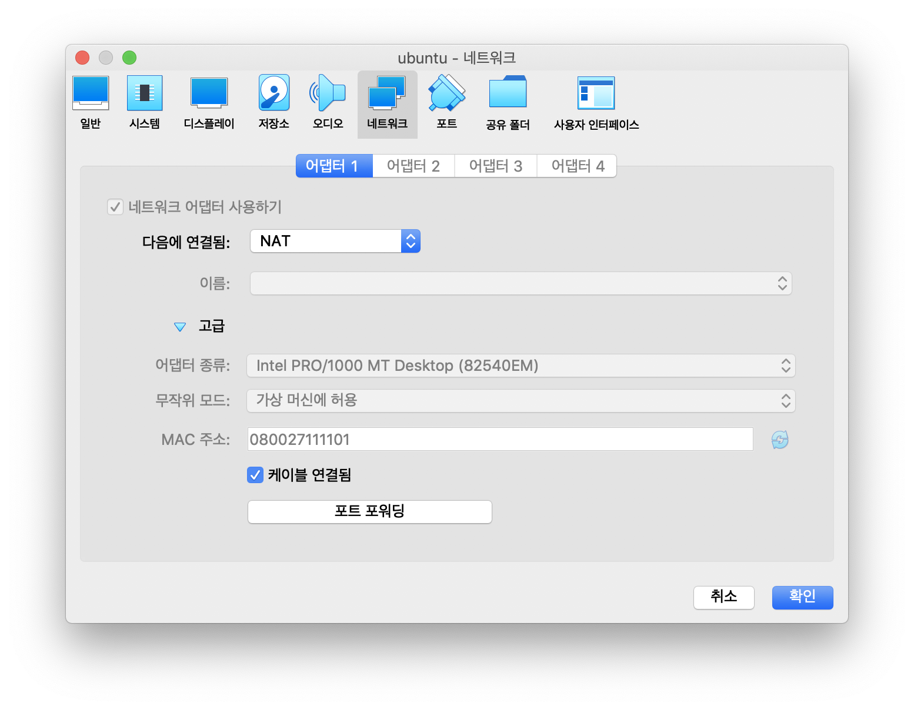
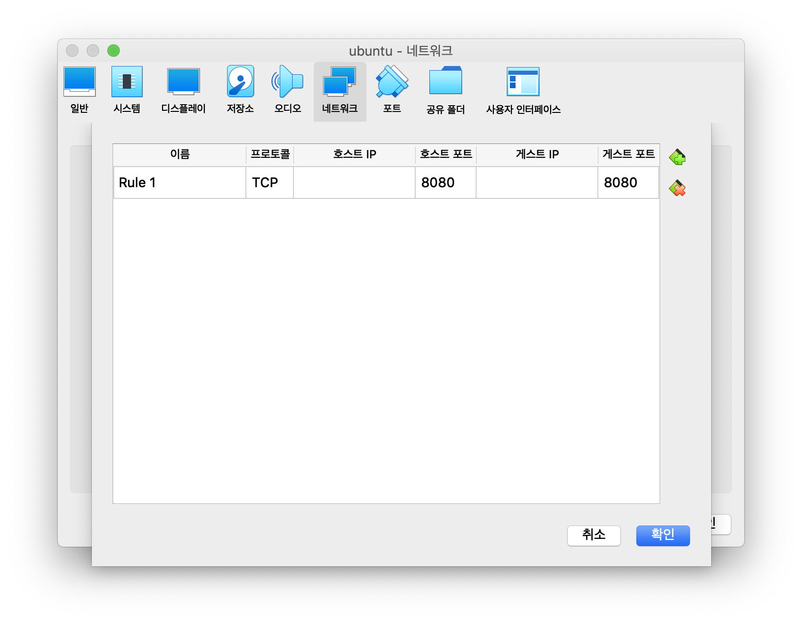
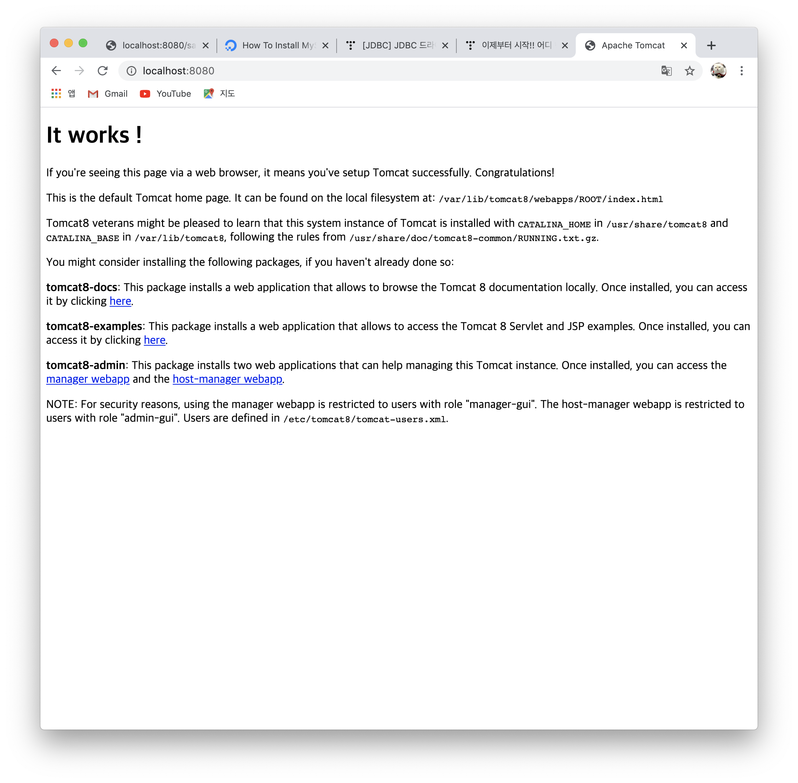
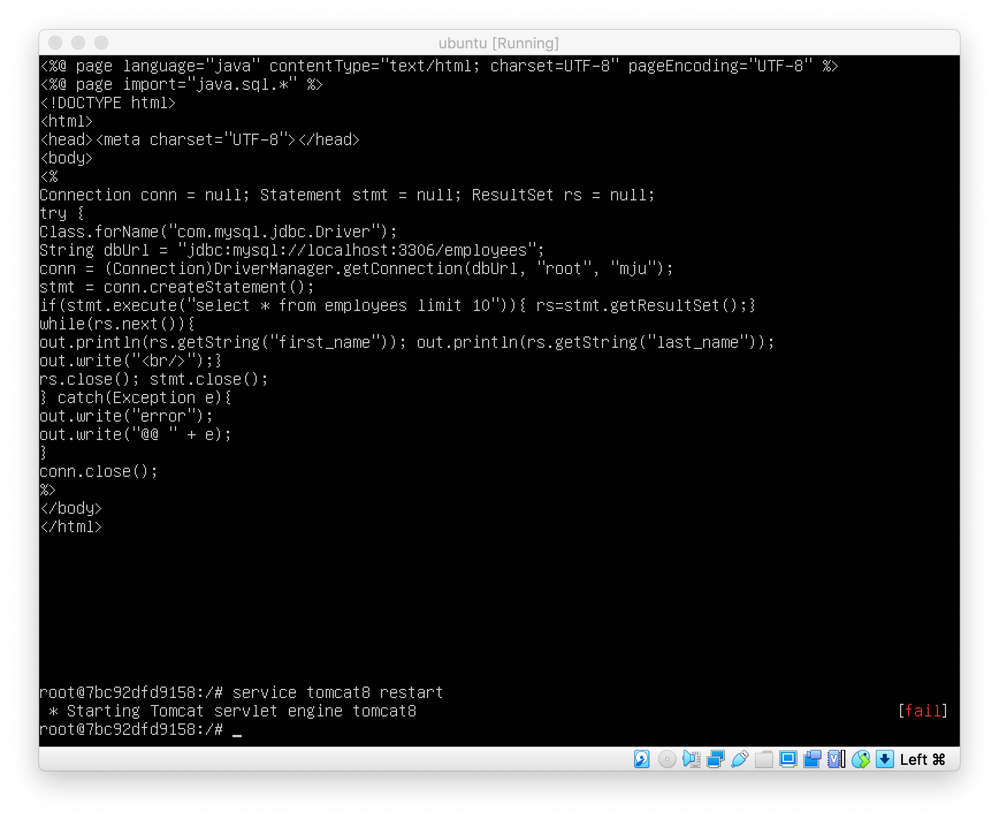
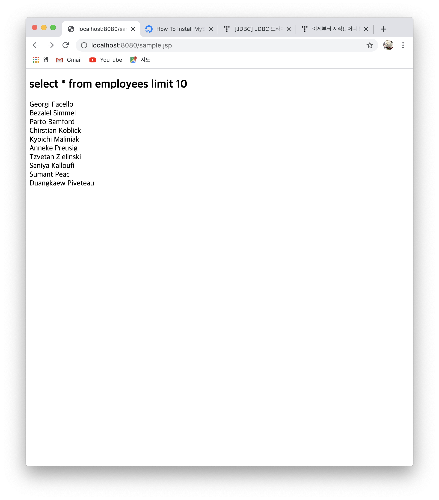

# JDBC on Ubuntu Container 🐳

Ubuntu container 안에 JDBC 실습을 진행해보자 👏   
  > [실습 선수 환경](https://github.com/ChoiEunji0114/TIL/blob/master/DatabaseProject/02_run_docker.md)


### 📌 create Ubuntu Container

```sh
$ docker run -d -it  -p 8080:8080 --name=ubt1 ubuntu

$ docker exec -it ubt1 bash
```

docker container 를 처음 만들 때 port 번호를 **8080** 으로 설정해두자

<br/>

### 📌 Set Port Number





설정 > 네트워크 > 고급 > 포트포워딩 > 추가  에 들어가 호스트 포트와 게스트 포트를 각각 **8080** 으로 설정해둔다.

<br/>

### 📌 Install Driver

```sh
# apt update

# apt install openjdk-11-jdk

# apt install libmysql-java

# apt install tomcat8

# cd /usr/share/java

# ln -s /usr/share/java/mysql-connector-java.jar /usr/share/tomcat8/lib/connector-java.java

# service tomcat8 start
```



```localhost:8080``` 으로 들어갔을 때 위 화면이 나오면 tomcat 서버 접속 성공이다 👏

<br/>

### 📌 Set MySQL


```sh
# apt install mysql-server
# apt install mysql-client
```

```sh
# service mysql start

# mysql -uroot -p
```

mysql 서버를 킨 다음 root user 로 mysql에 접속한다.

```sh
mysql > select user, authentication_string, plugin, host from mysql.user;

+------------------+-------------------------------------------+-----------------------+-----------+
| user             | authentication_string                     | plugin                | host      |
+------------------+-------------------------------------------+-----------------------+-----------+
| root             |                                           | auth_socket           | localhost |
| mysql.session    | *THISISNOTAVALIDPASSWORDTHATCANBEUSEDHERE | mysql_native_password | localhost |
| mysql.sys        | *THISISNOTAVALIDPASSWORDTHATCANBEUSEDHERE | mysql_native_password | localhost |
| debian-sys-maint | *CC744277A401A7D25BE1CA89AFF17BF607F876FF | mysql_native_password | localhost |
+------------------+-------------------------------------------+-----------------------+-----------+
4 rows in set (0.00 sec)
```
root user 에 권한이 아직 부여되지 않았음을 확인할 수 있다. 

```sh
mysql> alter user 'root'@'localhost' identified with mysql_native_password by 'password';
mysql> flush privileges;
mysql> grant all privilegesss on *.* to 'root'@'localhost' with grant option;

mysql> select user, authentication_string, plugin, host from mysql.user;

+------------------+-------------------------------------------+-----------------------+-----------+
| user             | authentication_string                     | plugin                | host      |
+------------------+-------------------------------------------+-----------------------+-----------+
| root             | *3636DACC8616D997782ADD0839F92C1571D6D78F | mysql_native_password | localhost |
| mysql.session    | *THISISNOTAVALIDPASSWORDTHATCANBEUSEDHERE | mysql_native_password | localhost |
| mysql.sys        | *THISISNOTAVALIDPASSWORDTHATCANBEUSEDHERE | mysql_native_password | localhost |
| debian-sys-maint | *CC744277A401A7D25BE1CA89AFF17BF607F876FF | mysql_native_password | localhost |
+------------------+-------------------------------------------+-----------------------+-----------+
4 rows in set (0.00 sec)

mysql> exit;
```
root user 에 권한 부여 완료❗️

<br/>

### 📌 Set ClassPath

```sh
# nano .bashrc
```

.bashrc 폴더에 들어가 다음과 같은 경로를 입력한다.

```sh
export CLASSPATH=$CLASSPATH:/usr/share/java/mysql-connector-java.jar
```

```sh
source .bashrc
```

경로 저장 완료 ❗️ 이걸 해두지 않으면 jdbc driver 를 찾지 못하는 오류가 발생한다 .. 

<br/>

### 📌 JDBC 실습

```
# nano /var/lib/tomcat8/webapps/ROOT/sample.jsp
```





employees table 의 first_name, last_name 을 모두 잘 로드해옴을 확인할 수 있다.


