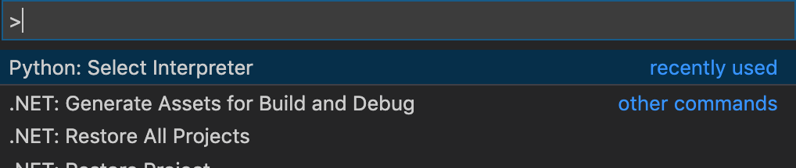
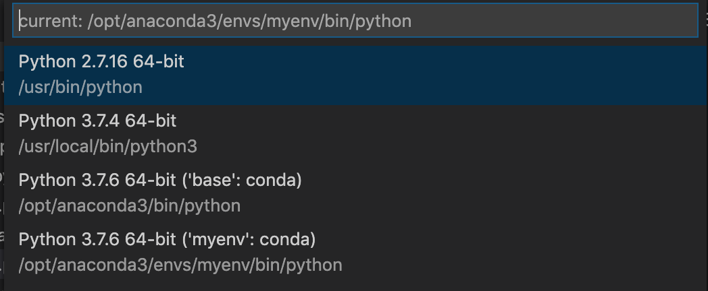
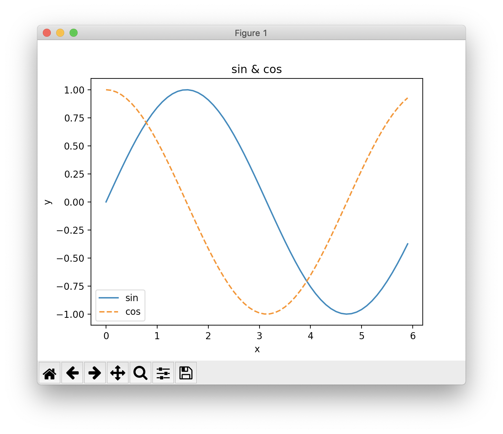
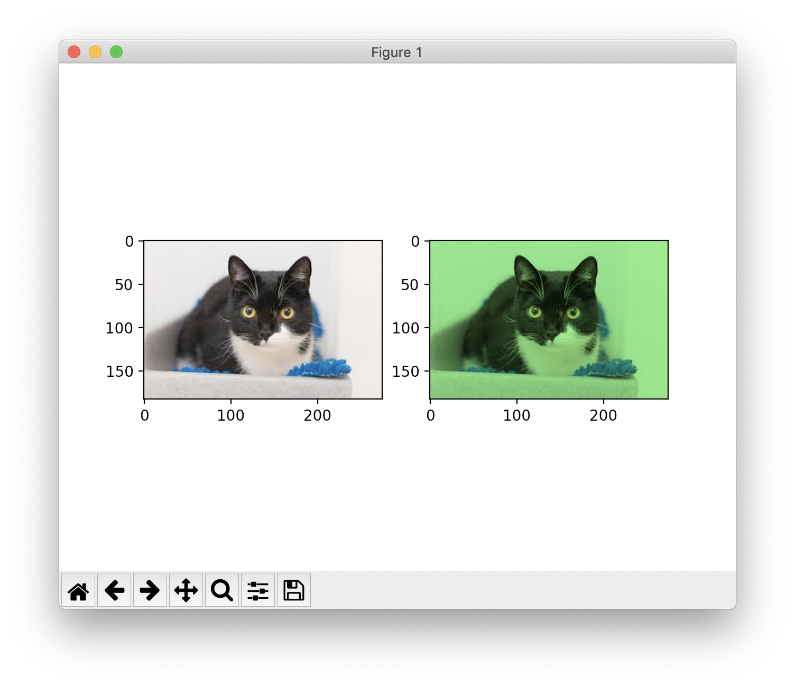
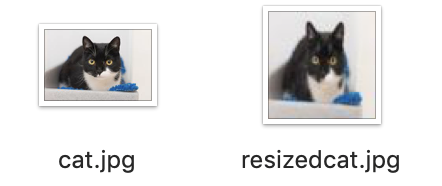

# Scipy Library 

> 참고자료 : 딥러닝 강의 자료 (2020-1)

### 📌 실습 준비 

visual studio 에서 진행할 때 적절한 interpreter 를 선택한다.





```control``` + ```p``` 를 누른 후 원하는 가상 환경 머신을 선택한다. 

```sh
$ pip install matplotlib

$ pip install scipy

$ pip install scipy==1.1.0
```

터미널 창에서 실습에 필요한 패키지를 install 한다. 실습 준비 끝❗️


### 📌 matplotlib

```python
import numpy as np
import matplotlib.pyplot as plt
from scipy.misc import imread, imsave, imresize

x = np.arange(0, 6, 0.1)
y1 = np.sin(x)
y2 = np.cos(x)

plt.plot(x, y1, label="sin")
plt.plot(x, y2, linestyle="--", label="cos")
plt.xlabel("x")
plt.ylabel("y")
plt.title("sin & cos")
plt.legend()
plt.show()
```



<br/>

### 📌 Image Processing

```python
import numpy as np
import matplotlib.pyplot as plt
from scipy.misc import imread, imsave, imresize

img = imread('./cat.jpg')
print(img)
print(img.dtype, img.shape)
# uint8 (183, 275, 3)
# 이미지 데이터는 uint8 자료형 2차원 배열이다.

img_tinted = img * [0.5, 1.0, 0.5] # RGB

plt.subplot(1,2,1)
plt.imshow(img)
plt.subplot(1,2,2)
plt.imshow(np.uint8(img_tinted)) # uint8 형으로 바꿔줘야 한다.
plt.show()

img_resized = imresize(img, (64,64))
imsave('./resizedcat2.jpg', img_resized)
```




코드를 실행하면 해당 디렉토리에 resize 된 이미지가 저장됨을 확인할 수 있다. 
<br/>

### 📌 Distance between points

```python
import numpy as np
from scipy.spatial.distance import pdist, squareform

x = np.array([[0,1], [1,0], [2,0]])

d1 = pdist(x, 'euclidean')
print(d1)
print(squareform(d1))
print()

d2 = pdist(x, 'cityblock')
print(d2)
print(squareform(d2))
print()

d3 = pdist(x, 'cosine')
print(d3)
print(squareform(d2))
```

```profile
[1.41421356 2.23606798 1.        ]
[[0.         1.41421356 2.23606798]
 [1.41421356 0.         1.        ]
 [2.23606798 1.         0.        ]]

[2. 3. 1.]
[[0. 2. 3.]
 [2. 0. 1.]
 [3. 1. 0.]]

[1. 1. 0.]
[[0. 2. 3.]
 [2. 0. 1.]
 [3. 1. 0.]]
```

1. **Euclidean Distance**

피타고라스 정리와 비슷한 개념이다. 가장 널리 쓰이는 거리 계산 방법이다.

2. **CityBlock Distance**

맨하탄 거리 (Manhattan Distance) 를 구한다.   
각 차원의 차를 제곱해서 사용하는 것이 아닌 절댓값을 바로 합산한다. 항상 euclidean 거리보다 크거나 같다. 


3. **Cosine Distance**

해밍 거리 (Hamming Distance) 를 구한다.    
각 차원마다 차이를 찾는 것이 아니라 '정확히 같은지' 여부만 고려한다. 주로 맞춤법 검사와 같은 알고리즘에 많이 사용된다.

