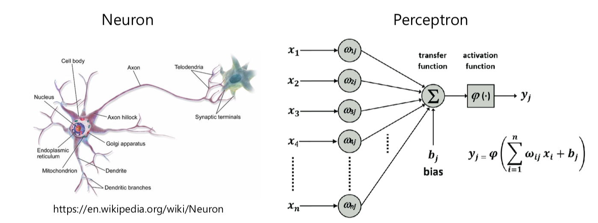
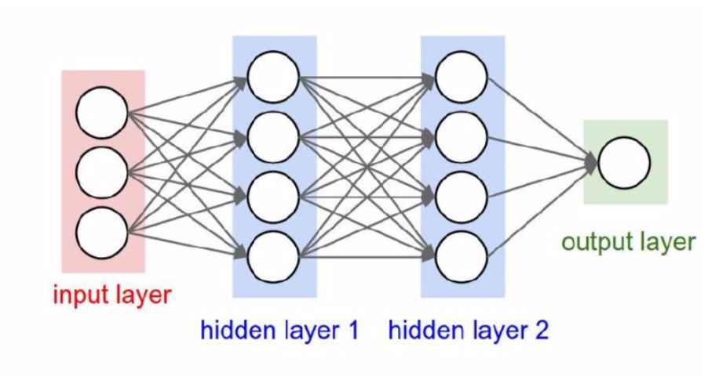
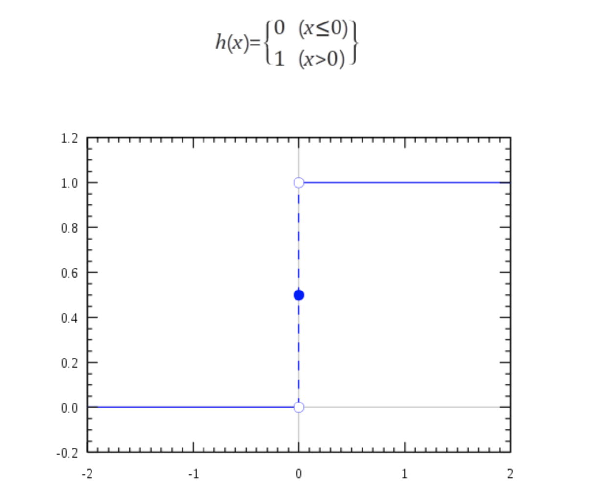
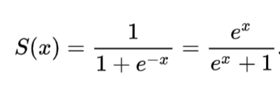
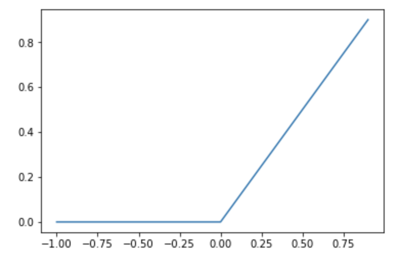

# Perceptron & Neural Network

> 강의 자료 : 딥러닝 (2020-1) 

## Perceptron

다수의 신호 (Input) 을 입력받아서 하나의 신호 (Output) 을 출력한다.    
perceptron 의 출력값은 1 또는 0 이기 때문에 선형 분류 (linear classifier) 모형이다.

 

처음에는 임의로 설정된 weight로 시작한다.   
학습 데이터를 perceptron 모형에 입력하며 분류가 잘 못 되었을 때 weight을 개선해 나간다. 

- **가중치** (weight) : 입력 신호가 결과 출력에 주는 영향도를 조절하는 매개변수
- **변향** (bias) : 뉴런이 얼마나 쉽게 활성화 되느냐를 조절하는 매개변수

퍼셉트론은 선형분류는 할 수 있지만 비선형분류는 불가능하다는 한계점이 있다.   
이를 극복하기 위해 다층 퍼셉트론을 만든다. 층을 겹겹이 쌓아나가는 것이다.   

단층 퍼셉트론은 `step function` (임계값을 넘어섰을 때 출력을 1로 함) 을 활성화 함수로 사용한다.   
다층 퍼셉트론은 층이 여러개이며 `sigmoid function` 을 활성화 함수로 사용한다.

 

## Neural Network

Perceptron이 가중치를 직접 수동으로 설정하는 작업을 한다는 한계점을 해결한 방법이 **신경망** 이다.   
알아서 가중치 값을 설정하고 조정하는 것이 (자동으로 학습) 신경망의 큰 특징이다

 

신경망은 Input(입력층), Hidden(은닉층), Output(출력층) 으로 표현할 수 있다.

 

## Activation Function

어떠한 신호를 입력받아 이를 적절한 처리를 하여 출력해주는 함수이다.   
이를 통해 출력된 신호가 다음 단계에서 활성화 되는지를 결정한다. 
즉, `input data` > `activation function` > `output data` 형태를 가진다.

### Step Function

퍼셉트론은 활성화 함수로 `step function` (계단 함수)를 이용한다.   
특정 임계값을 넘기면 활성화되는 함수이다.

 

### Sigmoid Function 

가중치 값을 전달할 때 좀 더 부드럽게 양을 조절해 전달한다.  0~1 사이의 값을 가진다.

 

### ReLU Function

입력이 0을 넘으면 그 입력을 그대 출력하고, 0 이하면 0을 출력하는 함수이다.

