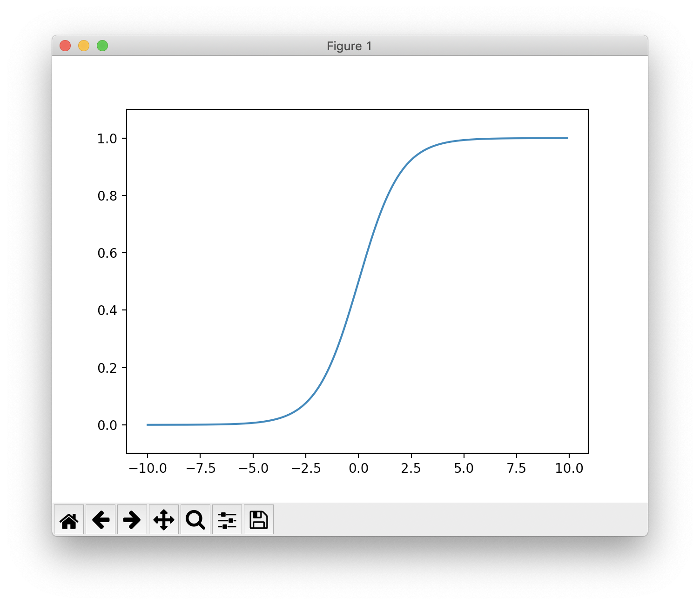
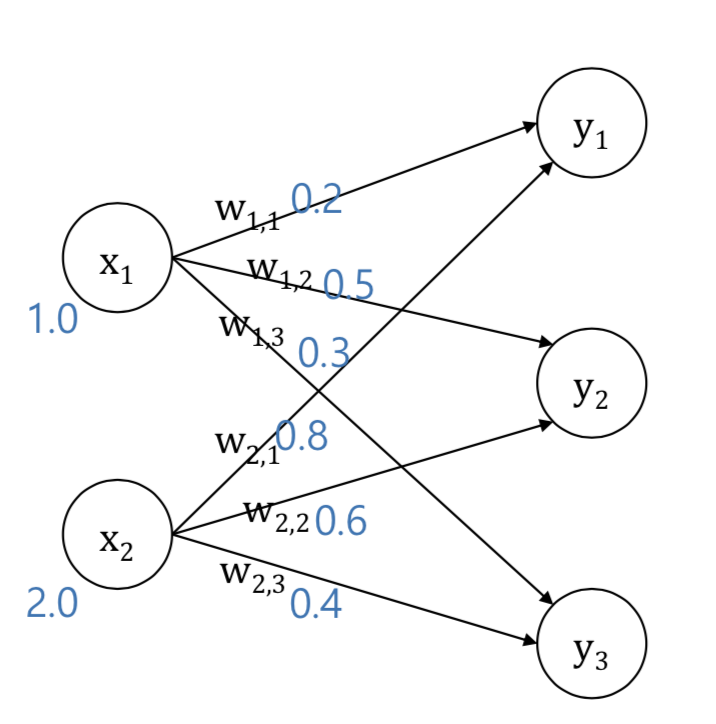

# ForwardPass 구현하기 (1)

### Sigmoid Function

```python
import numpy as np
import matplotlib.pylab as plt

def sigmoid(x):
    return 1 / (1+np.exp(-x))

print(sigmoid(1))
print(sigmoid(np.array([0,0.5,1])))

x = np.arange(-10.0, 10.0, 0.1)
y = sigmoid(x)

plt.plot(x,y)
plt.ylim(-0.1, 1.1)
plt.show()
```
```profile
0.7310585786300049
[0.5        0.62245933 0.73105858]
```



<br/>

### 단순 신경망 구조 만들기



```python
def init_network():
    network = {}
    network['W'] = np.array([
        [0.2, 0.5, 0.3],
        [0.8, 0.6, 0.4]
    ])
    return network

network = init_network()

print(network)
```
```profile
{'W': array([[0.2, 0.5, 0.3],
       [0.8, 0.6, 0.4]])}
```

<br/>

### Forward Pass 만들기

```python
# forward pass 1
def forward1(network, x):
    W = network['W']
    y = np.array([0.0, 0.0, 0.0])
    y[0] = W[0][0] * x[0] + W[1][0] * x[1]
    y[1] = W[0][1] * x[0] + W[1][1] * x[1]
    y[2] = W[0][2] * x[0] + W[1][2] * x[1]
    return y


# forward pass 2
def forward2(network,x):
    y = np.dot(x, network['W'])
    return y

# sigmoid : 출력값을 0~1로 조정
def sigmoid(x):
    return 1 / ( 1 + np.exp(-x) )

# forward + sigmoid (Active Function 적용)
def forward3(network,x):
    y = sigmoid(np.dot(x, network['W']))
    return y

print(forward2(network, np.array([1.0, 2.0])))
print(forward3(network, np.array([1.0, 2.0])))
```
```
[1.8 1.7 1.1]
[0.85814894 0.84553473 0.75026011]
```

`forward2`는 `numpy` 를 사용해 `forward1` 계산을 한 번에 한 형태이다.   
`forward3`은 `sigmoid` 함수를 적용해 forward 값을 0~1사이로 적용했다.

<br/>

### Softmax Function

```python
def softmax(x)  :
    e = np.exp(x - np.max(x))
    s = np.sum(e)
    return e / s
```

일반적으로 Neural Network 기반 multi-label classifier 의 마지막 층에서 사용한다.   
출력값이 0부터 1사이의 값이다. 출력의 합계는 1이다.

<br/>

## Loss Function

지금 예측이 얼마나 좋은지 알 수 있는 함수. 0에 가까울 수록 학습이 잘 된 모델이다.

### 1. MSE (Mean Squared Error)

선형 회귀는 적절한 가중치 (w) 와 편향(b) 를 찾기 위해  **평균 제곱 오차(MSE)** 를 최소화하는 파라미터 w 와 b 를 찾는다.   
실제 라벨값과 예측값의 차이가 작으면 작을 수록 예측 성능이 좋기 때문이다.

```python
def mean_squared_error(y,t):
    return np.mean((y-t)**2)
```

### 2. CSE (Croww Entropy Error)

```python
def cross_entropy_error(y,t):
    return -np.sum(t * np.log(y + 1e-9)) / y.shape[0]
```
`softmax` 를 사용했을 때 (분류 했을 때) 주로 사용한다. 
