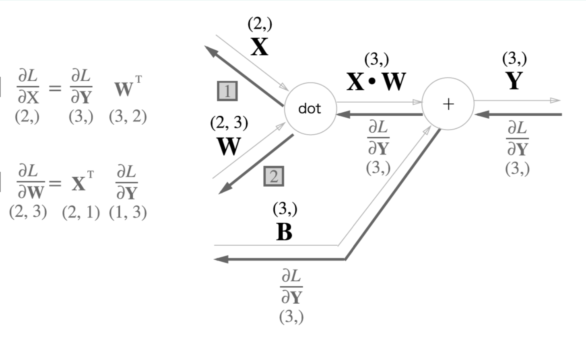
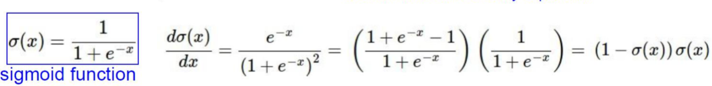

# Back Propagation (1)

이제 [Gradient Descent](https://github.com/ChoiEunji0114/TIL/blob/master/DeepLearning/06_Gradient_Descent.md) 를 사용해 Back Propagation 을 구현해보자.

###  `functions.py`

```python
def sigmoid(x):
    return 1 / (1 + np.exp(-1))

def softmax(x):
    e = np.exp(x-np.max(x, axis=1, keepdims=True))
    return e / np.sum(e, axis=1, keepdims=True)

def mean_squared_error(y,t):
    return np.mean((y-t)**2)

def cross_entropy_error(y,t):
    return -np.sum(t * np.log(y + 1e-9)) / y.shape[0]
```
저번에 실습했던 내용과 동일하다.   

`sigmoid` 는 가중치를 전달할 때 부드럽게 양을 조절해 전달하고,   
`softmax` 는 주로 마지막 층에서 사용한다.    
`mean_squared_error`, `cross_entropy error` 는 지금 예측이 얼마나 좋은지 측정한다.   

<br/>

### `layers.py`

1. Dense Layer

```python
class Dense:
def __init__(self, input_size, output_size, initializer='random'):
    self.W = 0.1 * np.random.randn(input_size, output_size)
    self.b = 0.1 * np.zeros(output_size)
    self.x = None
    self.y = None
    self.dW = None # W gradient
    self.db = None # b gradient

def forward(self, x):
    self.x = x # x값을 기억해 둠 (gradient 를 구할 때 사용)
    self.y = np.dot(self.x, self.W) + self.b
    return self.y

def backward(self, d_out, learning_rate):
    self.dW = np.dot(self.x.T, d_out)
    self.db = np.sum(d_out, axis=0)
    d_x = np.dot(d_out, self.W.T)
    self.W -= learning_rate * self.dW
    self.b -= learning_rate * self.db
    return d_x
```

일반 layer 구조이다. 저번 `foward pass` 에서 `backward` 가 추가되었다.   
`dw` 는 `w` 의 편미분 값이고, `db` 는 `b` 의 편미분 값이다. `d_out` 은 global gradinet 값이다.



위와 마찬가지로 backward 할 때 `d_x` 값에 `d_out` 과 `W` 의 transpose 값을 곱해준다.

```
w = w + (-grad) * learning_rate
```
그리고 위의 `gradient descent` 수식과 마찬가지로 `learning_rate` 를 곱한 값을 빼준다.


<br/>

2. Softmax Layer

```python
# last layer
class SoftmaxWithLoss:
def __init__(self):
    self.error = None
    self.y = None # 예측 답안
    self.t = None # 모범 답안

def forward(self,x):
    self.y = softmax(x)
    return self.y

def loss(self, t):
    self.t = t
    self.error = cross_entropy_error(self.y, self.t)
    return self.error

def backward(self, d_out=1, learning_rate=None): 
    batch_size = self.t.shape[0]
    d_x = (self.y - self.t) / batch_size
    return d_x
```

마지막 층에서 사용될 `soft max layer` 이다.   
저번 `forward pass` 에서 `loss` 와 `backward` 가 추가되었다.   

> softmax function 은 loss 계산으로 cross entropy error 을 사용한다. loss 는 제일 마지막 한 번만 계산한다.

> `batch_size` 는 한 번에 처리할 양을 의미한다.

<br/>

3. Sigmoid Activation Function

```python
class Sigmoid:
def __init__(self):
    self.y = None
    
def forward(self,x):
    self.y = sigmoid(x)
    return self.y

def backward(self, d_out, learning_rate=None):
    return d_out * (1.0 - self.y) * self.y
```
`sigmoid` 는 `dense layer` 의 activation function 으로 쓰인다.



위 식과 마찬가지로 미분 값을 backward 할 때 return 해준다.

<br/>

4. Relu Activation Function

```python
class Relu:
def __init__(self):
    self.mask = None

def forward(self, x):
    self.mask = (x<=0)
    out = x.copy()
    out[self.mask] = 0
    return out

def backward(self, d_out, learning_rate=None):
    d_out[self.mask] = 0
    d_x = d_out
    return d_x
```
Relu layer는 `backward` 할 때 x 가 0 이하인 값은 모두 0으로 처리한다. 

이제 이렇게 구성된 layer 을 바탕으로 network를 만들고, back propagation 실습을 진행해보자 ❗️
