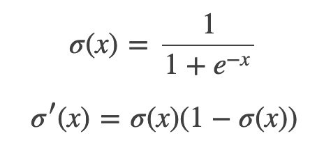
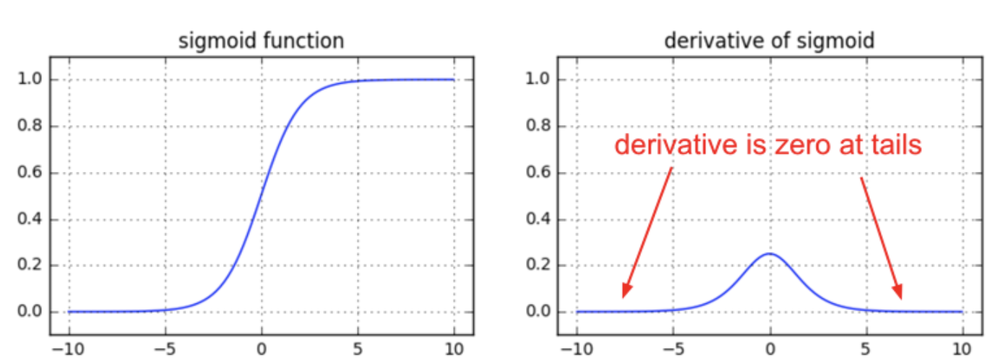
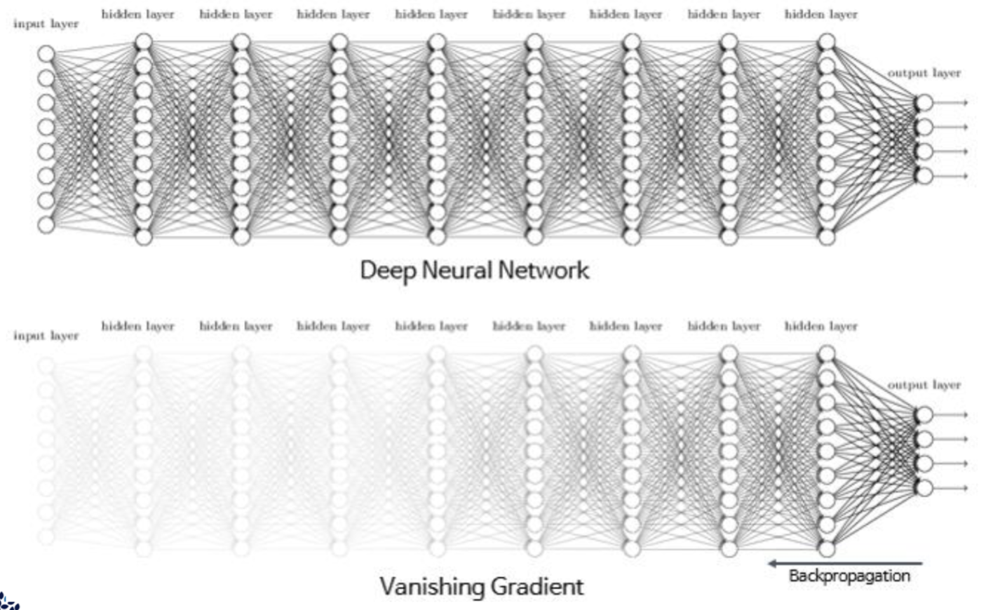
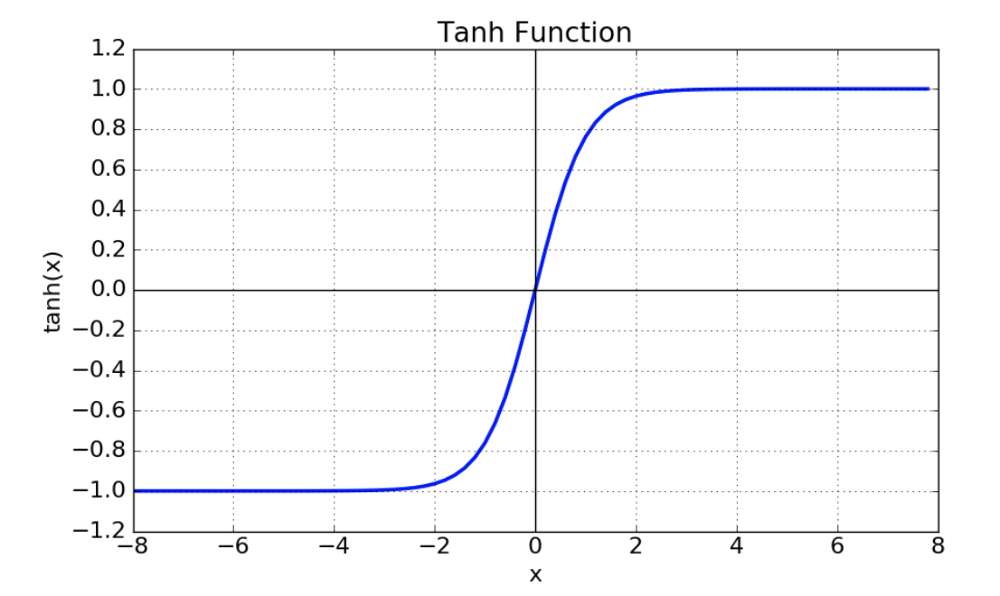
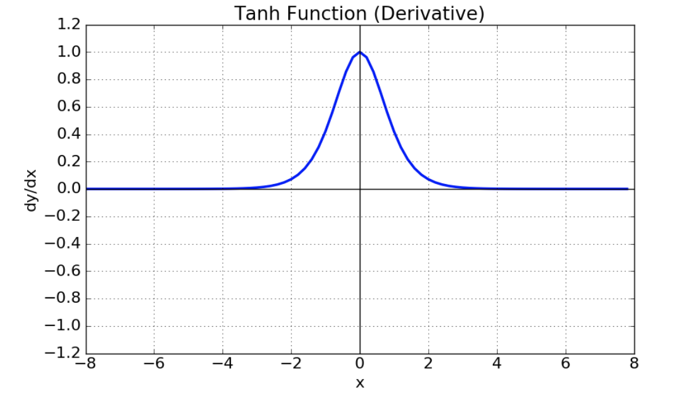
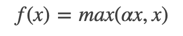
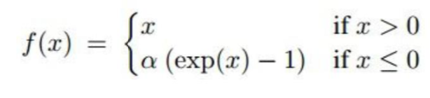
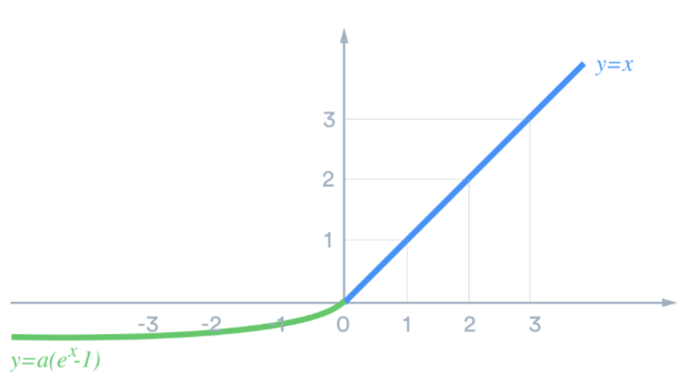

# Training NeuralNet (1) 

딥러닝 네트워크에서는 노드에 들어오는 값들에 대해 곧바로 다음 레이어로 전달하지 않고 비선형 함수를 통과시킨 후 전달한다.    
이 때 사용하는 함수를 **활성화 함수 (Activation Function)** 이라 부른다.

> 선형함수인 h(x)=cx를 활성화함수로 사용한 3층 네트워크를 떠올려 보세요. 이를 식으로 나타내면 y(x)=h(h(h(x)))가 됩니다. 이는 실은 y(x)=ax와 똑같은 식입니다. a=c3이라고만 하면 끝이죠. 즉, 은닉층이 없는 네트워크로 표현할 수 있습니다. 뉴럴네트워크에서 층을 쌓는 혜택을 얻고 싶다면 활성화함수로는 반드시 비선형 함수를 사용해야 합니다. 

딥러닝에서 사용되는 활성화 함수들에 대해서 자세히 알아보자.

 

## 1. Sigmoid Function

시그모이드 함수는 선형인 multi perceptron 에서 비선형 값을 얻기 위해 사용하기 시작했다.      
아래는 시그모이드 함수와 시그모이드 미분 함수를 그래프로 나타낸 것이다.

sigmoid 는 함수값이 (0,1) 로 제한되며, 중간 값은 1/2 이다.   

신경망 초기에 많이 사용되었지만 크게 세 가지 단점으로 지금은 사용하지 않는다.

### 문제 1: Vanishing Gradient

미분 함수에 대해 x=0 에서 최대값 1/4 을 가지고, input 값이 일정 이상 올라가면 미분 값이 거의 0에 수렴하게 된다. 이는 |x| 값이 커질 수록 Gradient Backpropagation 시 미분값이 소실될 가능성이 크다.  

따라서 이 값을 계속 곱해줄 수록 weight 변화량은 매우 작아져 잘 업데이트 되지 않는다.

### 문제 2: Not zero - centered (slow convergence)

함수값 중심이 0이 아니라 학습이 느려질 수 있다.

만약 모든 x값들이 같은 부호(ex. for all x is positive) 라고 가정하고 아래의 파라미터 w에 대한 미분함수식을 살펴보자. ∂L/∂w=∂L/∂a * ∂a/∂w 그리고 ∂a/∂w=x이기 때문에, ∂L/∂w=∂L/∂a * x 이다. 위 식에서 모든 x가 양수라면 결국 ∂L/∂w는 ∂L/∂a 부호에 의해 결정된다. 

따라서 한 노드에 대해 모든 파라미터w의 미분값은 모두 같은 부호를 같게된다. 

 
 따라서 같은 방향으로 update되는데 이러한 과정은 학습을 zigzag 형태로 만들어 느리게 만드는 원인이 된다.

### 문제 3: cost exp function

exp(x) 함수는 시간이 많이 걸린다.

 

## 2. tanh Function (Hypeerbolic tangent Function)

tanh 함수는 sigmoid 함수를 transformation 해서 얻을 수 있다.

 

함수의 중심값을 0으로 옮겨 sigmoid 의 최적화 과정이 느려지는 문제를 해결했다.    

그러나 미분 함수에 대해 일정 값 이상 커질 시 미분값이 소실되는 **gradient vanishing** 문제는 여전히 남아있다.

 

## 3. ReLU Function (Recitified Linear Unit)

ReLU 함수는 최근 가장 많이 사용되는 활성화 함수이다. 

- `x>0` 이면 기울기가 1인 직선이고, `x<0` 이면 함수값이 0이 된다.
- `sigmoid`, `tanh` 함수와 비교시 학습이 훨씬 빨라진다.
- 연산 비용이 크지 않고, 구현이 매우 간단하다.
- 그러나 `x<0` 인 값들에 대해서는 기울기가 0이기 때문에 뉴런이 죽을 수 있는 단점이 존재한다.

 

## 4. Leakly ReLU, PReLU Function

### Leakly ReLU

`leakly ReLU` 는 `ReLU` 뉴런이 죽는 **Dying ReLU** 현상을 해결하기 위해 나온 함수이다.

위의 식에서 0.01 대신 다른 매우 작은 값도 사용이 가능하다. (Hyper parameter)   
Leakly ReLU 는 음수의 x값에 대해 미분값이 0이 되지 않는다는 점을 제외하면 ReLU 와 같은 특성을 가진다.

### PReLU

Leakly ReLU 와 거의 유사하지만, 새로운 파라미터 `⍺`  를 추가하여 `x<0` 에서 기울기를 학습할 수 있게 했다.

 

## 5. ELU Function (Exponential Linear Unit)

- ReLU 의 모든 장점을 포함한다.
- "Dying ReLU" 문제를 해결했다.
- 출력값이 거의 zero-centered 에 가깝다.
- 일반적인 ReLU 와 달리 exp 함수를 계산하는 비용이 발생한다.

 

## 6. Maxout Function

이 함수는 ReLU가 가지는 모든 장점을 가졌으며, dying ReLU문제 또한 해결한다.    
하지만 계산량이 복잡하다는 단점이 있다.

 

### 그래서 어떤 Activation Function 을 사용해야 할까 ,,🤔

- 우선 가장 많이 사용되는 함수는 ReLU이다. 간단하고 사용이 쉽기 때문에 우선적으로 ReLU를 사용한다.
- ReLU를 사용한 이후 Leakly ReLU등 ReLU계열의 다른 함수도 사용 해본다.
- sigmoid의 경우에는 사용하지 않도록 한다.
- tanh의 경우도 큰 성능은 나오지 않는다.
