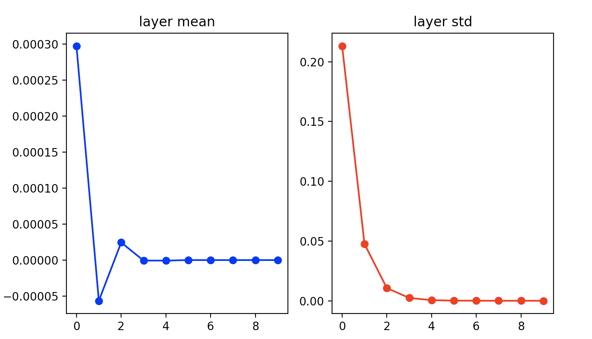
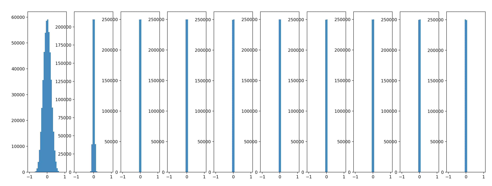
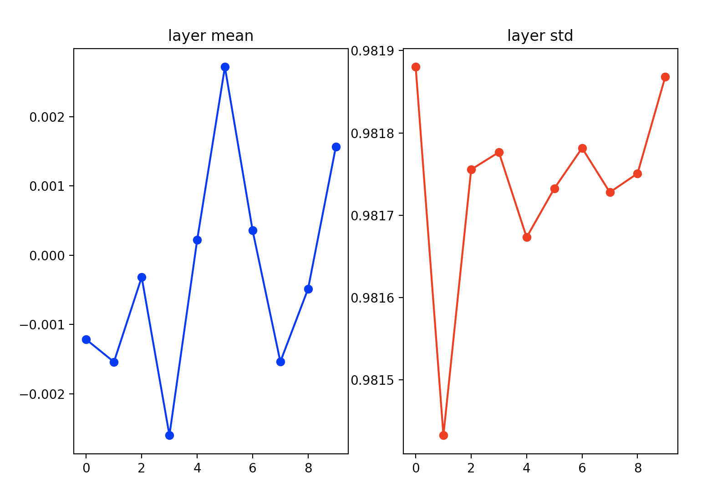
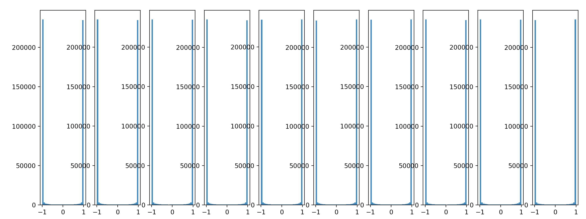
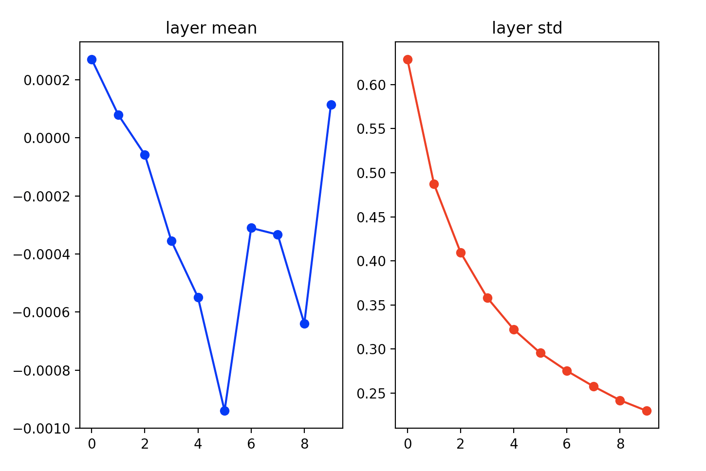
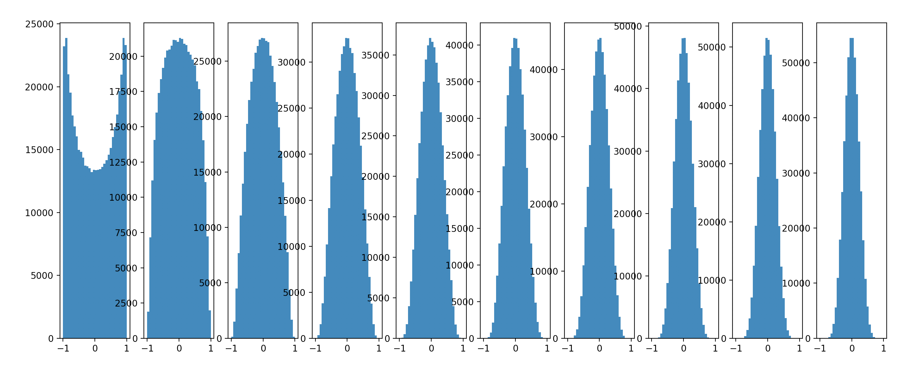
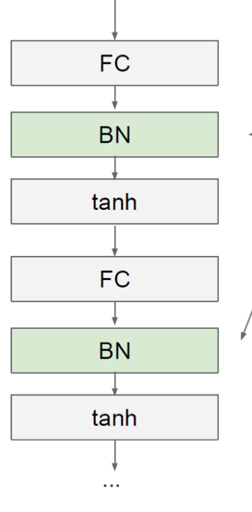
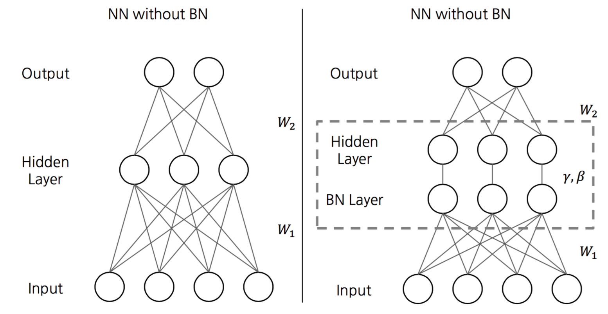
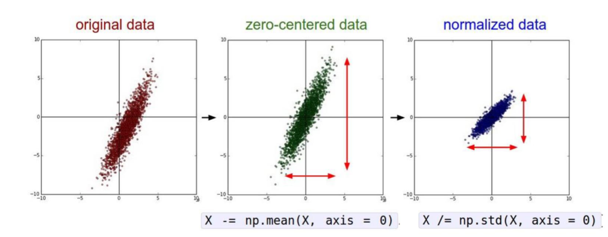
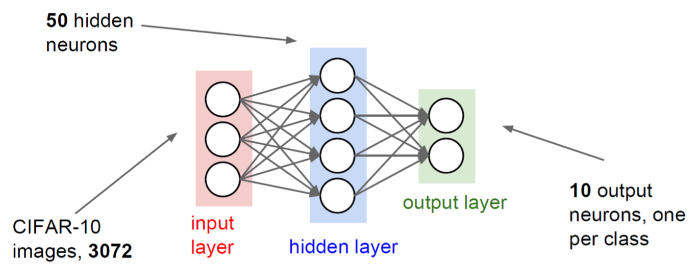

# Training NeuralNet (2) 

1. [Weight Initialization](#1. Weight Initialization)
2. [Batch Normalization](#2. Batch Normalization)
3. [Babysitting the Learning Process](#3. Babysitting the Learning Process)
4. [Hyperparameter Optimization](#4. Hyperparameter Optimization)


<br/>

## 1. Weight Initialization

딥러닝 학습에 있어서 초기 가중치 설정은 매우 중요한 역할을 한다.   
초기값 설정을 잘못해 문제가 발생하는 경우들을 살펴보자.

### 문제 발생 1. W 가 모두 같은 경우 (혹은 다 0인 경우)


만약 데이터를 평균 0으로 정규화 시킨다면, 가중치를 0으로 초기화 시킨다는 것이 합리적으로 보일 수 있다.   
그러나 실제로 0으로 가중치를 초기화하면 모든 뉴런들이 같은 값을 나타낼 것이고, 역전파 과정에서 각 가중치의 update 가 동일하게 이뤄질 것이다. 결국 제대로 학습하기 어려울 것이다.

### 문제 발생 2. small random number 을 줬을 경우

```python
import numpy as np
from matplotlib.pylab import plt

# assume some unit gaussian 10-D input data

D = np.random.randn(1000, 500)
hidden_layer_sizes = [500]*10
nonlinearities = ['tanh']*len(hidden_layer_sizes)

act = {'relu': lambda x:np.maximum(0,x), 'tanh':lambda x: np.tanh(x)}
Hs = {}

for i in range(len(hidden_layer_sizes)):
    X = D if i==0 else Hs[i-1] # input at this layer
    fan_in = X.shape[1]
    fan_out = hidden_layer_sizes[i]
    W = np.random.randn(fan_in, fan_out) * 0.01 # layer initialization

    H = np.dot(X, W) # matrix multiply
    H = act[nonlinearities[i]](H) # nonlinearity
    Hs[i] = H # cache result on this layer

print('input layer had mean', np.mean(D), 'and std', np.std(D))

# look at distributions at each layer
layer_means = [np.mean(H) for i,H in Hs.items()]
layer_stds = [np.std(H) for i,H in Hs.items()]

# print
for i,H in Hs.items() :
    print('hidden layer', i+1, 'had mean', layer_means[i], 'and std', layer_stds[i])

plt.figure()
plt.subplot(1,2,1)
plt.title("layer mean")
plt.plot(range(10), layer_means, 'ob-')
plt.subplot(1,2,2)
plt.title("layer std")
plt.plot(range(10), layer_stds, 'or-')

plt.show()

plt.figure()
for i,H in Hs.items() :
    plt.subplot(1,len(Hs), i+1)
    plt.hist(H.ravel(), 30, range=(-1,1))
plt.show()
```

> 예시 코드는 python 2  기준이라서 문법 몇 부분을 수정했다..

```profile
input layer had mean 0.00031233516316648657 and std 1.0006710331935624
hidden layer 1 had mean 0.0032899684992063636 and std 0.9820452751182597
hidden layer 2 had mean 0.003931758696050947 and std 0.9819251097074527
hidden layer 3 had mean 0.0026063736923909596 and std 0.9817340581953854
hidden layer 4 had mean 0.001848042971495998 and std 0.9817977909967206
hidden layer 5 had mean -0.0016554517737738606 and std 0.9815496358911521
hidden layer 6 had mean 0.0006604474921595372 and std 0.9816919440654884
hidden layer 7 had mean 0.0001594571291677151 and std 0.9816941165792189
hidden layer 8 had mean -0.0011475135707183642 and std 0.9816304323127083
hidden layer 9 had mean 0.0018214029856872354 and std 0.9815362486244705
hidden layer 10 had mean -0.0013684972820372828 and std 0.981809472200405
```





x가 0에 가까워지면 gradient도 0에 가까워져서 Vanishing gradient 가 발생한다.

### 문제 발생 3. 2의 case 에서 0.01 대신 1을 곱했을 경우

```python
    W = np.random.randn(fan_in, fan_out) * 1.0 # layer initialization
```

```profile
input layer had mean -0.0004322766817344249 and std 1.0010016502837895
hidden layer 1 had mean -0.0012174416683021685 and std 0.981880039850602
hidden layer 2 had mean -0.0015410543140147272 and std 0.9814327560617824
hidden layer 3 had mean -0.00031650342142403704 and std 0.9817555532084202
hidden layer 4 had mean -0.002599692767592639 and std 0.9817765320254677
hidden layer 5 had mean 0.00021900665038415243 and std 0.9816731709326508
hidden layer 6 had mean 0.0027174686541096625 and std 0.9817325832571894
hidden layer 7 had mean 0.00035636251219643234 and std 0.9817815950648252
hidden layer 8 had mean -0.0015383316857630897 and std 0.9817278825435273
hidden layer 9 had mean -0.00048497563819457115 and std 0.9817507524970054
hidden layer 10 had mean 0.0015641156086318114 and std 0.9818682873635451
```




Gradient가 0이 되어학습이 진행되지 않는다.

<br/>

가중치를 초기화 하는 방법들에 알아보자.

### 초기화 1 : Xavier Initialization

```python
    W = np.random.randn(fan_in, fan_out) / np.sqrt(fan_in)
```

```profile
input layer had mean -0.0007602850190879709 and std 0.9998665656626502
hidden layer 1 had mean 0.0002708052235341852 and std 0.6286386350311198
hidden layer 2 had mean 7.981811704091712e-05 and std 0.4871593737123403
hidden layer 3 had mean -5.8048525414097e-05 and std 0.4095861395151598
hidden layer 4 had mean -0.0003551174024725932 and std 0.35836212510095666
hidden layer 5 had mean -0.0005494540483613055 and std 0.32226268320263796
hidden layer 6 had mean -0.0009404907509430189 and std 0.2955054628386911
hidden layer 7 had mean -0.00031023383926448016 and std 0.27523767970783497
hidden layer 8 had mean -0.00033325822421282486 and std 0.25767757148442433
hidden layer 9 had mean -0.0006399647322567711 and std 0.24192558051206042
hidden layer 10 had mean 0.00011454739685321903 and std 0.22988941690330594
```




이전 노드와 다음 노드의 개수에 의존하는 방법이다. 

`Xavier` 함수는 비선형 함수 (`sigmoid`, `tanh`) 에서 효과적인 결과를 보여준다. 하지만 `ReLU` 함수에서 사용 시 출력값이 0으로 수렵하게 되는 현상을 확인할 수 있다. 따라서 `ReLU` 함수에는 또 다른 초기화 방법을 사용해야 한다.


### 초기화 2 : He Initialization

```python
    W = np.random.randn(fan_in, fan_out) / np.sqrt(2/fan_in)
```

```profile
input layer had mean -0.0011450863339822492 and std 1.000081508751302
hidden layer 1 had mean 0.00031914610114501144 and std 0.9988462279315763
hidden layer 2 had mean 0.0007438429591919188 and std 0.9988702745805579
hidden layer 3 had mean -0.0004157920971949518 and std 0.9988516421584084
hidden layer 4 had mean 0.0013355473511870704 and std 0.9988728127792286
hidden layer 5 had mean 0.0022546774264920765 and std 0.9988102361233384
hidden layer 6 had mean -0.0008834961822223749 and std 0.9988561182537576
hidden layer 7 had mean -0.0007944776103250633 and std 0.998888659921806
hidden layer 8 had mean 0.002610906298623285 and std 0.9988776807656174
hidden layer 9 had mean -0.002422902735376541 and std 0.9988868167237107
hidden layer 10 had mean 0.0019357676392045625 and std 0.9988350390063621
```

<br/>


## 2. Batch Normalization

**배치 정규화** 는 Activation Function 의 활성화값 또는 출력값을 정규화 (정규 분포로 만듦) 하는 작업을 말한다. 신경망의 각 layer 에서 데이터 (배치) 의 분포를 정규화 하는 작업이다.    





학습을 할 때마다 활성화 값, 출력값을 정규화 하기 때문에 초기화 (가중치 초깃값) 문제에서 비교적 자유로워진다.

각 hidden layer 에서 정규화를 하면서 입력 분포가 일정하게 되고, 이에 따라 Learning rate 를 크게 설정해도 괜찮아진다.   
결과적으로 **학습 속도가 빨라지게 된다.**

결과적으로

- 학습 속도가 개선된다. (학습률을 높게 설정할 수 있기 때문)
- 가중치 초깃값 선택의 의존성이 적어진다. (학습을 할 때마다 출력값을 정규화하기 때문)
- overfitting (과적합) 위험을 줄일 수 있다. drop out 같은 기법 대체 가능
- Gradient Vanishing 문제 해결이 가능하다.

<br/>

##  3. Babysitting the Learning Process

신경망을 학습하면서 체크해보아야 할 사항들이 있다.

### 1. Preprocess the data



### 2. Choose the architecture



50 뉴런의 hidden layer 1개를 가지고 있다고 가정하자.

### 3. Double check that the loss is reasonable

### 4. Find Learning rate

<br/>

## 4. Hyperparameter Optimization


<br/>

## Summary ✍️

- Activation Function : use ReLU
- Data preprocessing: subtract mean
- Weight Initialization: user Xavier / He init
- Batch Normalization : use
- Babysitting the learning process
- Hyperparameter optimization : random sample hyperparams, in log space when appropriate
