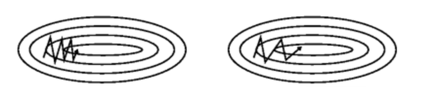

# Training NeuralNet (3) 

## Optimization


### SGD (Stochastic gradient descent)

Gradient Descent 는 전체 dataset 을 가지고 한 발자국 전진할 때마다 (learning rate) 최적의 값을 찾아 나간다.   
그러나 SGD는 **Mini-batch** 사이즈 만큼 조금씩 돌려서 최적의 값으로 찾아간다.

 

- Gradient Descent : **모든 training set 을 계산** 하여 loss 를 계산하고, 이를 이용하여 weight 을 조절함
- SGD : 추계적/ 확률적인 gradient 를 가지고 **일부만 계산** 함

```python
import numpy as np

class Optimizer:
    def __init__(self, learning_rate=0.01):
        self.lr = learning_rate

    def update(self, weight, grad):
        weight

""" Stochastic gradient descent """
class SGD(Optimizer):
    def __init__(self, learning_rate=0.01):
        super().__init__(learning_rate)

    def update(self, weight, grad):
        weight -= self.lr * grad

```


그러나 문제점이 존재한다. mini batch 를 통해 학습시키는 경우 최적의 값을 찾아 가기 위한 방향 설정이 뒤죽박죽이기 때문이다.

### Momentum

`momentum` 은 누적된 과거 gradient 가 지향하고 있는 방향을 현재 gradient 에 보정하는 방식이다.   
기울기 업데이트 시 폭을 조절하는 역할을 하며 이에 따라 velocity 가 변한다.

```python
class Momentum(Optimizer):
def __init__(self, learning_rate=0.01, momentum=0.9):
    super().__init__(learning_rate)
    self.momentum = momentum
    self.v = None

def update(self, weight, grad):
    if self.v is None:
        self.v = np.zeros_like(weight)
    
    self.v = self.momentum * self.v - self.lr * grad
    weight += self.v
```

### Nestrov Momentum


`Momentum` 과 거의 동일하나, 현재 위치의 gradient 를 이용하는 것이 아니고 현재 위치에서 속도 만큼 전진한 후의 gradient 를 이용한다.

### AdaGrad (Adaptive Gradient Algorithm)

### RMSProp (Root Mean Square Propagation)

### Adam (Adaptive Moment Estimation)


<br/>

## Ensemble

<br/>

## Regularization

### Dropout

<br/>

## Data Augmentation


