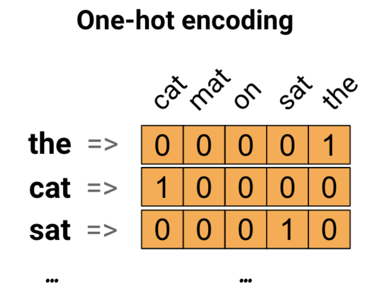
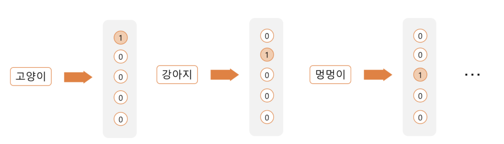
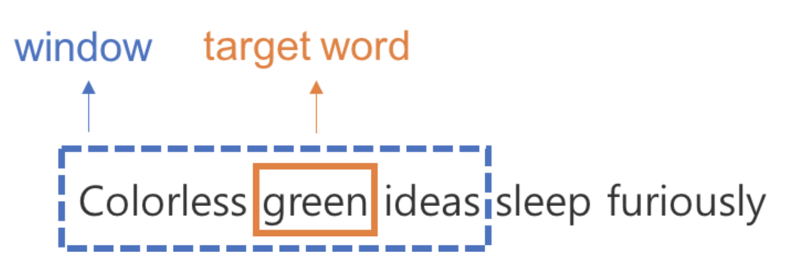

# Text and Sequences

> 자연어 처리하기 

## One-hot encoding

단어 집합의 크기를 벡터의 차원으로 하고, 표현하고 싶은 단어의 인덱스에 1의 값을 부여하고, 다른 인덱스에는 0을 부여하는 단어의 벡터 표현 방식이다. 

`one-hot encoding` 의 크기는 선택 (category or class) 개수이다.

1. 각 단어에 고유한 index 를 부여한다.
2. 표현하고 싶은 단어의 index 위치에 1을 부여하고, 다른 단어의 인덱스 위치에는 0을 부여한다. 

위와 같이 `one-hot encoding` 으로 표현된 벡터는 `one-hot vector`  라고 한다.   
이 표현법읜 희소 벡터 (`sparse vector`) 형태를 띈다.

### 단점

- 카테고리가 많아지면 차원의 수도 늘어남 (많은 메모리 사용)
- 단어의 유사성을 표현 못함 
    > 순서의 정보를 가지지 않아 벡터들의 모든 쌍에 대해서 유클리드 거리가 동일하다.

 

## Word embedding

`one-hot encoding` 의 단점은 벡터 표현에 단어와 단어 간의 관계가 전혀 드러나지 않는다는 점이다. 어떤 단어가 유사한 의미를 갖고 어떤 단어가 반대의 의미를 갖는지 단어 간의 관계는 전혀 반영하지 못한다. 

단어를 벡터로 바꿀 때, 좀 더 똑똑하게 바꿔서 벡터에 단어의 의미를 담을 수 있다면 유용하게 사용 가능할 것이다.

이렇게 단어를 벡터로 바꾸는 모델을 `Word Embedding Model` 이라고 부른다. word embedding 은 단어의 의미를 최대한 담기 위해 만들어진 알고리즘이다.

### 장점

-  `dense representation` 은 적은 차원으로 대상을 표현할 수 있다. 
- 일반화 능력 (`generalization power`) 을 갖고 있다. 
    > '강아지' 라는 단어에 대해 배운 지식을 비슷한 의미의 '멍멍이' 에도 적용할 수 있음 

 

## Word2Vec

`word2Vec` 은 단어 임베딩 모델들 중 대표적인 모델이다. 

주위 단어가 비슷하면 해당 단어의 의미는 유사하다는 생각에서 출발했다. 단어를 학습시킬 때 주위 단어를 label 로 매치하여 최적화 시킨다.  즉, 단어를 의미를 내포한 dense vector 로 매칭시키는 것이다. 

> 단어의 주위만 보았는데도 어떤 단어가 적합하고 어떤 단어가 부적합한지 어느정도 드러난다. 

`word2vec` 알고리즘은 **비지도학습** (unsupervised learning) 알고리즘이다.    

어떤 단어가 비슷한지 사람이 알려주지 않아도 word2vec 은 비슷한 단어들을 찾아낼 수 있다.   
**정답지가 필요하지 없다** 는 장점이 있다. 

### CBOW (Continuous bag of words)

주변 단어(context) 으로 target word 를 예측하는 문제를 푼다. 
> context : 보통 타겟 단어의 직전 몇 단어와 직후 몇 단어를 의미함. 이 범위를 window라 부름

dataset 을 만들 때 word2vec 은 `sliding window` 방법을 쓴다. 
> sliding window : window 를 점차 옆으로 밀면서 타겟 단어를 계속 바꾸는 방식 

이렇게 만들어진 window 하나 하나가 우리의 학습 데이터가 된다. 

 

## 정리

| one-hot encoding  | word embedding |
|:--------|--------|
| Sparse | Dense |
| High-dimensional | Lower-dimensional |
| hardcoded | Learned from data | 
