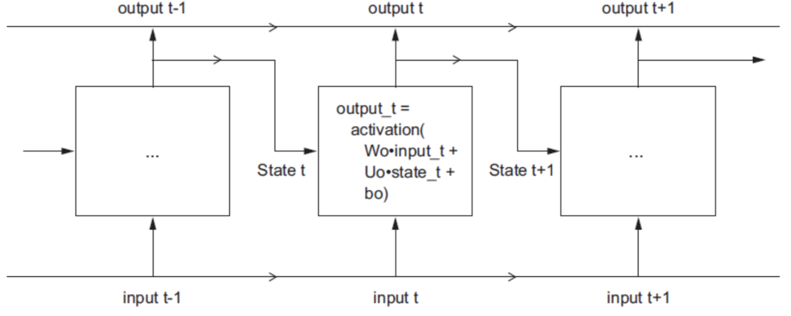

# RNN

## RNN (Recurrent Neural Network)

RNN 은 히든 노드가 방향을 가진 엣지로 연결돼 순환 구조를 이루는 인공 신경망의 한 종류이다.

sequence 길이에 관계 없이 input, output 을 받아들일 수 있는 네트워크 구조이기 때문에 필요에 따라 다양하고 유연하게 구조를 만들수 있다는 점이 RNN 의 가장 큰 장점이다.

### Problem

- vanishing gradient problem

> 그러나 RNN은 관련 정보와 그 정보를 사용하는 지점 사이 거리가 멀 경우 역전파시 gradient 가 점차 줄어 학습 능력이 크게 저하한다.

- long term depencency (장기 의존성 문제)

 

## LSTM (Long Short Term Memory)

RNN 의 vanishing gradient problem 문제를 해결하기 위해 고안된 알고리즘이다.

LSTM 은 RNN의 hidden state 에 **cell-state** 를 추가한 구조이다.

LSTM은 cell state와 hidden state 가 재귀적으로 구해지는 구조이다. 따라서 cell state의 gradient 와 hidden state의 gradient 는 직전 시점의 gradient 값에 영향을 받는다.

 

## GRU (Gated Recurrent Unit)

LSTM 과 유사하나 computation 이 더 빠르다.
