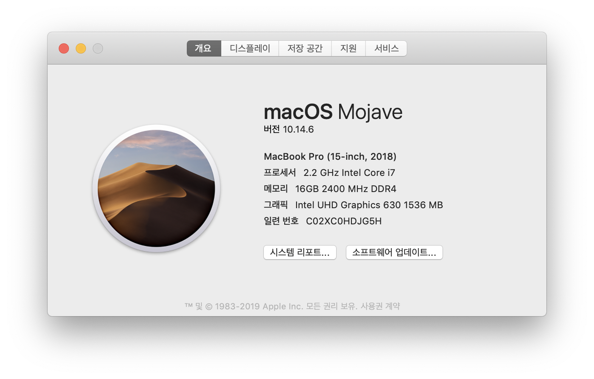
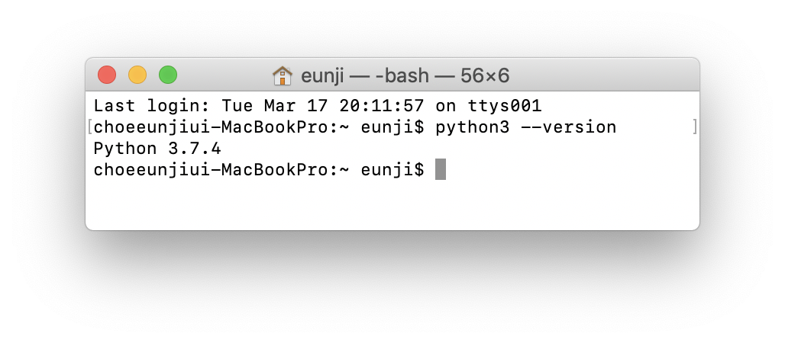
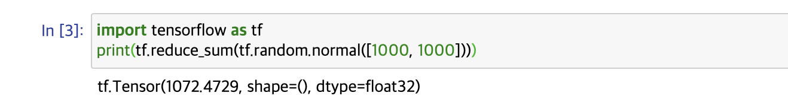

## Tensorflow 설치하기

[공식문서](https://www.tensorflow.org/install) 를 참고해 tensorflow 를 설치해 보았다.


아래는 공식문서에 나와있는 선수 환경이다.


### 설치 환경 및 HW 사양




모두 설치 환경에 만족한다.

<br/>

### 설치 방법
pip package 를 사용해 설치했다.

```
pip install tensorflow

pip install msgpack

pip install keras
```

<br/>

### 실습

jupyter notebook 으로 실행해보았다.



에러 없이 잘 실행된다.

