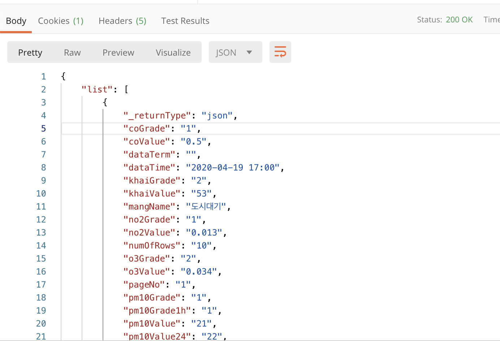
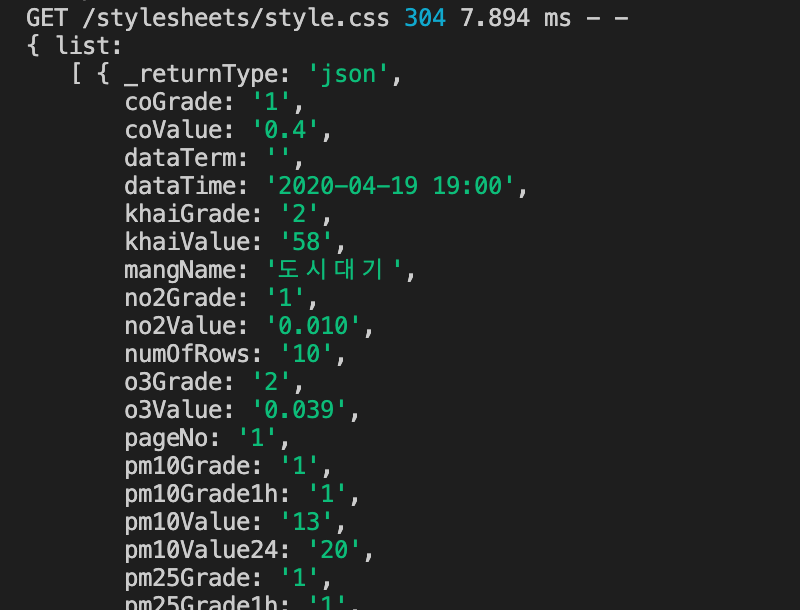
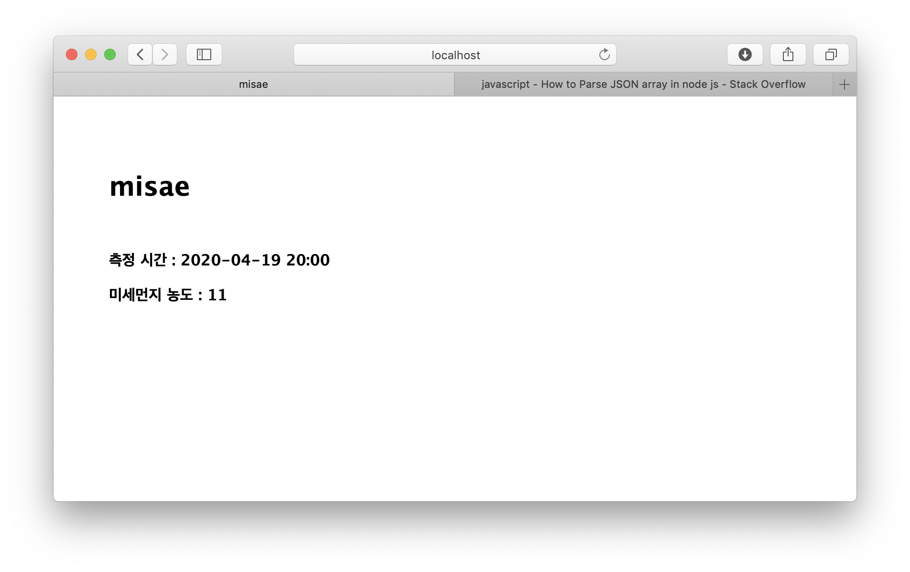

## Connect API

> 선수환경 : [한국 환경 공단 대기 오염 정보 API](https://www.data.go.kr/dataset/15000581/openapi.do) 에서 API KEY 발급 받기

### 📌 Install 

```sh
$ npm install request
```

request library 를 설치해준다.

<br/>

### 📌 Check API Work



신청한 APIKEY 를 넣어 postman 에 돌려본다. 제대로 작동함을 확인할 수 있다

<br/>

### 📌 Connect to API

```js
var request = require('request')
```
`router` 상단에 `request` 라이브러리르 불러와준다.

```js
const key = '[발급받은 APIKEY]'

const addr = 'http://openapi.airkorea.or.kr/openapi/services/rest/ArpltnInforInqireSvc/getMsrstnAcctoRltmMesureDnsty?stationName='
const addr2 = '&dataTerm=month&pageNo=1&numOfRows=10&ServiceKey=' 
const addr3 = '&ver=1.3&_returnType=json'

var myaddr = addr + encodeURI('서대문구') + addr2 + key + addr3
```

요청 문구에 한글이 들어가 있으면 에러가 발생한다. `encodeURI()` 를 사용해 한글을 encode 해준다.

```js
router.get('/misae', function(req, res, next){
  request(myaddr, function(error, response, body){
    if(error){
      console.log(error)
    }
    var obj = JSON.parse(body)
    console.log(obj) // 콘솔창에 찍어보기
  })
})
```



api 로 호출한 data 가 무사히 json 으로 parsing 되었다. 

```js
    data = obj.list[0].dataTime
    pm10 = obj.list[0].pm10Value

    res.render('apicall/misae', {title: 'misae', data:data, pm10:pm10})
```



view 에 제대로 찍힌다. API 연결 성공 ❗️
    
