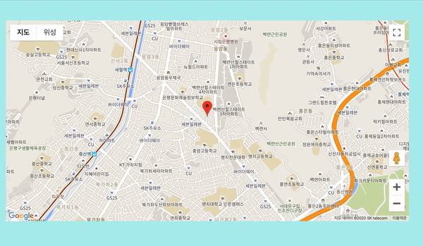

# Google map

>  선수 환경 : [구글 클라우드 플랫폼](https://cloud.google.com/gcp/?hl=ko&utm_source=google&utm_medium=cpc&utm_campaign=japac-KR-all-ko-dr-bkws-all-super-trial-e-dr-1008074&utm_content=text-ad-none-none-DEV_c-CRE_437547345765-ADGP_Hybrid+%7C+AW+SEM+%7C+BKWS+~+T1+%7C+EXA+%7C+General+%7C+1:1+%7C+KR+%7C+ko+%7C+cloud+platform+%7C+google+cloud+platform+%7C+en-KWID_43700030027797672-kwd-26415313501&userloc_1009871&utm_term=KW_google%20cloud%20platform&gclid=CjwKCAjw8df2BRA3EiwAvfZWaCRNa4sZyD-vw_WmezU7smcKIgDtel-sGigu2g9gqU755MnMP-UFBRoCAwMQAvD_BwE) 에서 API KEY 발급 받기 

<br/>

## Ready to Connect 

```js
    script(src='http://maps.googleapis.com/maps/api/js?key=[발급받은 API KEY]&callback=[Map initialize 함수 이름]')
```
script 파일을 연결시켜준다. (위는 pug 파일 작성 기준이다.)

<br/>

## View

```pug
    canvas(id='china_seoul_graph', width="800", height="500")
```
원하는 id, width, height 을 지정한 canvas view 를 만든다. 

<br/>

## Get my locatioin & Draw map

> [공식문서](https://www.w3schools.com/graphics/google_maps_basic.asp) 참조

1. `handleLocationError`
```js
function handleLocationError(browserHasGeolocation, infoWindow, pos) {
    infoWindow.setPosition(pos);
    infoWindow.setContent(browserHasGeolocation ?
                          'Error: The Geolocation service failed.' :
                          'Error: Your browser doesn\'t support geolocation.');
    infoWindow.open(map);
  }
```
내 위치 접근 허용을 거부했을 때 에러를 처리한다. 

2. `initialize`
```js
function initialize() {

    // default map
    map = new google.maps.Map(document.getElementById('map_container'), {
        center: {lat: -34.397, lng: 150.644},
        zoom: 15
    });
    infoWindow = new google.maps.InfoWindow;

    // get my location
    if (navigator.geolocation) {
        navigator.geolocation.getCurrentPosition(function(position) {
          var pos = {
            lat: position.coords.latitude,
            lng: position.coords.longitude
        };

        infoWindow.open(map);
        map.setCenter(pos);
    }, function() {
        handleLocationError(true, infoWindow, map.getCenter());
        });
    } else {
        // Browser doesn't support Geolocation
        handleLocationError(false, infoWindow, map.getCenter());
    }
}
google.maps.event.addDomListener(window, 'load', initialize);
```
처음 default map 은 내 위치 접근하기 전의 지도를 그린다. (그래서 위치, 경도를 직접 작성했다.)    

내 위치는 `navigator.geolocation` 으로 접근한다. 

<br/>

## Add Marker

```js
    var marker = new google.maps.Marker({
        position : pos,
        animation : google.maps.Animation.BOUNCE
    });
    marker.setMap(map);
```
원하는 위치에 marker를 지도에 표시할 수 있다. animation 으로 원하는 애니메이션을 지정할 수 있다. 

<br/>


## Screenshot




<br/>


### 전체 source code 

```js
function handleLocationError(browserHasGeolocation, infoWindow, pos) {
    infoWindow.setPosition(pos);
    infoWindow.setContent(browserHasGeolocation ?
                          'Error: The Geolocation service failed.' :
                          'Error: Your browser doesn\'t support geolocation.');
    infoWindow.open(map);
  }

// 지도 설정
function initialize() {

    // default map
    map = new google.maps.Map(document.getElementById('map_container'), {
        center: {lat: -34.397, lng: 150.644},
        zoom: 15
    });
    infoWindow = new google.maps.InfoWindow;

    // get my location
    if (navigator.geolocation) {
        navigator.geolocation.getCurrentPosition(function(position) {
          var pos = {
            lat: position.coords.latitude,
            lng: position.coords.longitude
        };
        var marker = new google.maps.Marker({
            position : pos,
            animation : google.maps.Animation.BOUNCE
        });
        marker.setMap(map);

        infoWindow.open(map);
        map.setCenter(pos);
    }, function() {
        handleLocationError(true, infoWindow, map.getCenter());
        });
    } else {
        // Browser doesn't support Geolocation
        handleLocationError(false, infoWindow, map.getCenter());
    }
}
google.maps.event.addDomListener(window, 'load', initialize);
```
