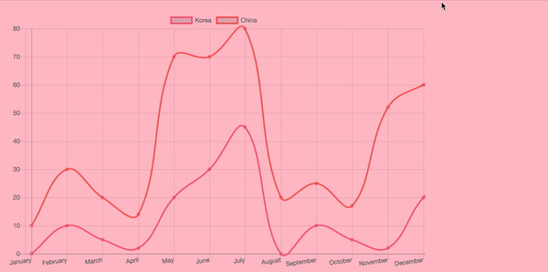

# Draw Chart

> [공식 문서](https://www.chartjs.org/docs/latest/getting-started/installation.html) 참조 

## Install Chart.js

```
$ npm install chart.js --save
```
해당 디렉토리로 들어가서 chart.js module을 install 한다.

<br/>

## Script Tag

```js
link(rel='stylesheet', href='path/to/chartjs/dist/Chart.min.css')
script(src="/Path/To/Chart.bundle.min.js")
script(src="https://cdnjs.cloudflare.com/ajax/libs/Chart.js/2.1.6/Chart.bundle.min.js")
```
Tag 작성까지 완료하면 이제 chart 를 그릴 준비가 완료 되었다 ❗️

<br/>

## View

```pug
    canvas(id='china_seoul_graph', width="800", height="500")
```
원하는 id, width, height 를 입력한 canvas 를 만든다.

<br/>

## Draw Chart

```js
$(document).ready(function(){
    var ctx = document.getElementById("china_seoul_graph").getContext("2d");
    var chart = new Chart(ctx, {
        // The type of chart we want to create
        type: "line",
        // The data for our dataset
        data: {
            labels: ["January", "February", "March", "April", "May", "June", "July", "August", "September", "October", "November", "December"],
            datasets: [
                {
                    label: "Korea",
                    borderColor: "rgb(255, 99, 132)",
                    data: [0, 10, 5, 2, 20, 30, 45, 0, 10, 5, 2, 20, 30],
                    fill: false
                },
                {
                    label: "China",
                    borderColor: "rgb(255, 99, 100)",
                    data: [10, 20, 15, 12, 50, 40, 35, 20, 15, 12, 50, 40, 35],
                    fill: false
                }
            ]
        },
        // Configuration options go here
        options: {
            responsive:false,
            maintainAspectRatio: false,
            scales: {
                yAxes: [{
                    stacked: true
                }]
            },
        }
    }); 
});
```

- `type` : 그리려는 chart의 type 을 지정할 수 있다. 
- `data` : 데이터를 입력한다. `label`, `dataset`으로 이루어져 있다.
- `options` :  별도의 option 을 지정할 수 있다. (애니메이션, 반응형, 글꼴, 크기 등등..)

<br/>

### Screenshot


