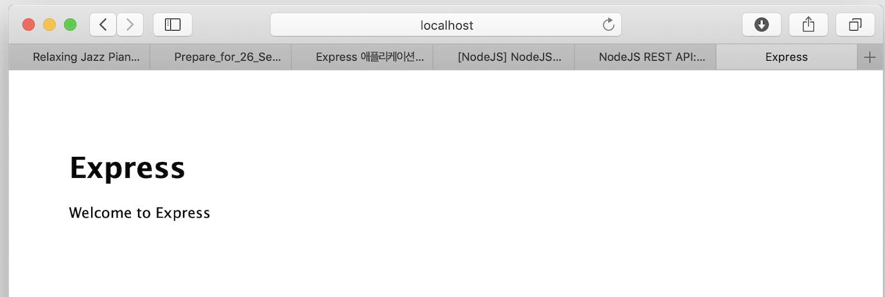

## Install Express

> 선수환경 : npm, Visual Studio

<br/>

설치를 원하는 디렉토리에 들어가서 다음 명령어를 입력한다.

```
npm install -g express-generator
```

설치 완료 후 원하는 프로젝트 명을 넣어 다음 명령어를 입력한다.

```
express [project name] -v pug
```
> 나는 html 대신 pug 를 사용하는 것이 편해 명령어 뒤에 ``` -v pug ``` 를 입력했다.

```
cd [project name]
npm install
npm start
```
방금 생성시킨 프로젝트에 들어가서 ``` npm install ``` 한 후 ``` npm start ``` 명령어로 실행시켜 보았다.




``` http://localhost:3000 ``` 주소에서 위 화면이 뜬다면 성공이다❗️

<br/>

데이터가 바뀔 때마다 다시 서버를 껐다 켜기 귀찮으므로 ``` nodemon ``` 을 설치해준다.

```
npm install nodemon
nodemon
```

개발 환경이 편리해졌다 👏 
