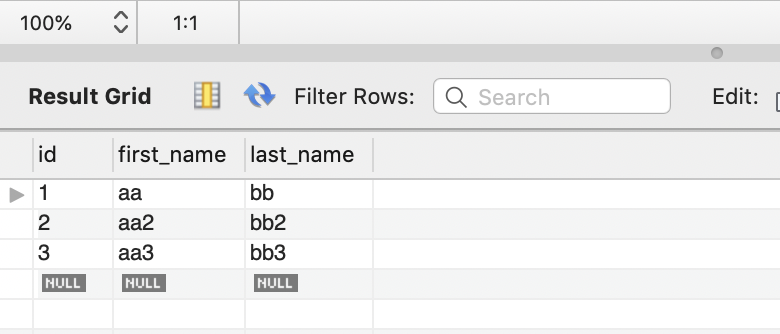
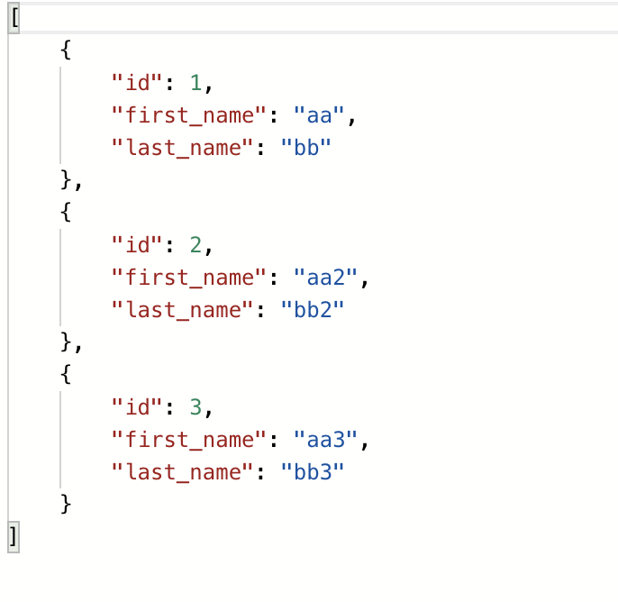
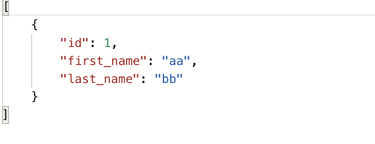
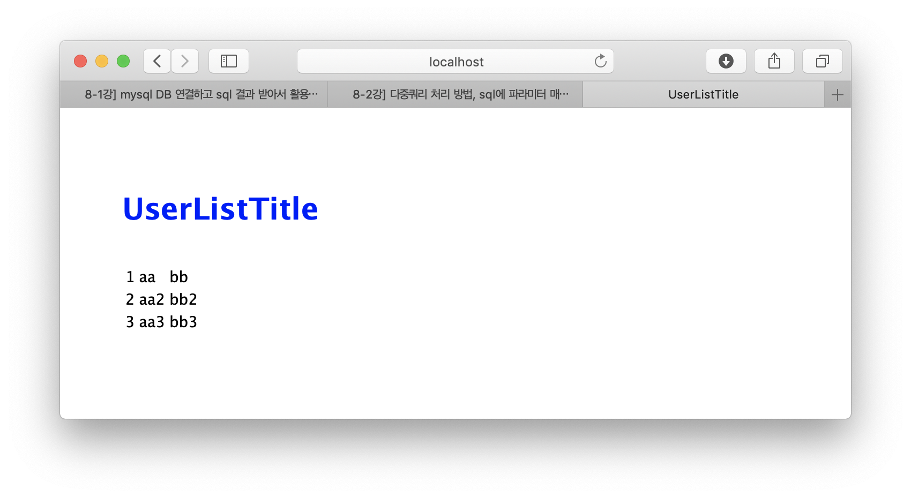
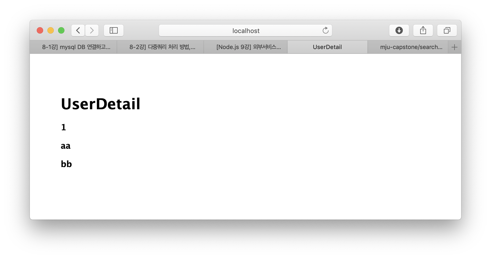

# RestAPI With MySQL 

> 선수환경 : MySQL



<br/>

### 📌 Install MySQL

```sh
$ npm i mysql
```

<br/>

### 📌 Connect to MySQL

```js
const mysql = require('mysql')
```
상단에 ```mysql``` library 를 불러와준다.

```js
const connection = mysql.createConnection({
  host: 'localhost',
  user: [username],
  password: [pw],
  database: [db name]
})
```
연결할 준비 끝❗️

<br/>

### 📌 전체 user 리스트 불러오기

```js
router.get('/', function(req, res, next) {
  var queryString = "SELECT * FROM user"

  connection.query(queryString, (err,rows,fields) => {
    res.json(rows)
  })

});
```



<br/>

### 📌 원하는 user 리스트 불러오기

```js
router.get('/:id', function(req,res,next) {
  var queryString = "SELECT * FROM user WHERE id = ?"
  var userId = req.params.id

  connection.query(queryString, [userId], (err,rows,fields) => {
    if(err){
      console.log(err)
      res.sendStatus(500)
      return
    }
    res.json(rows)
  })
})
```




<br/>


### 📌 Render Data List on View

데이터 부르고 json 형식으로 보내는 것까지 쉽게 했지만, 의외로 그 데이터를 view 에 rendering 하는데 오류가 많이 났다.   
connection.query 안에 view를 rendering 하는 걸로 해결 했다..

```js
router.get('/list', catchErrors(async (req,res,next)=> {

  var queryString = "SELECT * FROM user"

  connection.query(queryString, (err,rows,fields)=>{
    if(err){
      throw err
    } 
    console.log(rows)
    res.render('user/list', {userlist: rows, title: 'UserListTitle'})
  })
}))
```
```pug
extends ../layout

block content
    h1.custom=title
    br
    table
        tbody
            each i, idx in userlist
                tr
                    td=i.id
                    td=i.first_name
                    td=i.last_name
```




<br/>

특정 id의 user만 조회하는 경우 (데이터 1행만 조회) 는 `rows[0]` 만 입력하면 된다. 

```js
router.get('/:id', function(req,res,next) {
  var queryString = "SELECT * FROM user WHERE id = ?"
  var userId = req.params.id

  connection.query(queryString, [userId], (err,rows,fields) => {
    if(err){
      console.log(err)
      res.sendStatus(500)
      return
    }
    console.log(rows)
    res.render('user/userdetail', {title: 'UserDetail', user: rows[0]})
  })

})
```

```pug
extends ../layout

block content
    h1= title
    h3= user.id
    h3= user.first_name
    h3= user.last_name
```


