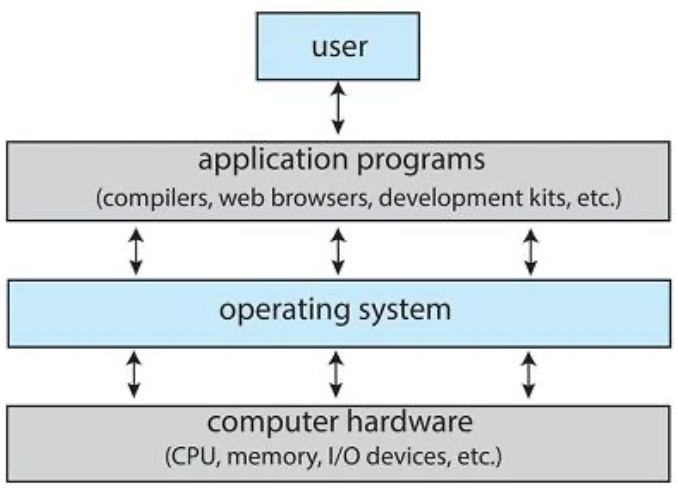
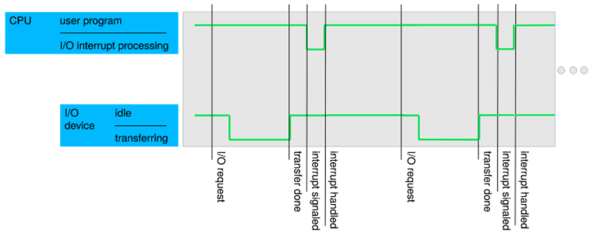

# Chapter 01 : Introduction

## What is an Operating System❓

운영체제(Operating System) 는 컴퓨터 사용자와 컴퓨터 하드웨어 간의 인터페이스로서 **중재자** 역할을 하는 시스템 소프트웨어의 일종으로, 다른 응용 프로그램이 유용한 작업을 할 수 있도록 환경을 제공해줍니다. 

운영체제는 컴퓨터 시스템의 자원들을 효율적으로 관리하며, 사용자가 컴퓨터를 편리하고 효과적으로 사용할 수 있도록 환경을 제공하는 데 목적을 두고 있습니다. 

 

## Computer System Structure

컴퓨터 시스템은 네 가지 요소로 나눌 수 있습니다. 

1. Hardware (하드웨어)
    
    - 기본 컴퓨팅 리소스 (계산용 자원) 를 제공합니다.
    - CPU(Central Processing Unit), Memory, I/O(Input/Output) Devices

2. Operating System (운영 체제)

    - 하드웨어 자원을 관리하여 응용 프로그램에 편리한 서비스를 제공합니다.
    - 응용 프로그램과 컴퓨터 하드웨어 간의 인터페이스 역할을 하는 프로그램입니다. 

3. Application programs (응용 프로그램)

    - 컴파일러, 워드 프로세서, 웹 브라우저, 데이터베이스 시스템 등과 같은 자원이 어떻게 사용될 지를 정의합니다. 

4. Users (사용자)

 

## what OS do

### User View

- PC 유저들은  편리성, 성능을 원합니다.
    > 리소스 최적화에 신경쓰지 않아도 됩니다. 
- 모바일 기기는 무선 네트워크, 터치 스크린, 음성 인식 등을 통해 상호 작용을 합니다.
- 임베디드 PC는 사용자 인터페이스가 거의 없습니다. (점점 확장되는 추세)

### System View

- resources allocator (자원 할당자) 

    > OS 는 모든 리소스를 관리합니다. 효율적이고 공정한 리소스 활용을 위한 결정을 내립니다.
- control program (제어 프로그램)

    > 프로그램 실행을 제어하여 오류나 부적절한 사용을 방지합니다. 

 

### OS Definition 

1. Kernel

    - 운영 체제의 핵심 부분으로 자원 할당, 하드웨어 인터페이스, 보안 등을 담당합니다. 
    - The one program running at all times on the computer 
    
        > 프로그램이 켜진 순간부터 꺼질 때까지 작동합니다. 

2. Middleware

    - 응용 소프트웨어가 OS로부터 제공받는 서비스 이외에 추가적으로 이용할 수 있는 서비스를 제공합니다.
    
3. System program

    - 프로그램의 개발과 실행을 위해 좀 더 편리한 환경을 구축하도록 도움을 주는 시스템 유틸리티입니다. 

 

## Computer System Organization

컴퓨터 시스템은 버스로 연결되어 있습니다. 이러한 각각의 요소들을 OS가 다루고 제어합니다. 

- 입출력 장치와 CPU는 동시에 동작합니다.
- 각 **device controller** 는 제어를 담당합니다. 각각 device 만을 위한 buffer memory 를 가지고 있습니다. 이는 device driver 라는 운영체제에 의해 관리됩니다.       
- 입출력은 device controller 의 local buffer 장치를 통해 이루어집니다. 
- CPU 는 메인 메모리의 값과 컨트롤러의 local 메모리 값을 서로 주고받을 수 있습니다. 
- device controlelr 는 CPU 와 데이터 전송을 **interrupt** 로 주고 받습니다. 

### Interrupt

- CPU 는 모든 명령을 실행한 후 **interrupt request line** 을 감지합니다. 
- CPU 가 interrupt 를 감지하고, interrupt number를 읽고 **interrupt vector** 를 통해 **interrupt handler routine** 으로 점프합니다. 

    > interrupt vector 는 모든 서비스 루틴의 주소를 가지고 있습니다. 
- **interrupt handler** 는 register 와 program counter 를 저장하여 Interrupted state 를 저장한 후, interrupt의 원인을 파악해 필요한 처리를 수행하고 상태를 복원합니다. 

