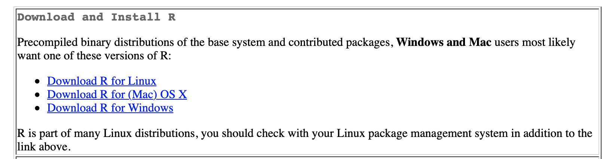
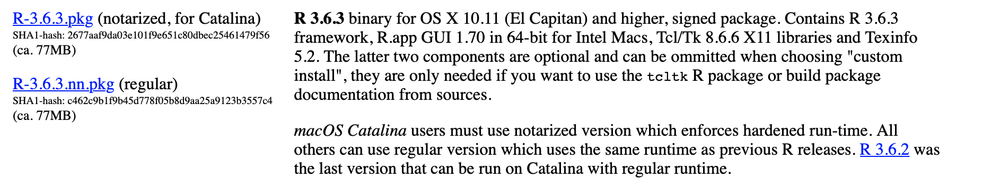
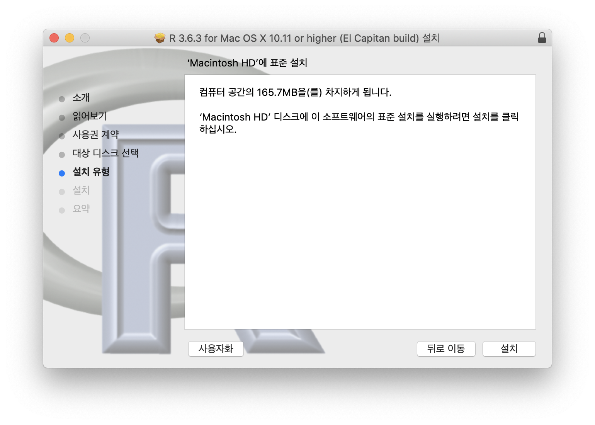
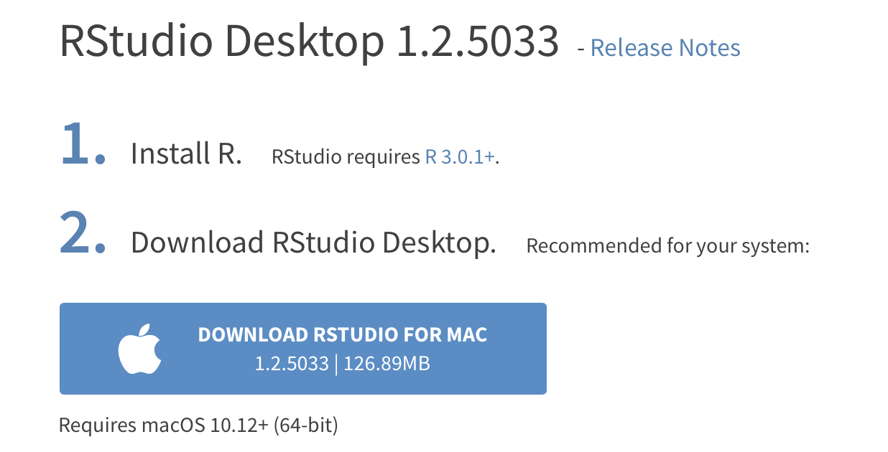

## Install R & RStudio

R과 Rstudio 를 내 PC 에 설치 해보자 🛠 

> 내 PC : macOS Mojave (10.14.6)

<br/>

### Install R

[공식 홈페이지](http://lib.stat.cmu.edu/R/CRAN/) 에 들어간다.





두 번째 ``` Download R for (Mac) OS X ``` 를 클릭한 후 본이 pc 사양에 맞는 파일을 찾아 설치한다.
> 나는 아직 Catalina 로 업데이트 하지 않아 ``` R-3.6.3.nn.pkg ``` 를 설치했다.




lauchpad 에 위 아이콘이 나오면 설치 성공이다 👏

<br/>

### Install RStudio

[공식 홈페이지](https://rstudio.com/products/rstudio/download/#download) 에 들어가 ```Download RStudio For Mac``` 을 클릭한다.



 👈 launchpad 에서 이 아이콘을 누른다.


위 화면이 나오면 설치 성공이다 👏👏
