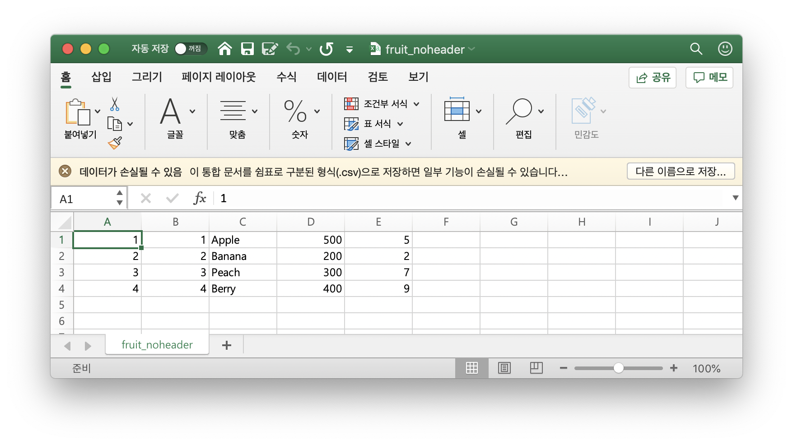

# FileData 🗂

### 📌 Read & Write FileData

```r
> no=c(1,2,3,4)
> name=c("Apple","Banana","Peach","Berry")
> price=c(500,200,300,400)
> qty=c(5,2,7,9)
> fruit=data.frame(No=no, Name=name, Price=price, Quantity=qty)
> fruit
  No   Name Price Quantity
1  1  Apple   500        5
2  2 Banana   200        2
3  3  Peach   300        7
4  4  Berry   400        9
> save(fruit, file="test.dat") # working directory 에 fruit데이터 저장
```


working directory 에 ```test.dat``` 파일이 새로 생겼음을 확인할 수 있다.

```r
> rm(fruit) # fruit 데이터 삭제 
> fruit
Error: object 'fruit' not found
> load("test.dat") # 파일 읽기
> fruit
  No   Name Price Quantity
1  1  Apple   500        5
2  2 Banana   200        2
3  3  Peach   300        7
4  4  Berry   400        9
```

<br/>

### 📌 Read & Write CSV Data

CSV : Comma Seperated Value

```r
> write.csv(fruit, "fruit.csv")
```


working directory 에 ```fruit.csv``` 파일이 새로 생겼음을 확인할 수 있다.

```r
> rm(fruit)
> fruit
Error: object 'fruit' not found
> fruit=read.csv("fruit.csv")
> fruit
  X No   Name Price Quantity
1 1  1  Apple   500        5
2 2  2 Banana   200        2
3 3  3  Peach   300        7
4 4  4  Berry   400        9
```

위 명령올 csv 파일을 저장하고 불러올 수 있다.



위와 같이 헤더가 없는 경우 데이터를  읽어보자 


```r
> fruit2<-read.csv("fruit_noheader.csv", header = FALSE)
> fruit2
  V1 V2     V3  V4 V5
1  1  1  Apple 500  5
2  2  2 Banana 200  2
3  3  3  Peach 300  7
4  4  4  Berry 400  9
> names(fruit2)<-c("X", "No", "Name", "Price", "Quantity") # 헤더를 직접 넣는다.
> fruit2
  X No   Name Price Quantity
1 1  1  Apple   500        5
2 2  2 Banana   200        2
3 3  3  Peach   300        7
4 4  4  Berry   400        9
```

 
