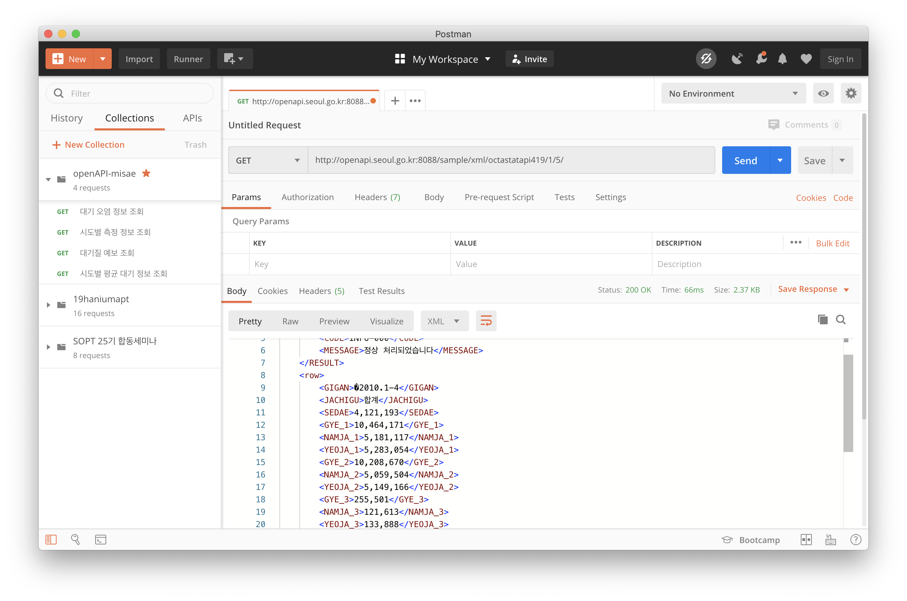

# Use API with R

> 참고 자료 : 빅데이터 기술 특론 (2020-1)

## 📌 Check Postman 



불러오고 싶은 API 주소를 입력해 제대로 돌아가는지 postman 에서 확인해 본다.

<br/>

## 📌 Install Packages

xml data load 에 필요한 package 를 install 해준다.

```r
install.packages("XML")
library(XML)
```

<br/>

## 📌 Load XML

API 호출 주소를 사용해 XML 형식의 데이터를 불러온다.

```r
> url <- "http://openapi.seoul.go.kr:8088"
> key <- "[발급받은 인증키]"
> api.url<-paste(url, key, "xml", "octastatapi419","1","5", sep="/")
>
> parsedXML <- xmlParse(api.url)
> rowXml <- getNodeSet(parsedXML, "//row")
> api_data <- xmlToDataFrame(rowXml, stringsAsFactors = F)
>
> str(api_data)
'data.frame':	5 obs. of  14 variables:
 $ GIGAN                : chr  "2010.1-4" "2010.1-4" "2010.1-4" "2010.1-4" ...
 $ JACHIGU              : chr  "합계" "종로구" "중구" "용산구" ...
 $ SEDAE                : chr  "4,121,193" "74,300" "58,472" "107,407" ...
 $ GYE_1                : chr  "10,464,171" "177,023" "138,102" "250,844" ...
 $ NAMJA_1              : chr  "5,181,117" "88,225" "69,175" "123,295" ...
 $ YEOJA_1              : chr  "5,283,054" "88,798" "68,927" "127,549" ...
 $ GYE_2                : chr  "10,208,670" "168,158" "129,786" "238,366" ...
 $ NAMJA_2              : chr  "5,059,504" "84,088" "65,216" "116,764" ...
 $ YEOJA_2              : chr  "5,149,166" "84,070" "64,570" "121,602" ...
 $ GYE_3                : chr  "255,501" "8,865" "8,316" "12,478" ...
 $ NAMJA_3              : chr  "121,613" "4,137" "3,959" "6,531" ...
 $ YEOJA_3              : chr  "133,888" "4,728" "4,357" "5,947" ...
 $ SEDAEDANGINGU        : chr  "2.48" "2.26" "2.22" "2.22" ...
 $ N_65SEISANGGORYEONGJA: chr  "956,414" "20,925" "16,208" "28,436" ...
```

- `xmlParse()` : api 호출 주소를 통해 xml을 불러온다.
- `getNodeSet()` : XML 중 실제 데이터가 담긴 원하는 태그만 데이터 프레임으로 변환한다.
- `xmlToDataFrame()` : XML 데이터를 dataframe 으로 변환한다.

```r
> for(i in 3:14){
>   api_data[,i] <- as.numeric(gsub(",","",api_data[,i]))
> }

> str(api_data)
data.frame':	5 obs. of  14 variables:
 $ GIGAN                : chr  "2010.1-4" "2010.1-4" "2010.1-4" "2010.1-4" ...
 $ JACHIGU              : chr  "합계" "종로구" "중구" "용산구" ...
 $ SEDAE                : num  4121193 74300 58472 107407 126942
 $ GYE_1                : num  10464171 177023 138102 250844 316113
 $ NAMJA_1              : num  5181117 88225 69175 123295 158228
 $ YEOJA_1              : num  5283054 88798 68927 127549 157885
 $ GYE_2                : num  10208670 168158 129786 238366 308144
 $ NAMJA_2              : num  5059504 84088 65216 116764 154389
 $ YEOJA_2              : num  5149166 84070 64570 121602 153755
 $ GYE_3                : num  255501 8865 8316 12478 7969
 $ NAMJA_3              : num  121613 4137 3959 6531 3839
 $ YEOJA_3              : num  133888 4728 4357 5947 4130
 $ SEDAEDANGINGU        : num  2.48 2.26 2.22 2.22 2.43
 $ N_65SEISANGGORYEONGJA: num  956414 20925 16208 28436 30704
```

- `as.numeric()` : 데이터를 num 형으로 변환한다.
