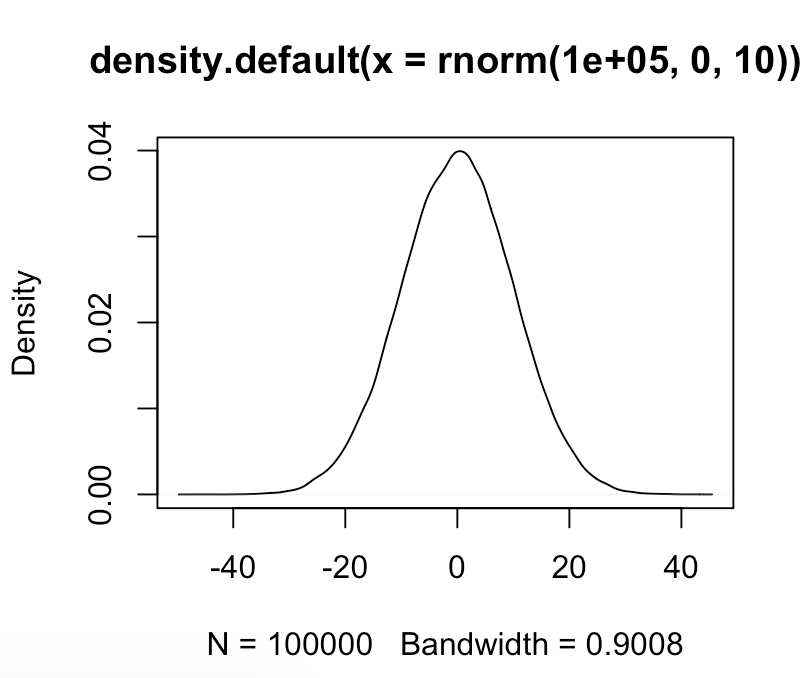
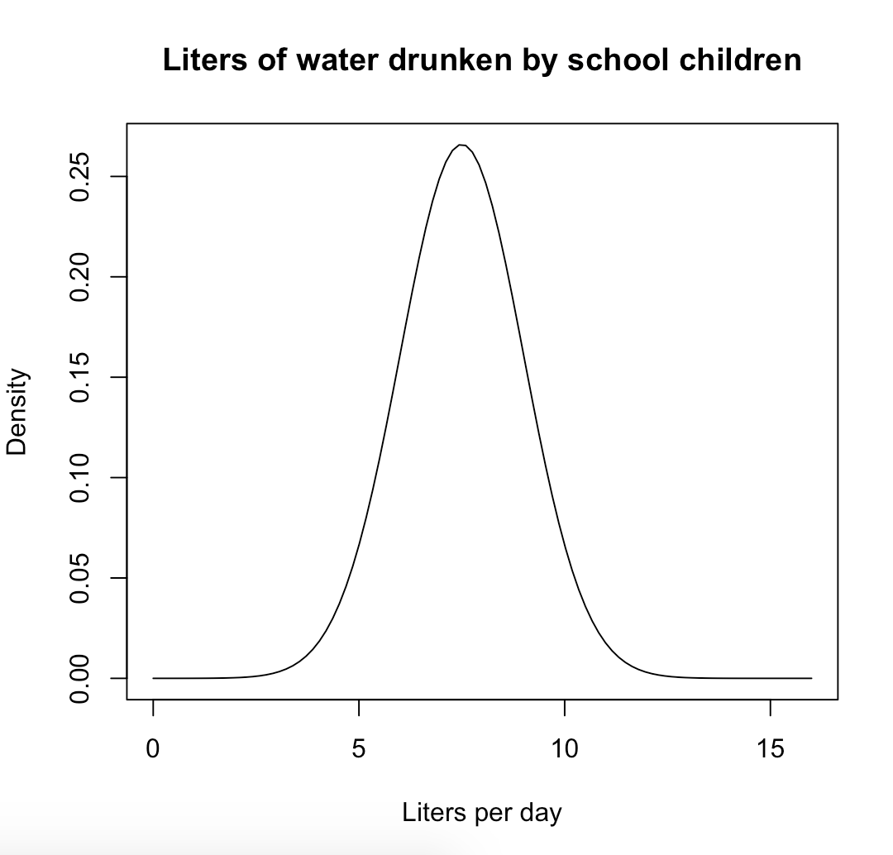
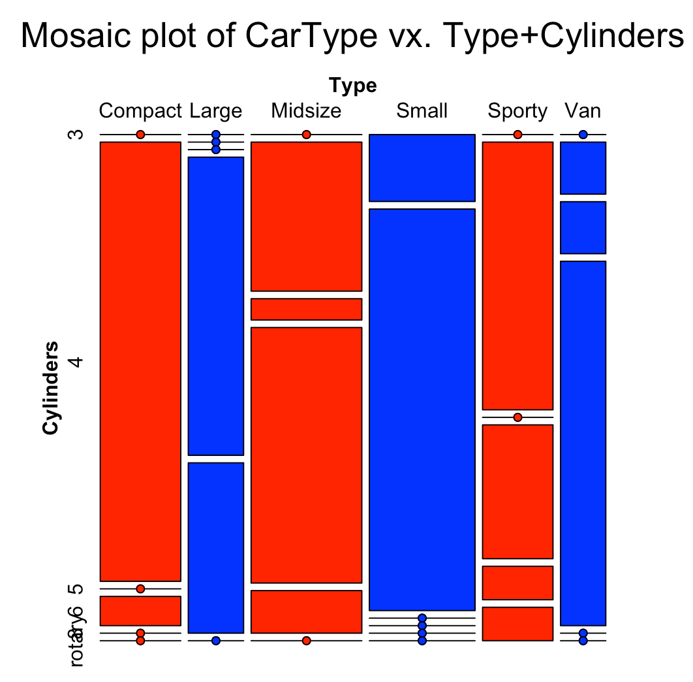

# Statistical Analysis (1)

> 참고 자료 : R 통계분석 (2019-1)

### 분석 방법

- 차이 검정
    - 집단간 차이 분석
    - 평균 검정 (T-test), 분산 분석 (ANOVA: ANalysis Of Variance)
- 관계 검정
    - 변수와 변수의 관계를 검정
    - 상관분석, 회귀분석, 교차분석, 로지스틱 회귀 분석
- 요인 분석
- 기타
    - 군집 분석, 데이터 마이닝 등 


## 1. 난수 생성 및 분포 함수

### 난수 생성

```r
rnorm(100, 0, 10) # 평균 0, 표준편차 10인 정규분포로부터 난수 100개 생성 
plot(density(rnorm(100000, 0, 10)))

pnorm(0) # 0.5
qnorm(0.5) # 0. 전체 누적값을 0.5로 만들어 주는 x의 값
```


- `dnorm` : 확률 밀도 함수 (probability density function). 확률 분포 함수값
- `pnorm` : 누적 분포 함수 (cumulative distribution function). 밀도 함수. 누적된 값의 면적
- `qnorm` : p분포 함수의 역함수 (특정 누적 확률을 생성하는 값)

### 확률 밀도 함수의 활용

어린이가 하루 마시는 물의 양이 평균 7.5이고 표준편차가 1.5인 정규분포를 따른다고 가정하자.

1. 어린이가 4리터 이하의 물을 마실 확률은?

```r
x=seq(0,16,length=100) # 0:min, 16:max
y=dnorm(x,mean=7.5, sd=1.5) # 정규분포의 확률 분포

plot(x,y,type="l",
     xlab="Liters per day",
     ylab="Density",
     main="Liters of water drunken by school children"
     )

# 4리터 이하의 물을 마실 확률
pnorm(4, mean=7.5, sd=1.5, lower.tail = TRUE) # 0.009815329
```



2. 어린이가 8리터 이하의 물을 마실 확률과 정규 곡선에 해당 영역을 지정하여 색칠하시오.

```r
plot.new() # plot 초기화

plot(x,y,type="l",
     xlab="Liters per day",
     ylab="Density" )

lower=8
upper=15

i= (x>=lower & x<upper) 
polygon(c(lower,x[i],upper), c(0,y[i],0), col="red")
abline(h=0, col="gray")

# 확률 계산
pb = round(pnorm(8, mean=7.5, sd=1.5, lower.tail=FALSE), 2) # 0.37
pb.results = paste("Cumulative probability of child drinking > 8L/day", pb, sep=":")
title(pb.results)

```


<br/>

## 2. 기초 통계량

### 분할표

대상이 되는 데이터의 성격에 따라 명목형 (Categorical) 또는 순서형 (Ordinal) 데이터로 분류한 후에 도수 (Frequency) 를 표 형태로 나타낸 것이다.

R 분할표 작성 함수

```r
table([data frame 이름])
xtabs([도수 저장 변수] ~ [분류를 나타내는 변수])
```

1. 주어진 데이터에서 특정 문자의 출현 횟수를 기반으로 분할표 작성

```r
table(c("a", "b", "a", "d", "e", "d", "a", "c", "a", "b"))

a b c d e 
4 2 1 2 1 
```


2. `Xtabs` 를 이용한 분할표 작성

```r
CTable <- data.frame(x=c("3", "7", "9", "10"),
y=c("A1", "B2", "A1", "B2"),
num=c(4,6,2,9))

# CTable 의 모습
   x  y num
1  3 A1   4
2  7 B2   6
3  9 A1   2
4 10 B2   9

# CTable 에서 num을 기준으로 분할표를 만들어 보자.

# x에 대한 num의 값이 매칭
xtabs(num~x, data=CTable)

x
10  3  7  9 
 9  4  6  2 
 
# y값은 A1, B2 2가지가 있는데, 이것에 대한 num의 y합이 분할표로 구성된다.
xtabs(num~y, data=CTable)

y
A1 B2 
 6 15

# num의 값을 x와 y로 구성된 테이블에 넣는다.
tmp<-xtabs(num~x+y, data=CTable)


    y
x    A1 B2
  10  0  9
  3   4  0
  7   0  6
  9   2  0
```

3. `margin.table` 을 사용한 분할표 조작 

```r
margin.table(tmp,1) # 행에 대한 합 (1=행)
x
10  3  7  9 
 9  4  6  2 
 
margin.table(tmp,2) # 열에 대한 합 (2=열)
y
A1 B2 
 6 15 

margin.table(tmp) # 전체 데이터의 합
[1] 21
```

> 예제 : 성별에 따른 입학 허가 여부를 table 형태로 작성하고, mosaic 그래프로 가시화 하라.

```r
library(MASS)
library(grid)
library(vcd)
data("Cars93")

str(Cars93)

car_table1<-with(Cars93, table(Type, Cylinders))
car_table2<-xtabs(~Type+Cylinders, data=Cars93)
# car_table1, car_table2 모두 동일함

# mosaic plot : categorical data 가시화 
mosaic(car_table2, 
       gp=gpar(fill=c("Red", "Blue")),
       direction = "v",
       main="Mosaic plot of CarType vx. Type+Cylinders")
```


<br/>

## 3. 데이터 검정 (적합도 검정)

### 가설 검정

**H0: 귀무 가설 (null hypothesis)**
- 대립 가설의 반대 주장으로 통계적 검정의 대상이 되는 가설
- 두 현상 간에 관련이 없다.

**H1: 대립 가설 (alternative hypothesis)**
- 연구자가 적극적으로 입증하고자 하는 가설
- 두 현상 간에 관련이 있다.
- '같지 않다', '작다', '크다' 형태가 있음
    - Two sided test : 양측 검정으로 같지 않음을 검정
    - One sided test : 크거자 작음을 검정
    
**p-value**   

귀무 가설을 참이라고 생각했을 때 주어진 데이터 또는 그보다 극단적인 데이터가 관측될 확률

기각역을 0.05 (귀무 가설에 95% 의 신뢰도를 줌) 로 둔 경우 p-value 가 0.05보다 작으면   
- 귀무 가설이 참이라 믿었는데 관찰된 데이터는 그 가정하에서는 좀처럼 볼 수 없음 >> 같은 분포 아님.
- 귀무 가설이 사실이 아니라고 볼 수 밖에 없으므로 대립 가설을 참이라고 판단 >> 귀무 가설 기각. 대립 가설 채택

기각역을 0.05(귀무 가설에 95%의 신뢰를 줌) 로 둔 경우 p-value 가 0.05보다 크면 귀무 가설 채택

<br/>

### 1. 카이 제곱 검정 (Chi-squared Test)

명목형 변수가 차이가 있는지 검정

- 귀무 가설 : 차이가 없다. 관련이 없다.
- 대립 가설 : 차이가 있다. 관련이 있다.

```r
# chi-squared test
child1<-c(5,11,1)
child2<-c(4,7,3)
Toy<-cbind(child1, child2)
rownames(Toy) <-c("car", "truck", "doll")

chisq.test(Toy)

    Pearson's Chi-squared test

data:  Toy
X-squared = 1.7258, df = 2, p-value = 0.4219

Warning message:
In chisq.test(Toy) : Chi-squared approximation may be incorrect
```
p-value 가 0.05보다 큼 > 귀무 가설 채택 > **관련이 없다** 판정

<br/>

### 2. 피셔 검정 (Fisher Test)

표본 수가 적거나 분할표가 치우치게 분포된 경우에 적용

```r
fisher.test(Toy)

    Fisher's Exact Test for Count Data

data:  Toy
p-value = 0.5165
alternative hypothesis: two.sided
```
p-value 가 0.05보다 큼 > 귀무 가설 채택 > **관련이 없다** 판정

<br/>

> 예제 : 학생들의 성별에 따라 운동량에 차이가 있는가?

```r
library(MASS)
data("survey")
str(survey) # 데이터 확인

SexExer=xtabs(~Sex+Exer, data=survey)
SexExer

chisq.test(SexExer)


    Pearson's Chi-squared test

data:  SexExer
X-squared = 5.7184, df = 2, p-value = 0.05731


# p-value>0.05 
# 귀무 가설 채택 (관계 없음)
```

<br/>

### 3. 샤피로 윌크 검정 (Shapiro-Wilk Test)

데이터가 정규 분포를 하는지 검정

- 귀무 가설 : 정규 분포를 한다.
- 대립 가설 : 정규 분포가 아니다.

```r
shapiro.test(rnorm(100, mean=5, sd=3))

    Shapiro-Wilk normality test

data:  rnorm(100, mean = 5, sd = 3)
W = 0.99325, p-value = 0.9025
```
p값이 0.05보다 큼 -> 귀무 가설 채택 -> 정규 분포를 한다.

