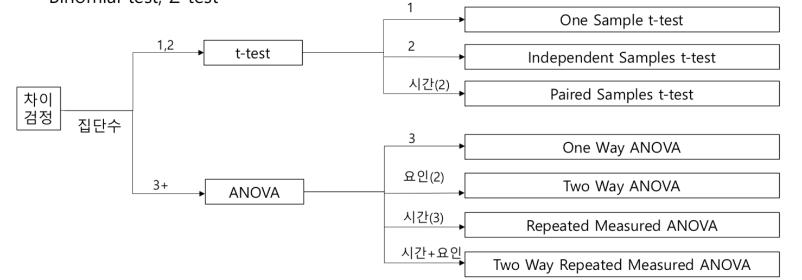

# Statistical Analysis (2)

## 차이 분석 (검정)

- 하나, 두개 또는 그 이상의 데이터 집합이 차이가 있는지를 검정
- 기법
    - T-test, Paired-T test
    - F-test, ANOVA(ANalysis Of VAriance)
    - Binomial test, Z-test
    

 

## T-test

- 하나 또는 두 개 집단의 평균을 비교하는 Parametric Test (모수적 감정법)
- 사용 조건 : 측정값이 **정규 분포** 를 하며, 평균이 그 집단의 대표값 역할을 수행하는 경우
    - 반드시 `shapiro test` 를 사용해 정규 분포인지 확인 하고 차이 분석 진행하기

