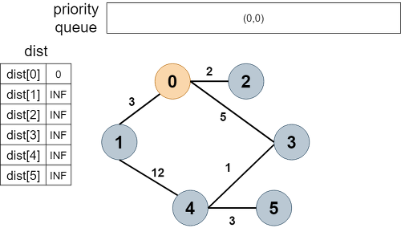
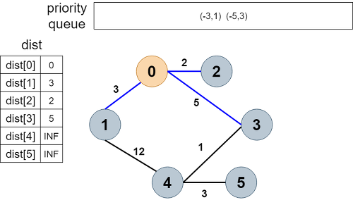
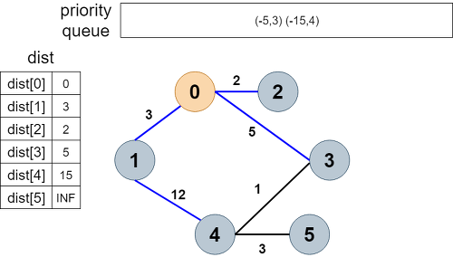
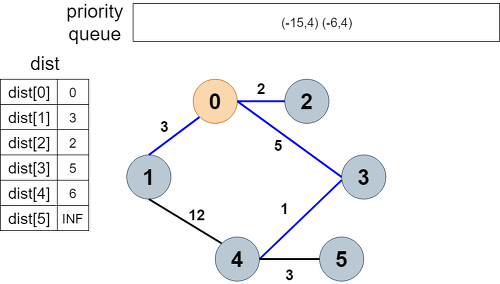

## Dijkstra algorithm

다익스트라 알고리즘 (Dijkstra algorithm) 은 **한 노드에서 다른 모든 노드까지의 최단 거리** 를 구하는 알고리즘입니다. 방향 그래프, 무방향 그래프 모두 상관 없으나, 가중치가 음수인 edge 가 단 하나라도 존재하면 이 알고리즘은 사용할 수 없습니다.

---

이 알고리즘은 최단 거리를 구하는 것이므로 **BFS** 를 기반으로 작동합니다. 

```c++
#include <vector>
#include <iostream>
#include <queue>
 
#define MAX_V 100
#define INF 99999999
using namespace std;

vector<pair<int, int> > adj[100]; // 그래프

vector<int> dijkstra(int start, int V) {
    vector<int> dist(V, INF);
    dist[start] = 0;
    priority_queue<pair<int, int> > q;
    q.push(make_pair(0, start));
 
    while (!q.empty()) {
        int cost = -q.top().first;
        int from = q.top().second;
        q.pop();
 
        if (dist[from] < cost) continue;
 
        for (int i = 0; i < adj[from].size(); i++) {
            int to = adj[from][i].first;
            int distFromTo = cost + adj[from][i].second;
            if (distFromTo < dist[to] ) {
                dist[to] = distFromTo;
                q.push(make_pair(-distFromTo, to));
            }
        }
    }
    return dist;
}

int main(int argc, char **argv)
{
    int E, V; // 정점 개수, 간선 개수 
    printf("[input] vertex edge :");
    scanf("%d %d", &V, &E);
 
    for (int i = 0; i < E; i++) {
        printf("[input] from to cost :");
        int from, to, cost; // 시작 정점, 끝 정점, 비용
        scanf("%d %d %d", &from, &to, &cost);
        adj[from].push_back(make_pair(to, cost));
        adj[to].push_back(make_pair(from, cost));
    }
 
    printf("===dijkstra===\n");
    vector<int> dist = dijkstra(0, V);
    for (int i = 0; i < V; i++) {
        printf("from 0 to %d : %d\n", i, dist[i]);
    }
    return 0;
}

```

다익스트라 알고리즘은 `priority queue` 를 사용합니다. 정점으로부터 **가장 작은 값으로 연결**되어 있는 정점을 꺼내는 것이 더 효율적이기 때문입니다. 

`priority queue` 는 가장 큰 값을 먼저 꺼내옵니다. 다익스트라 에서는 가장 작은 값이 필요하므로 `-` 를 붙여서 push 하면 가장 큰 값으로 연결된 정점이 가장 나중에 pop 됩니다. (가장 작은 값으로 연결된 정점이 먼저 pop됩니다.) 

<br/>

<div align="center"></div>

초기 상태입니다. 최단 거리 `dist` 는 각각 무한대로 초기화 시킵니다. 이 때, 시작 노드(자기 자신) 까지의 최단 거리는 0이므로 `dist[0] = 0` 으로 초기화 시킵니다. (아직 while문 돌기 전)


<div align="center"></div>

첫 while문을 돌며 우선순위 큐에 저장된 (0,0) 을 가져옵니다. 그 후 첫 while 루프를 돌면서 큐에 저장된 (0,0)을 가져옵니다. 0은 dist[0]보다 작지 않기 때문에 if문에 걸리지 않고 for루프를 돌게 됩니다. 주변에 가장 작은 값으로 연결된 정점은 2, 1, 3이지요. 그래서 그에 대응되는 거리 2, 3, 5와 함께 우선 순위 큐에 저장합니다. 이 때 우선순위 큐는 큰 값이 먼저 선정되기 때문에 음수를 붙여서 -2,-3,-5로 바꾸어서 넣어줍니다.


<div align="center"></div>

우선순위 큐에서 2를 꺼내올때 이미 dist[2]는 2로, dist[2]보다 2가 더 작지 않으므로 if 조건문에 걸려 continue됩니다. (더 이상의 최단 거리 update 없음)


<div align="center"></div>

이 후 (-3, 1)을 꺼내옵니다. 정점 1에서 연결된 정점 중 가장 가까운 정점은 4입니다. 그렇기 때문에 dist[4]를 15(3 + 12)로 수정하고 이 정보를 우선순위 큐에 저장합니다.


<div align="center"></div>

이제 (-5,3)을 꺼내올 차례입니다. dist[3]은 5이고, 큐에서 꺼내온 값 역시 5이므로 if문에 걸리지 않고 for루프를 돕니다. 이제 3에 연결되어 있는 정점은 4로 연결된 cost가 1인 간선입니다. 그래서 그전에 있던 dist[3]과 4로 연결된 간선의 cost 1을 더한 값(6)과 dist[4]와 연결된 값과 비교해보니 6이 더 작으므로 dist[4]=6으로 갱신하고 (-6,4)를 큐에 집어 넣습니다.

여기서 우선순위 큐를 사용하는 이유가 나옵니다. 만일 순서를 고려하지 않고 (-5, 3)이 큐에 맨 끝에 위치해있다면 이러한 갱신을 맨끝에 하게 되어 for루프를 돌게 되는 시간적인 낭비가 있게 되는 겁니다. 

그렇기 때문에 가장 비용이 낮은 것이 먼저 나오는 것이 유리하다는 것이죠.


<div align="center"></div>

