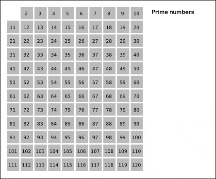

## 에라토스테네스의 체 

> 고대 그리스의 수학자 에라토스테네스가 만들어 낸 소수를 찾는 방법.   
이 방법은 마치 체로 치듯이 수를 걸러낸다고 하여 **'에라토스테네스의 체** '라고 부른다. 



> 간단히 나타내 본 아리스토테네스의 체 알고리즘 

<br/>

### 구현 과정

| |2|3|4|5|6|7|8|9|10|
|--|--|--|--|--|--|--|--|--|--|
|11|12|13|14|15|16|17|18|19|20|
|21|22|23|24|25|26|27|28|29|30|
|31|32|33|34|35|36|37|38|39|40|
|41|42|43|44|45|46|47|48|49|50|
|51|52|53|54|55|56|57|58|59|60|
|61|62|63|64|65|66|67|68|69|70|
|71|72|73|74|75|76|77|78|79|80|
|81|82|83|84|85|86|87|88|89|90|
|91|92|93|94|95|96|97|98|99|100|
|101|102|103|104|105|106|107|108|109|110|
|111|112|113|114|115|116|117|118|119|120|

120까지의 모든 소수를 구한다고 해 보자.   
에리스토테네스의 체는 2부터 120까지의 수를 배열에 모두 넣은 후 소수가 아닌 것들으 모두 체크해버리는 것이다.   
즉, **체크가 안 된 수들이 소수** 이다.

<br/>

1. 2를 제외한 2의 배수 지우기

| |2|3||5||7||9||
|--|--|--|--|--|--|--|--|--|--|
|11||13||15||17||19||
|21||23||25||27||29||
|31||33||35||37||39||
|41||43||45||47||49||
|51||53||55||57||59||
|61||63||65||67||69||
|71||73||75||77||79||
|81||83||85||87||89||
|91||93||95||97||99||
|101||103||105||107||109||
|111||113||115||117||119||

<br/>

2. 3을 제외한 3의 배수 지우기

| |2|3||5||7||||
|--|--|--|--|--|--|--|--|--|--|
|11||13||||17||19||
|||23||25||||29||
|31||||35||37||||
|41||43||||47||49||
|||53||55||||59||
|61||||65||67||||
|71||73||||77||79||
|||83||85||||89||
|91||||95||97||||
|101||103||||107||109||
|||113||115||||119||

<br/>

3. 4의 배수는 지울 필요 없다 (2의 배수에서 이미 지워짐)   
2,3 다음으로 남아있는 가장 작은 수인 5를 제외한 5의 배수를 지운다.

| |2|3||5||7||||
|--|--|--|--|--|--|--|--|--|--|
|11||13||||17||19||
|||23||||||29||
|31||||||37||||
|41||43||||47||49||
|||53||||||59||
|61||||||67||||
|71||73||||77||79||
|||83||||||89||
|91||||||97||||
|101||103||||107||109||
|||113||||||119||
<br/>


📌 &nbsp; 이런 식으로 남은 것들의 2배수, 3배수, ... n배수를 지우다 보면 소수만 남는다.   
이미 정해진 소수의 배수인 것들은 지워서 소수를 구하는 방법이 ***아리스토테네스의 체*** 이다.

📌 &nbsp; 근데 2의 배수를 지우고, 3의 배수를 지우고 하면 5의 배수를 지울 때 2,3의 배수들이 이미 한 번 지운게 겹친다.   
**이런 중복이 없을 때부터 배수를 지우려면 제곱한 수 부터 배수를 지우면 된다.** 

📌 &nbsp; 5의 배수를 지운다면, 5의 제곱인 25부터 25+(5 * 1), 25+(5 * 2), 25 + (5 * 3) ... 이런 식으로 배수를 지운다.   
이렇게 하면 그 전에 이미 지워져 있는 배수들은 건너 뛰게 된다.

📌 &nbsp;  ```n^2 + i*n ``` (i는 0부터 증가)

<br/>

> 참고하면 좋은 알고리즘 문제  [백준 - 1929번 소수 구하기](https://www.acmicpc.net/problem/1929)
