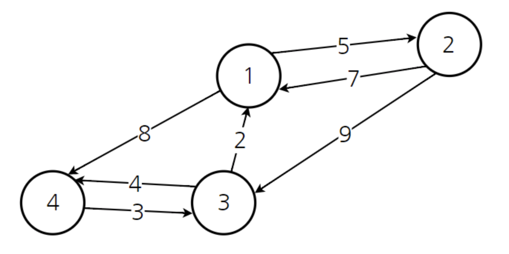

## Floyd-Warshall (플로이드-워셜 알고리즘)
> 그래프에서 모든 꼭짓점 사이의 최단 경로의 거리를 구하는 알고리즘이다. 
음수 가중치를 갖는 간선도 순환만 없다면 잘 처리된다. 제일 바깥쪽 반복문은 거쳐가는 꼭짓점이고, 두 번째 반복문은 출발하는 꼭짓점, 세 번째 반복문은 도착하는 꼭짓점이다. 

- '모든 정점' 에서 '모든 정점' 으로의 최단 경로를 구하고 싶다면 **플로이드 워셜 알고리즘** 을 사용해야 한다.
- 핵심 아이디어는 **'거쳐가는 정점'** 을 기준을 최단 거리를 구하는 것이다.
- 기본적으로 다이나믹 프로그래밍(DP) 기술에 의거한다.
- 최단 경로를 찾기에 좋은 알고리즘이다.

<br/>
<br/>



위와 같은 그래프가 존재한다고 가정할 때, 각각의 정점이 다른 정점으로 가는 비용을 이차원 배열의 형태로 출력한다면 다음과 같다.

|     |1|2|3|4|
|-----|-|-|-|-|
|**1**|0|5|∞|8|
|**2**|7|0|9|∞|
|**3**|2|∞|0|4|
|**4**|∞|∞|3|0|

<br/><br/>

1️⃣ 노드1 을 거쳐가는 경우

**노드A 에서 노드B 로 가는 최소 비용 VS 노드A 에서 노드1로 가는 비용 + 노드1에서 노드B로 가는 비용**
- 다음 두 식을 비교해서 필요한 부분을 갱신한다.
- 즉 노드1을 거쳐서 가는 경우가 더 빠른 경우가 존재한다면 빠른 경우로 최소 비용을 계산한다.


|     |1|2|3|4|
|-----|-|-|-|-|
|**1**|0|5|∞|8|
|**2**|7|0|9|15|
|**3**|2|7|0|4|
|**4**|∞|∞|3|0|

<br/>

2️⃣ 노드2 를 거쳐가는 경우

|     |1|2|3|4|
|-----|-|-|-|-|
|**1**|0|5|14|8|
|**2**|7|0|9|15|
|**3**|2|7|0|4|
|**4**|∞|∞|3|0|

<br/>
...
<br/>

4️⃣ 노드 4까지 수행한 후 (최종)

|     |1|2|3|4|
|-----|-|-|-|-|
|**1**|0|5|11|8|
|**2**|7|0|9|13|
|**3**|2|7|0|4|
|**4**|5|10|3|0|

<br/>

## source code
```C++
void floyd(){
    for(int k=0; k<n; k++){ // k : 거쳐가는 노드
        for(int i=0; i<n; i++){ // i : 출발 노드
            for(int j=0; j<n; j++){ // j : 도착 노드
                if(d[i][k] + d[k][j] < d[i][j]){
                    d[i][j] = d[i][k] + d[k][j];
                }
            }
        }
    }
}
```

- 시간 복잡도 : O(n^3) 
