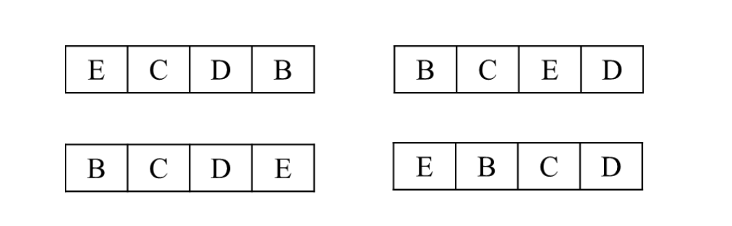
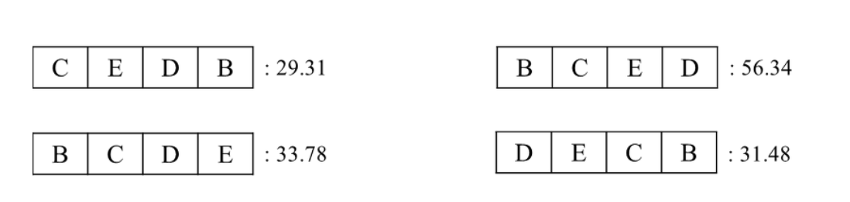
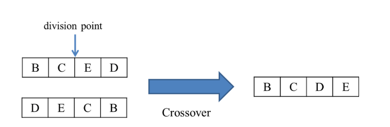
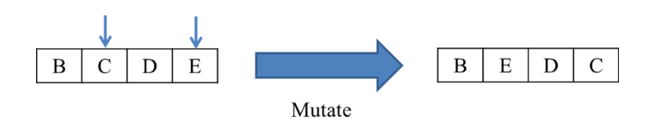
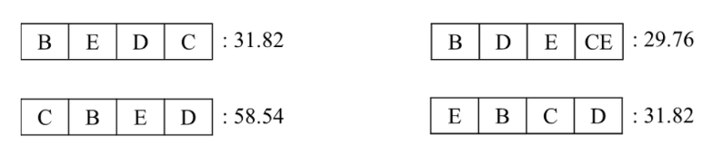

# Genetic Algorithm

유전 알고리즘은 자연 세계의 진화 과정에 기초한 계산 모델로서 존 홀랜드에 의해서 개발된 **전역 최적화 기법** 으로, 최적화 문제를 해결하는 기법의 하나이다.     
생물의 진화를 모방한 진화 연산의 대표적인 기법으로, 실제 진화 과정에서 많은 부분을 차용하였으며 변이, 교배 연산 등이 존재한다.

유전 알고리즘의 동작의 단계는 아래와 같다.

## 1. 초기 염색체의 집합 생성

> 그림 1: 초기 염색체의 집합

초기 염색체 생성 연산에 의해 생성된 염색체들은 위 <그림 1> 과 같다.

 

## 2. 초기 염색체들에 대한 적합도 계산

> 그림 2 : 초기 염색체들에 대한 적합도 계산

<그림 1> 의 염색체들에 대한 적합도를 계산하면 위 <그림2> 와 같다.

 

## 3. 현재 염색체들로부터 자손들 생성

> 그림 3: 두 염색체로부터 자손 생성

룰렛 휠 선택 방법을 통해 염색체 [B C E D] 가 선택되었다고 가정하면, crossover 연산을 통해 <그림 3> 과 같은 자손이 생성된다.

Crossover 연산을 통해 성공적으로 자손을 생성하였다면, 확률적으로 새롭게 생성된 자손에 돌연변이를 일으킨다. 유전 알고리즘의 인자를 설정하는 단계에서 설정한 돌연변이 확률로 새롭게 생성된 자손에 돌연변이가 발생한다.

> 그림 4: 돌연변이 연산

만약 <그림 3> 에서 생성된 자손에 돌연변이가 발생하였다고 가정하면, <그림 4> 와 같은 과정을 통해 새롭게 생성된 자손이 변형된다. 따라서, 최종적으로 생성된 자손은 [B E D C] 가 된다.

 

## 4. 생성된 자손들의 적합도 계산

> 새롭게 생성된 자손들에 대한 적합도 계산

앞의 과정을 통해 생성된 4개의 자손에 대한 적합도를 계산한다.

 

## 5. 종료 조건 판별

종료 조건 판별 연산을 한다. 종료 조건이 거짓인 경우, (3) 으로 이동하여 반복한다. 종료 조건이 참인 경우, 알고리즘을 종료한다.
