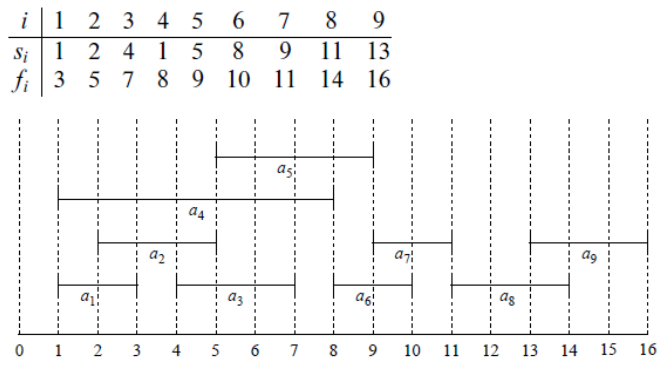
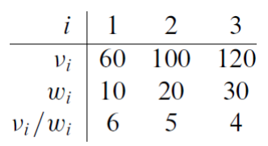

## Greedy Algorithm

> 동적 프로그래밍 사용 시 지나치게 많은 일을 한다는 것에서 착안하여 고안된 알고리즘이다.    
**탐욕 알고리즘**, **욕심쟁이 알고리즘** 으로도 불린다.   
매 순간 최적이라고 생각되는 것을 선택해 나가는 방식으로 진행하 최종적인 최적해에 도달하는 기법이다.

<br/>

### 📌 &nbsp; Activity Selection Problem (활동 선택 문제)

한 강의실에서 여러 개의 수업을 하려고 할 때 한 번에 가장 많은 수업을 할 수 있는 경우를 고르는 것이다.   
```Si```는 시작시간, ```Fi```는 종료시간이다. (서로 수업 시간이 겹치면 안 된다.)



직관적으로 생각하면, 최적의 해를 구하기 위해서는 첫 번째 활동이 최대한 일찍 끝나면 된다.    
그래야 다른 활동을 더 많이 선택할 수 있기 때문이다.

위의 경우 첫 선택으로 가장 빨리 끝나는 ```A1```을 고른다. 이제 ```A2``` 와 ```A4```는 고를 수 없다. (```A1```이랑 겹침)    
그 다음 선택은 다음으로 일찍 끝나는 ```A3```가 된다. 다음은 ```A6```, ```A8```이 되어 최종적으로 ``` A1, A3, A6, A8 ``` 이 된다.

> 관련 알고리즘 문제 : [백준 1931 : 회의실배정](https://www.acmicpc.net/problem/1931)

<br/>


### 📌 &nbsp; Fractional knapsack problem (분할 가능 배낭 문제)

한 여행가가 가지고 가는 배낭에 담을 수 있는 무게의 최댓값이 정해져 있고, 일정 가치와 무게가 있는 짐들은 배낭에 넣을 때 가치의 합이 최대가 되도록 짐을 고르는 방법을 찾는 문제이다. (짐은 쪼갤 수 있다.)   
```Vi``` 는 짐의 가치이고 ```Wi``` 는 짐의 무게이다.



```Vi/Wi``` 는 무게 대비 가치를 의미한다. 직관적으로 생각해 볼 때 무게 대비 가치가 높은 것들을 먼저 넣기 시작한다.   
무게 제한이 50인 경우 1번, 2번, 3번 순으로 넣는다. 3번은 무게 초과이기 때문에 20만큼 쪼개서 넣는다. 

