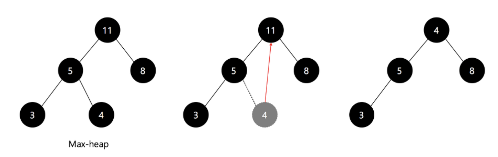
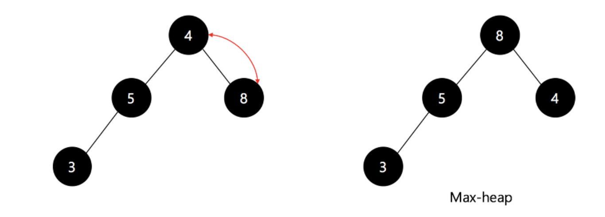

# Heap Sort (힙 정렬)

- 완전 이진 트리의 일종으로 우선순위 큐를 위하여 만들어진 자료 구조

    >완전 이진 트리란?? 삽입할 때 왼쪽부터 차례대로 추가하는 이진 트리

- 최댓값, 최솟값을 쉽게 추출할 수 있는 자료구조

<br/>

## 시간 복잡도

- 평균, 최선, 최악 : O(NlogN)

<br/>

## 로직

1. 최대 힙을 구성한다.
2. 현재 힙 루트는 가장 큰 값이 존재한다. 루트의 값을 마지막 요소와 바꾼 후, 힙의 사이즈를 하나 줄인다.
3. 힙의 사이즈가 1보다 크면 위의 과정을 반복한다.

<br/>

## 장점

- 시간 복잡도가 좋은편
- 힙 정렬이 가장 유용한 경우는 전체 자료를 정렬하는 것이 아니라 가장 큰 값 몇개만 필요할 때 이다.

<br/>

<div align="center"></div>

루트 노드를 마지막 노드로 대체한다. (11->4) 그리고 다시 최대 힙 구성.

<div align="center"></div>

이와 같은 방식으로 최대 값을 하나씩 뽑아내면서 정렬하는 것이 Heap Sort이다.

<br/>

```java
package sort;

/**
 * created by victory_woo on 2020/03/14
 */
public class HeapSort {
    public static void main(String[] args) {
        int[] arr = {230, 10, 60, 550, 40, 220, 20};
        heapSort(arr);

        for (int i = 0; i < arr.length; i++) System.out.print(arr[i] + " ");
    }

    private static void heapSort(int[] arr) {
        int n = arr.length;

        // max heap 초기화.
        for (int i = (n / 2) - 1; i >= 0; i--) {
            heapify(arr, n, i);
        }

        for (int i = n - 1; i > 0; i--) {
            swap(arr, 0, i);
            heapify(arr, i, 0);
        }
    }

    private static void heapify(int[] arr, int n, int i) {
        int p = i; // 부모 노드.
        int l = i * 2 + 1; // 왼쪽 자식 노드.
        int r = i * 2 + 2; // 오른쪽 자식 노드.

        // 왼쪽 자식 노드와 부모 노드를 비교하여 큰 값을 부모 노드로 올린다.
        if (l < n && arr[p] < arr[l]) p = l;

        // 오른쪽 자식 노드와 부모 노드를 비교하여 큰 값을 부모 노드로 올린다.
        if (r < n && arr[p] < arr[r]) p = r;

        // 부모 노드를 가리키는 p 값이 바뀌면 위치를 교환하고
        // heapify()를 호출하여 과정을 반복한다.
        if (i != p) {
            swap(arr, p, i);
            heapify(arr, n, p);
        }
    }

    private static void swap(int[] arr, int a, int b) {
        int temp = arr[a];
        arr[a] = arr[b];
        arr[b] = temp;
    }

}
```
