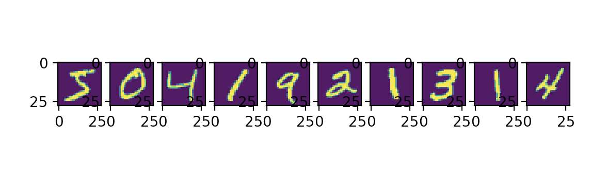

# ForwardPass 구현하기 (2)

> 선수환경 : [여기](http://yann.lecun.com/exdb/mnist/) 에서 gz 압축파일 4개 다운로드

- load_mnist: gzip 파일을 읽어서 np.array로 변환 후 차원 조정
  - normalize : 입력(0 ~ 255 정수) 을 0.0 ~ 1.0 사이의 실수로 변환
  - flatten : 입력을 784(28*28) array로 / 28x28 matrix 로
  - one_hot_label : label을 숫자 (0~9) 로 / [0,1, .. ,0] 과 같은 1*10 배열로
 
 <br/>

## `minst_data.py`

```python
import gzip
import pickle
import os
import numpy as np

files = {
    'train_img':'train-images-idx3-ubyte.gz',
    'train_label':'train-labels-idx1-ubyte.gz',
    'test_img':'t10k-images-idx3-ubyte.gz',
    'test_label':'t10k-labels-idx1-ubyte.gz'
}

# gzip 파일을 읽어서 np.array 로 변환한 후 차원 조정

def _load_img(filename):
    with gzip.open(filename, 'rb') as f:
        data = np.frombuffer(f.read(), np.uint8, offset=16)
    data = data.reshape(-1, 784)
    return data

def _load_label(filename):
    with gzip.open(filename, 'rb') as f:
        data = np.frombuffer(f.read(), np.uint8, offset=8)
    return data

def _change_one_hot_label(X):
    T = np.zeros((X.size, 10)) # 초기화
    for idx, row in enumerate(T) :
        row[X[idx]] = 1
    return T

def load_mnist(normalize=True, flatten=True, one_hot_label=True):
    dataset = {}

    for key in ('train_img', 'test_img') :
        dataset[key] = _load_img(files[key])

    for key in ('train_label', 'test_label'):
        dataset[key] = _load_label(files[key])

    if one_hot_label :
        for key in ('train_label', 'test_label'):
            dataset[key] = _change_one_hot_label(dataset[key])
        
    if not flatten :
        for key in ('train_img', 'test_img') :
            dataset[key] = dataset[key].reshape(-1,1,28,28)

    return ((dataset['train_img'], dataset['train_label']), (dataset['test_img'], dataset['test_label']))
```

<br/>

## `mnist01.py` (`load_mnist` 테스트)

```python
import numpy as np 
from mnist_data import load_mnist
from matplotlib.pylab import plt

(x_train, y_train), (x_test, y_test) = load_mnist()

for i in range(10):
    img = x_train[i]
    label = np.argmax(y_train[i])
    print(label, end=", ")
    img = img.reshape(28, 28)
    plt.subplot(1, 10, i + 1)
    plt.imshow(img)

print()
plt.show()
```

```profile
5, 0, 4, 1, 9, 2, 1, 3, 1, 4, 
```


`load_mnist()` 으로 `x_train`, `y_train` 데이터 10개를 가져와서 출력해 보았다.   
`x_train` 은 학습 데이터 중 이미지 데이터를 의미하고, `y_train` 은 학습 데이터 중 정답 데이터를 의미한다.

<br/>

## Fully-Connected Network (3 Layer) : ```mnist02.py```


20, 10 개의 perceptron 을 가진 hidden layer 를 가지며 activation 함수로 softmax 를 사용하는 network를 만들어보자.


```python
import numpy as np
from mnist_data import load_mnist
from functions import sigmoid, softmax

layers = [784, 20, 10, 10] # perceptron 개수

# 네트워크 초기화
def init_network() :
    network = {}
    network['W1'] = 0.01 * np.random.randn(layers[0], layers[1]) # 784 * 20
    network['W2'] = 0.01 * np.random.randn(layers[1], layers[2]) # 20 * 10
    network['W3'] = 0.01 * np.random.randn(layers[2], layers[3]) # 10 * 20
    network['b1'] = np.zeros(layers[1])
    network['b2'] = np.zeros(layers[2])
    network['b3'] = np.zeros(layers[3])
    return network

# 예측
def predict(network, x):
    W1, W2, W3 = network['W1'], network['W2'], network['W3']
    b1, b2, b3 = network['b1'], network['b2'], network['b3']
    x1 = sigmoid(np.dot(x, W1) + b1)
    x2 = sigmoid(np.dot(x1, W2) + b2)
    y = softmax(np.dot(x2,W3) + b3)
    return y

# 정확도
def accuracy(network, x, t):
    y = predict(network, x) 
    y = np.argmax(y, axis=1) # 내가 예측한 정답
    t = np.argmax(t, axis=1) # 실제 정답
    accuracy = np.sum(y==t)/ float(y.shape[0]) # 정답 비교하기
    return accuracy

(x_train, y_train), (x_test, y_test) = load_mnist()

network = init_network()
print(accuracy(network, x_train, y_train))
```
```profile
0.09736666666666667
```


