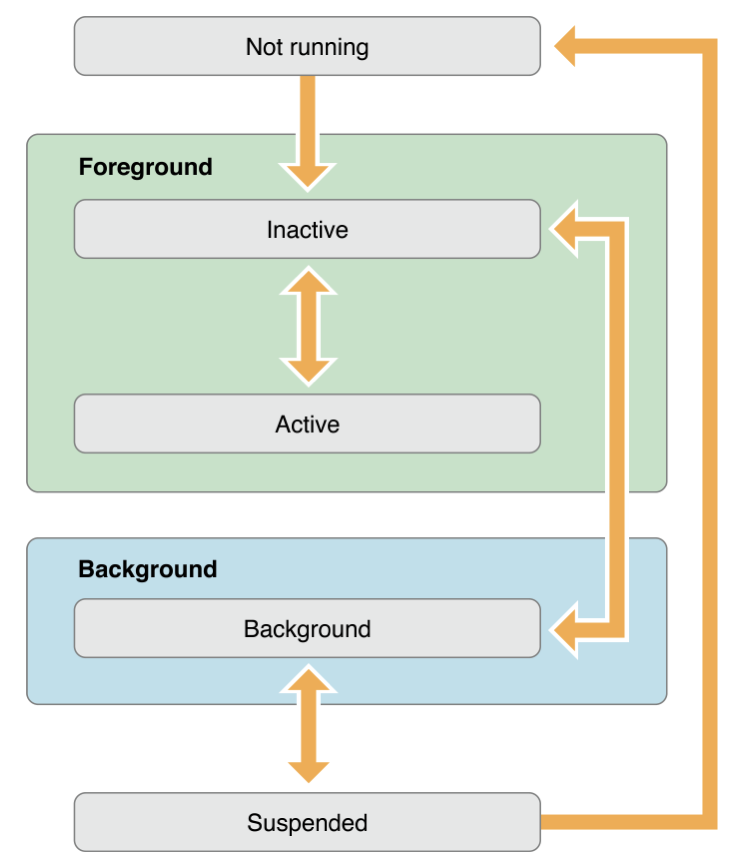

## AppDelegate

AppDelegate 는 entry point (진입 지점) 과 input events (입력 이벤트) 를 앱에 전달하는 run loop 를 생성합니다.

<dig align="center"></div>

1. 앱 실행

```swift
func application(_ application: UIAppliscation, didFinishLaunchingWithOptions launchOptions: [UIApplicationLaunchOptionsKey: Any]?) -> Bool {
        // Override point for customization after application launch.
        return true
    }

```

앱을 실행하면 호출되는 delegate 메소드입니다. 리턴 값을 false 로 바꿔도 앱은 정상적으로 실행 됩니다.

리턴값은 앱이

2. 앱 활성화

```swift
func applicationDidBecomeActive(_ application: UIApplication) {
        // Restart any tasks that were paused (or not yet started) while the application was inactive. If the application was previously in the background, optionally refresh the user interface.
    }
```

앱이 화면에 뜬 이후 실행되는 메소드입니다. 
앱이 background 로 간 이후, 다시 foreground 로 올라온 이후에도 실행되는 메소드입니다.

3. 홈버튼 

```swift
func applicationWillResignActive(_ application: UIApplication) {
        // Sent when the application is about to move from active to inactive state. This can occur for certain types of temporary interruptions (such as an incoming phone call or SMS message) or when the user quits the application and it begins the transition to the background state.
        // Use this method to pause ongoing tasks, disable timers, and invalidate graphics rendering callbacks. Games should use this method to pause the game.
    }

```

홈 버튼을 누르면 앱은 background 로 이동합니다. 가장 먼저 App이 포커스를 잃으면서 실행되는 메소드입니다.
task 일시정지, 타이머 비활성화, 게임의 경우 일시정지를 처리하는 로직을 구현해야 하는 메소드입니다.

4. 백그라운드로 이동 후 (화면에서 앱이 안 보이는 상태)

```swift
func applicationDidEnterBackground(_ application: UIApplication) {
        // Use this method to release shared resources, save user data, invalidate timers, and store enough application state information to restore your application to its current state in case it is terminated later.
        // If your application supports background execution, this method is called instead of applicationWillTerminate: when the user quits.
    }
```

5. 다시 앱 실행

```swift
func applicationWillEnterForeground(_ application: UIApplication) {
        // Called as part of the transition from the background to the active state; here you can undo many of the changes made on entering the background.
    }    

```

앱이 다시 포어그라운드로 올라올 때 호출되는 메소드입니다. 보통 API를 통해 앱의 상태를 갱신할 때 사용합니다. (버전체크, 메인테이닝 체크 ..)