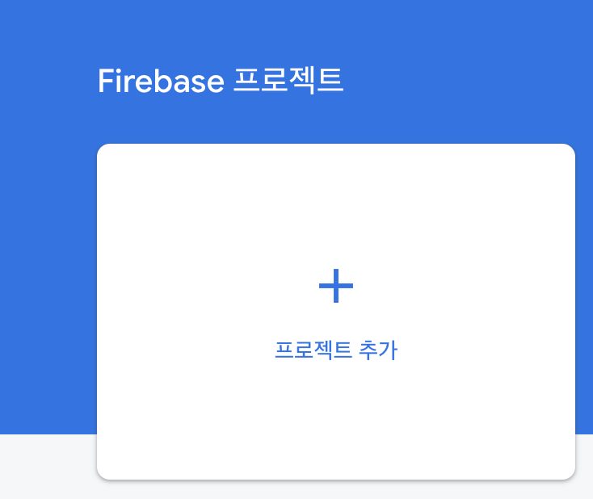
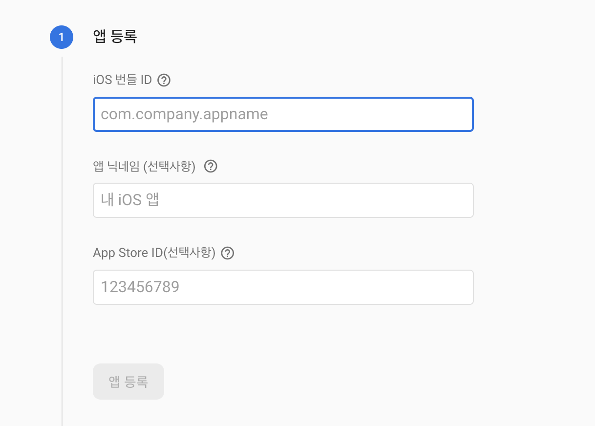
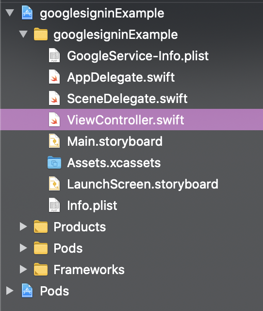
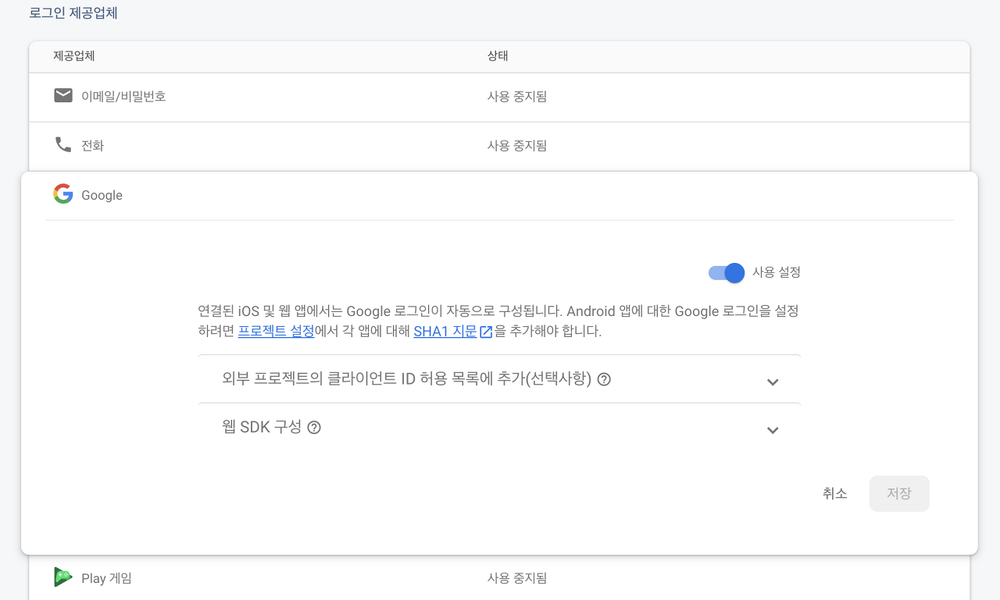
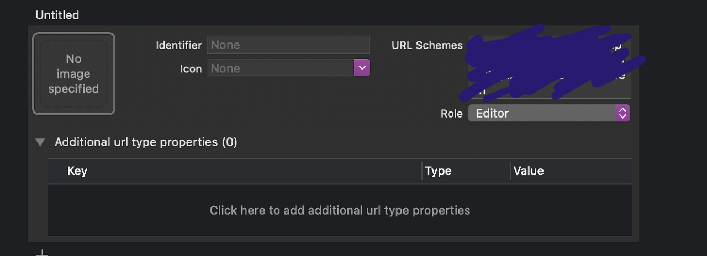
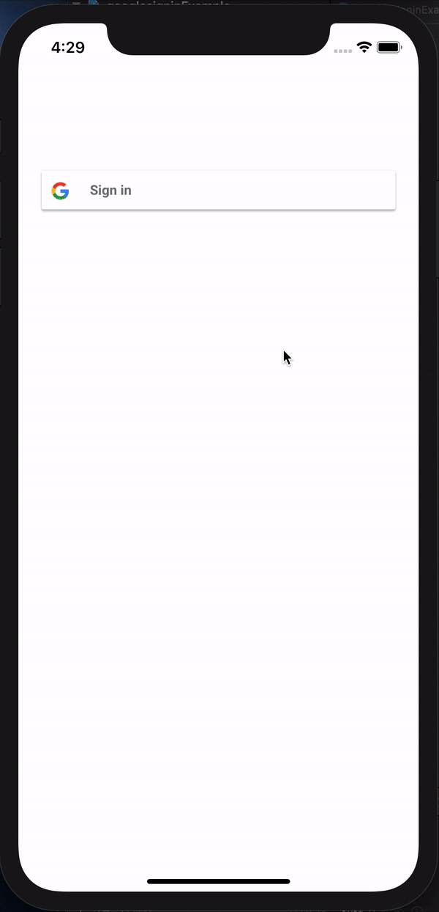

## Google Login

구글 계정으로 소셜 로그인 하려면 Firebase 와 연동이 필요합니다.


### Firebase 프로젝트 설정하기

[구글 파이어베이스 콘솔 창]([console.firebase.google.com/u/0/](https://console.firebase.google.com/u/0/))에서 새 프로젝트를 설정합니다.

<div align="center"></div>

생성한 프로젝트에서 iOS 프로젝트 추가를 누릅니다.

<div align="center"></div>

자신의 프로젝트의 iOS 번들 ID 를 입력합니다. 그리고 앱 등록(다음) 버튼을 눌러 `GoogleService-Info.plist` 파일을 다운 받습니다.

<div align="center"></div>

다운받은 `GoogleService-Info.plist` 파일을 자신의 프로젝트로 복사합니다. 

<br/>

### Google 로그인 사용 설정하기

아까 생성한 파이어베이스 프로젝트 내에 들어가 'authentication - sign in method' 페이지로 들어갑니다.

<div align="center"></div>

google 탭을 눌러 '사용 설정' 을 눌러 구글 로그인 허용을 합니다.

여기 까지 완료 하면 파이어베이스 프로젝트 설정은 끝납니다.

<br/>

### 라이브러리 설치하기

```
pod 'Firebase/Core'
pod 'Firebase/Auth'
pod 'GoogleSignIn'
```

위 세가지 라이브러리를 설치합니다.

<br/>

### URL Scheme 등록

아까 프로젝트에 추가한 `GoogleService-Info.plist` 에서 `REVERSED_CLIENT_ID` 부분을 복사합니다.

target - Info 탭에서 URL Types 를 추가하고, URL Schemes 에 앞서 복사한 내용을 붙여넣습니다.

<div align="center"></div>

<br/>

### `AppDelegate.swift` 설정하기

모듈 Firebase, GoogleSignIn 를 import 하고, GIDSignInDelegate 를 추가합니다.

```swift
import Firebase
import GoogleSignIn

@main
class AppDelegate: UIResponder, UIApplicationDelegate, GIDSignInDelegate {

	..

}
```

`didFinishLaunchingWithOptions` 메소드에 firebase 와 google login 연동을 추가합니다.

```swift
    func application(_ application: UIApplication, didFinishLaunchingWithOptions launchOptions: [UIApplication.LaunchOptionsKey: Any]?) -> Bool {
        
        FirebaseApp.configure()
        
        GIDSignIn.sharedInstance()?.clientID = ""
        GIDSignIn.sharedInstance()?.delegate = self
       
        return true
    }
```

이 때 clienID 값은 `GoogleService-Info.plist` 에서 `CLIENT-ID` 값을 복사해 붙여 넣습니다.

```swift
    func sign(_ signIn: GIDSignIn!, didSignInFor user: GIDGoogleUser!, withError error: Error!) {
        print("User email: \(user.profile.email ?? "No email")")
    }
```

`sign` 메소드는 구글 로그인에 성공했을 때 실행됩니다. 성공시 user email 을 프린트하도록 했습니다.

여기까지 `AppDelegate.swift` 파일 설정 끝!

<br/>

### `LoginVC` 설정하기

```swift
import GoogleSignIn
```

```swift
@IBOutlet var signInButton: GIDSignInButton!
```

모듈을 추가하고, 구글 로그인 버튼 `GIDSignInButton` 을 추가했습니다.

(스토리보드로 추가: `UIView` 추가 -> 클래스 명을 `GIDSignInButton` 으로 변경 ->` IBOutlet` 연결)

```swift
GIDSignIn.sharedInstance()?.presentingViewController = self
```

`ViewDidLoad()` 메소드에 `presentingViewController` 를 입력하면 끝!

<div align="center"></div>

제대로 구글 로그인에 성공하면 `AppDelegate.swift` 파일의 `sign()` 메소드에서 user email 이 출력됩니다.

<div align="center"></div>

