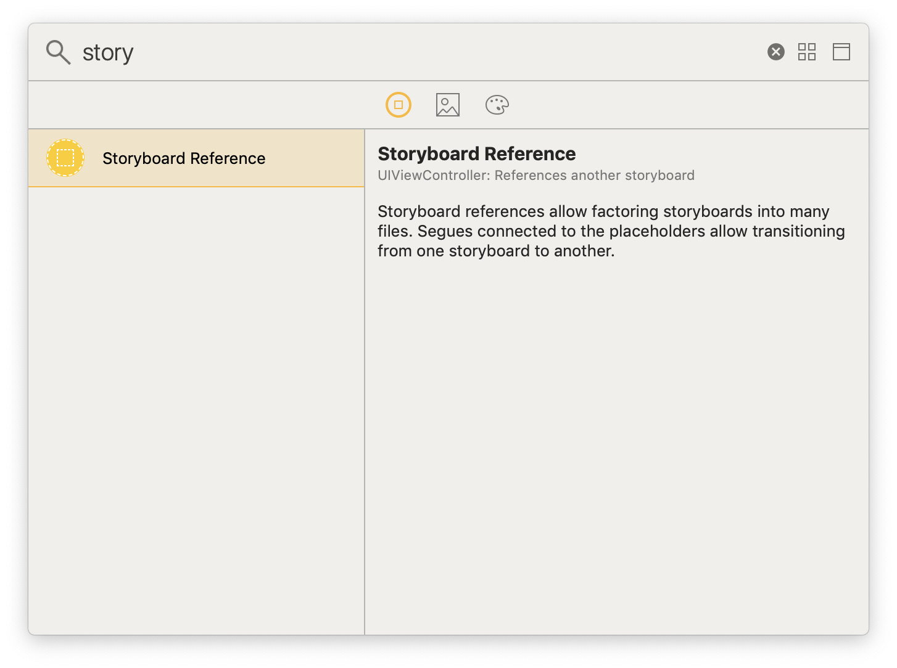
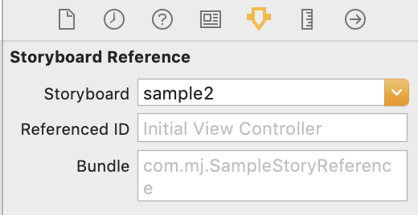
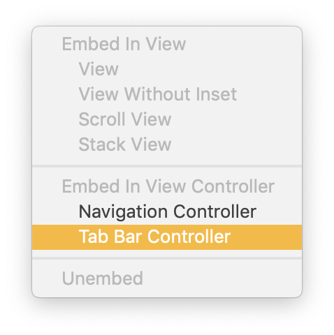
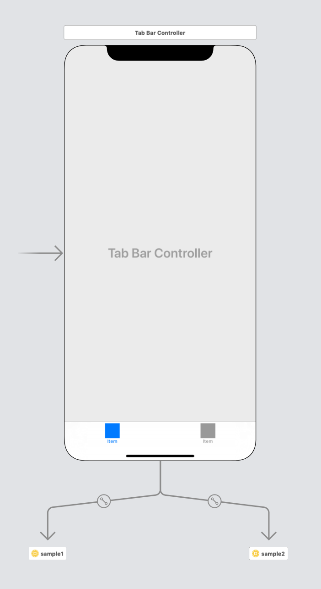
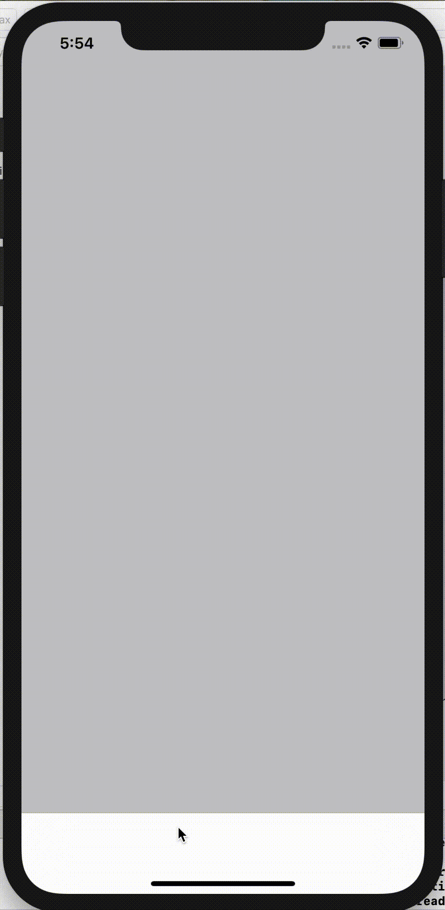
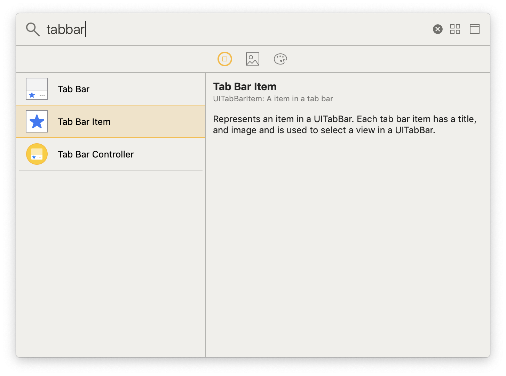
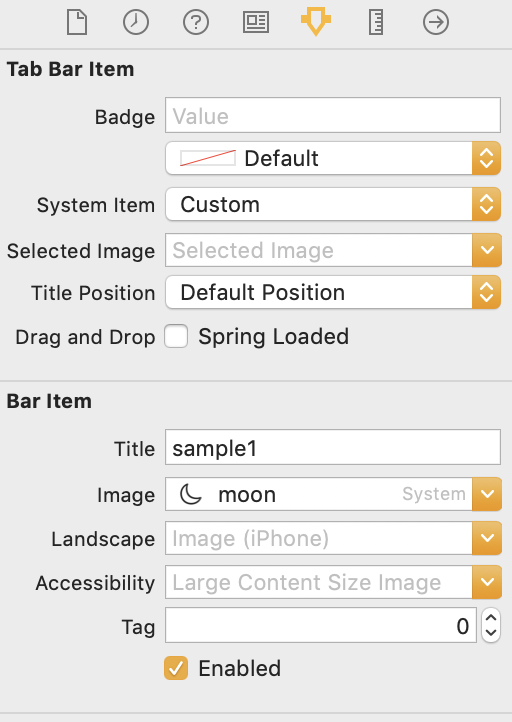
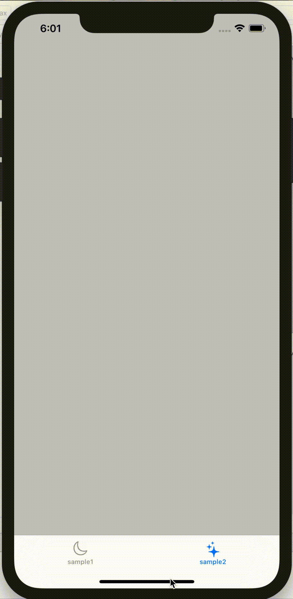

## Tabbar using Storyboard Reference 

- 한 storyboard 안에 여러 개 tabbar 를 넣으면 너무 복잡해지므로 storyboard reference 를 사용해 깔끔하게 분리해보자 ❗️

<br/>

1. Storyboard Reference 추가   
 

<br/>

2. 미리 만들어 둔 원하는 storyboard ID 입력   
 

<br/>

3. 원하는 storyboard reference 를 선택한 후 Tab Bar Controller 선택

  

<br/>


4. 확인

 


<br/>

---

<br/>

### 공백인 tabbar 에 원하는 title 과 image 를 넣어보자

1. 참조한 storyboard 의 viewcontroller 에 tabbar item 추가   

 

<br/>

2. tabbar item 클릭 후 원하는 title 과 image 설정

 

<br/>


3. 확인

 


<br/>

---

### 코드로 tabbar title, image 설정하기

- default tabbar viewcontroller 의 viewDidLoad 에 작성

```swift
       // tab bar item 의 title 설정
        if let downcastStrings = self.tabBarController?.tabBar.items
        {
            downcastStrings[0].title = "탭1"
            downcastStrings[1].title = "탭2"
            downcastStrings[2].title = "탭3"
            downcastStrings[3].title = "탭4"
        }
        
        // tab bar item image 설정
        self.tabBarController?.tabBar.items![0].image = UIImage(named: "tabIc01")
        self.tabBarController?.tabBar.items![1].image = UIImage(named: "tabIc02")
        self.tabBarController?.tabBar.items![2].image = UIImage(named: "tabIc03")
        self.tabBarController?.tabBar.items![3].image = UIImage(named: "tabIc04")
        
        // tab bar color 설정
        self.tabBarController?.tabBar.selectedImageTintColor = UIColor.marigold
```

<br/>

---

### 번외

- storyboard reference 를 사용해 tabbar 를 만들면 원하는 순서대로 탭의 위치를 바꿔야 할 때가 있다.
- 그럴 땐 Visual Studio 를 사용하자

```html
<!--Tab Bar Controller-->
        <scene sceneID="X4a-w9-NzN">
            <objects>
                <tabBarController automaticallyAdjustsScrollViewInsets="NO" id="G2i-rX-UXN" sceneMemberID="viewController">
                    <toolbarItems/>
                    <tabBar key="tabBar" contentMode="scaleToFill" insetsLayoutMarginsFromSafeArea="NO" id="Lzy-1U-PPN">
                        <autoresizingMask key="autoresizingMask"/>
                        <color key="backgroundColor" white="0.0" alpha="0.0" colorSpace="custom" customColorSpace="genericGamma22GrayColorSpace"/>
                    </tabBar>
                    <connections>
                        <segue destination="Fpb-GR-x11" kind="relationship" relationship="viewControllers" id="FDh-dC-TNe"/>
                        <segue destination="fAv-Ku-UQZ" kind="relationship" relationship="viewControllers" id="cSR-d1-yky"/>
                    </connections>
                </tabBarController>
                <placeholder placeholderIdentifier="IBFirstResponder" id="OWN-1M-DxP" userLabel="First Responder" customClass="UIResponder" sceneMemberID="firstResponder"/>
            </objects>
            <point key="canvasLocation" x="188.40579710144928" y="591.96428571428567"/>
        </scene>
```

- iOS 프로젝트를 Visual Studio 로 연다.
- TabBarController 내의 segue 순서를 바꿔준다.

```html
   <connections>
      <segue destination="Fpb-GR-x11" kind="relationship" relationship="viewControllers" id="FDh-dC-TNe"/>
      <segue destination="fAv-Ku-UQZ" kind="relationship" relationship="viewControllers" id="cSR-d1-yky"/>
   </connections>
```
👆 이 부분!!
