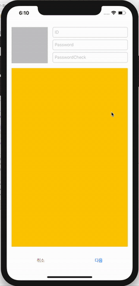

## UIImagePickerController

1. picker 생성
```swift
   let imagePicker = UIImagePickerController()
```

<br/>

2. picker 를 보여줄 메소드 정의
```swift
   @objc func pickImage(){
       self.present(self.imagePicker, animated: true)
   }
```


<br/>

3. ViewDidLoad 에 imagePicker 속성 지정
```swift
    self.imagePicker.sourceType = .photoLibrary // 앨범에서 가져옴
    self.imagePicker.allowsEditing = true // 수정 가능 여부
    self.imagePicker.delegate = self // picker delegate
```

<br/>

4. exrtension UIImagePickerControllerDelegate, UINavigationControllerDelegate

```swift
extension SignUpViewController: UIImagePickerControllerDelegate, UINavigationControllerDelegate {
    
    func imagePickerController(_ picker: UIImagePickerController, didFinishPickingMediaWithInfo info: [UIImagePickerController.InfoKey : Any]) {
        
        var newImage: UIImage? = nil
        
        
        if let possibleImage = info[UIImagePickerController.InfoKey.editedImage] as? UIImage {
            newImage = possibleImage // 수정된 이미지가 있을 경우
        } else if let possibleImage = info[UIImagePickerController.InfoKey.originalImage] as? UIImage {
            newImage = possibleImage // 원본 이미지가 있을 경우
        }
        
        self.profileImageView.image = newImage // 받아온 이미지를 update
        picker.dismiss(animated: true, completion: nil) // picker를 닫아줌
        
    }
}

```

<br/>

5. 확인

 
