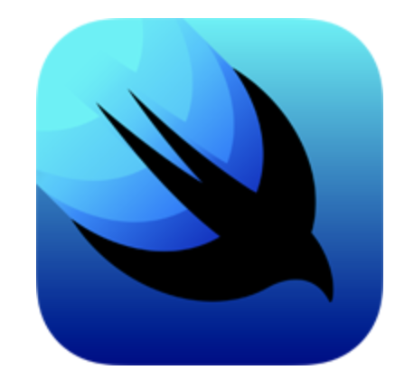
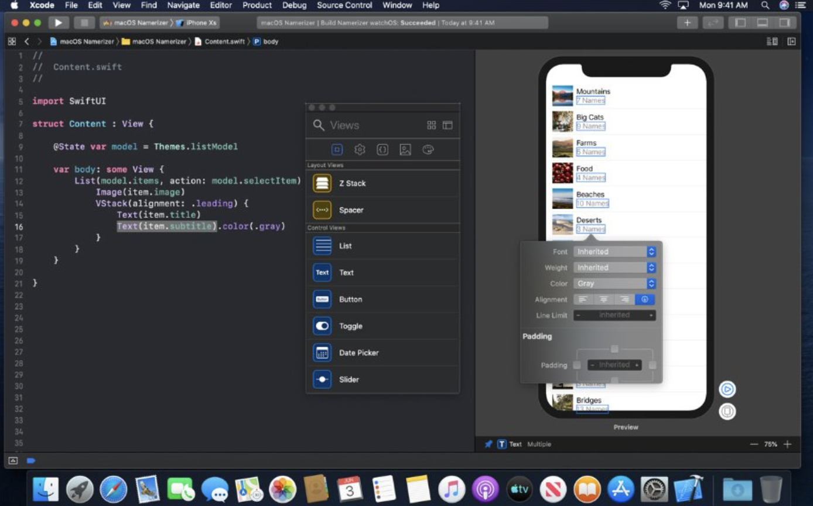
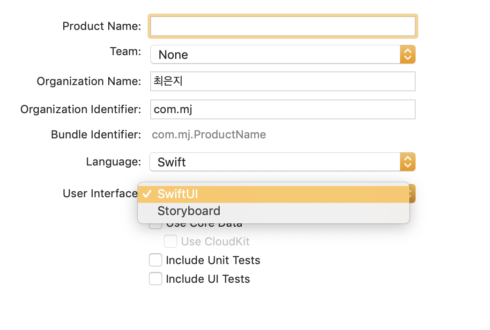
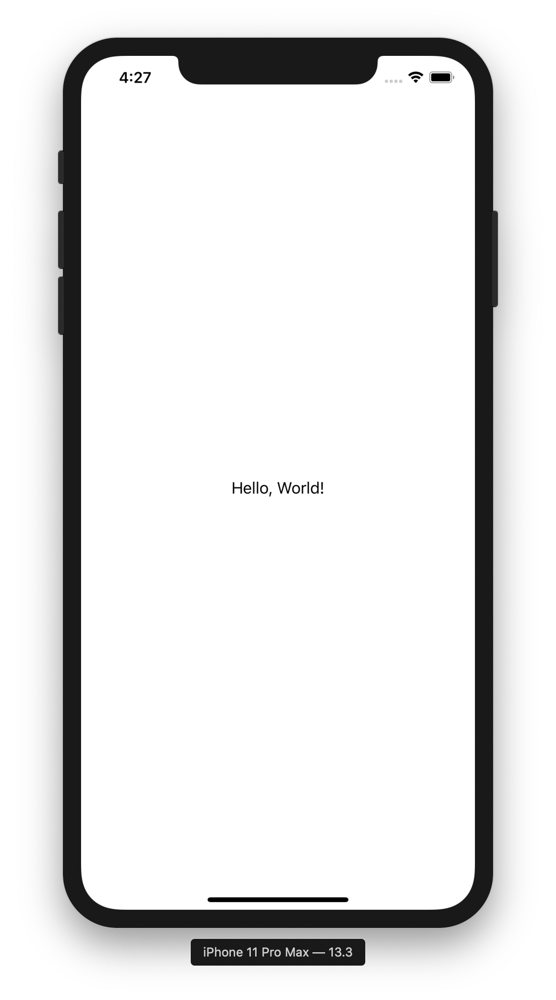
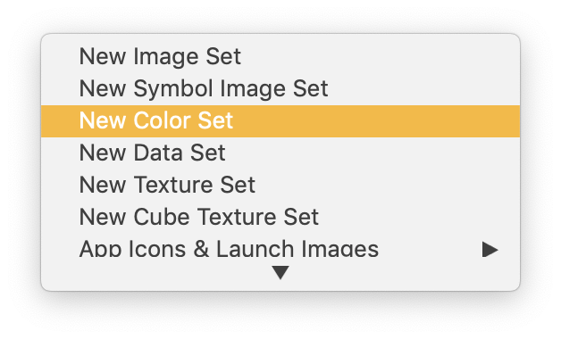
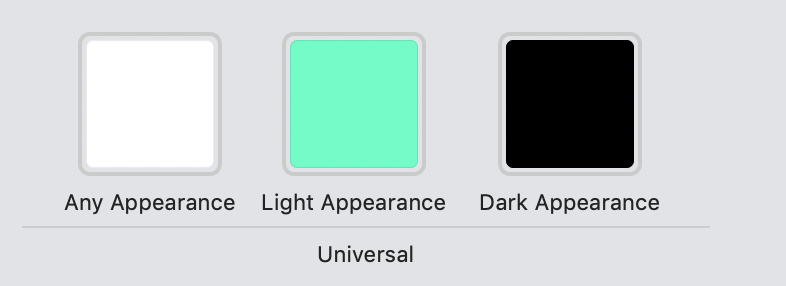
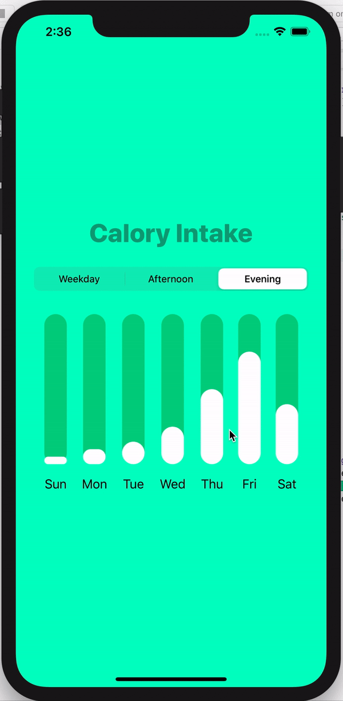

## Animated BarChart Using SwiftUI


### SwiftUI 란?
> SwiftUI는 모든 애플 플랫폼에서 사용자 인터페이스를 만들 수 있게 해주는 새로운 개발 패러다임이다.   
하나의 도구 및 API로 모든 애플 기기의 사용자 인터페이스를 만들 수 있게 해준다.   
기존의 Storyboard 와 Autolayout 을 대체할 수 있는 UIFramework 이다.



- 실시간으로 Swift 코드 작성 시 UI 미리보기를 제공함
- UI 변수 연결인 outlets, action 을 컴파일 할 때 체크하여 런타임 때 UIFail 의 위험을 감소시킴
- 속도가 매우 빠름 
- 최신 버전의 운영체제에서만 작동 가능함 (macOS Catalina 10.15 beta, Xode 11 beta)

<br/>

### 첫 실행

UserInterface > SwiftUI 지정 



```swift
import SwiftUI

struct ContentView: View {
    var body: some View {
        Text("Hello, World!")
    }
}

struct ContentView_Previews: PreviewProvider {
    static var previews: some View {
        ContentView()
    }
}
```



- swiftUI 에서 View는 반드시 **body** 변수가 있어야 하며 최상위 View 역할을 한다.
- ``` ContentView_Previews ``` 는 실제 앱에는 적용되지 않지만 Xcode 의 Canvas 기능을 위한 **Preview Layout** 이다.
- ``` State ``` 어노테이션이 붙은 변수에 변경이 일어나면 자동으로 View 를 다시 렌더링 한다.

<br/>

### Stack
- Vstack : 수직(Vertical) 으로 View 를 쌓음
- Hstack : 수평(Horizontal) 으로 View 를 쌓음
- ZStack : View 를 겹쳐서 쌓아 올림


```swift
struct ContentView: View {
    var body: some View {
        HStack {
            Text("Hello world!")
            Text("Hello world!")
            Text("Hello world!")
        }.background(Color.red)
    }
}
```

```swift
struct ContentView: View {
    var body: some View {
        VStack {
            Text("Hello world!")
            Text("Hello world!")
            Text("Hello world!")
        }.background(Color.red)
    }
}
```

<br/>


### SwiftUI 를 사용한 barChart 만들기


1. create BarView

```swift
struct BarView: View {
    
    var value: CGFloat
    var week: String
    
    var body: some View {
        VStack {
            ZStack(alignment: .bottomTrailing){
                Capsule().frame(width: 30, height: 200)
                    .foregroundColor(Color(myColor)))
                Capsule().frame(width: 30, height: value)
                    .foregroundColor(.white)
                
            }
            Text(week).padding(.top, 8)
        }
    }
}
```

2. ```State``` 변수 선언

```swift
    @State var pickerSelectedItem = 0
    
    @State var dataPoints: [[CGFloat]] = [
        [...],
    ]
    
    @State var week: [String] = [ ... ]
```

3. ```ZView``` 안에 ```Vstack```, ```Picker```, ```Hstack``` 선언

```swift
import SwiftUI

struct ContentView: View {

    var body: some View {
        
        ZStack {
            
            Color("appBackground").edgesIgnoringSafeArea(.all) 
            
            VStack {
                
                Text("Calory Intake")
                ...
                
                Picker(selection: $pickerSelectedItem, label: Text("")) {
                    ...
                }.pickerStyle(SegmentedPickerStyle())
                    .padding(.horizontal, 24)
                
                HStack (spacing: 20){
                    BarView(value: dataPoints[pickerSelectedItem][0], week: "Sun")
                    BarView(value: dataPoints[pickerSelectedItem][1], week: "Mon")
                    ...
                    
                }.padding(.top, 24)
                    .animation(.default)
            }
        }
    }
}

```

<br/>

👇 darkmode 와 lightmode 의 색깔 변경하기   

 
- Assets > New Color Set > Light Apperance, Dark Apperance 색상 각각 지정


<br/>

### 실행 화면

 

참고 : [swiftUI tutorial](https://www.youtube.com/watch?v=5lSJzzI2fj8)


