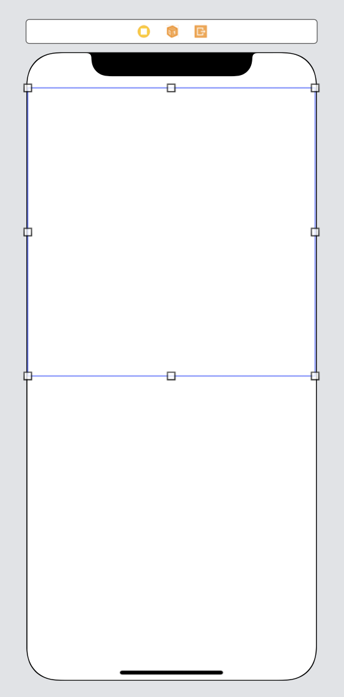
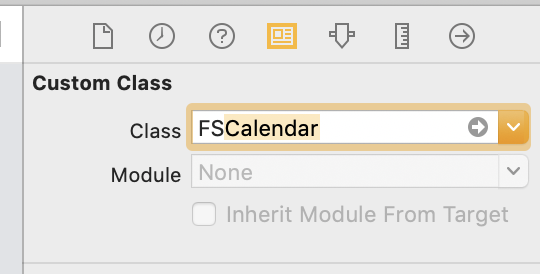
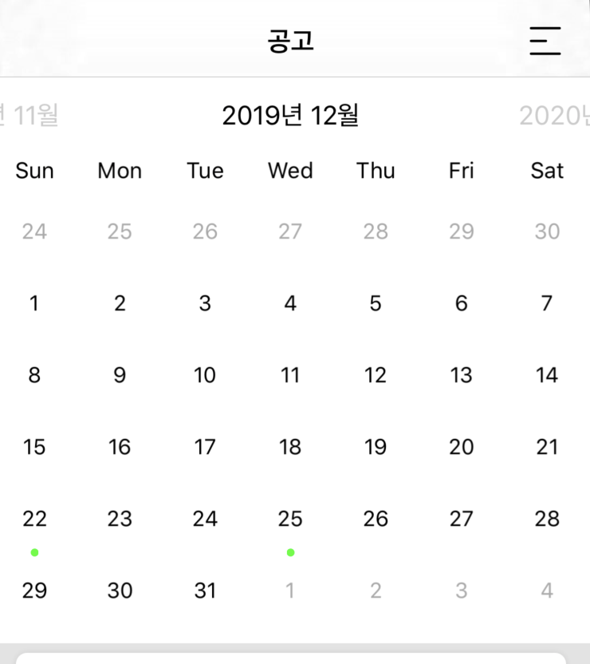

## 🗓 Calendar 
- [FSCalendar](https://github.com/WenchaoD/FSCalendar) 라이브러리 사용 

---

### 설치 방법
```
pod 'FSCalendar'
pod install 
```

---

### 사용하기
1️⃣ UIView 생성



2️⃣ View Class name 을 ```FSCalendar``` 으로 입력 -> 자동으로 바뀜



---

### Event 

1️⃣이벤트 컬러 마크 색깔 커스텀 (default = blue)

```swift
  calendar.appearance.eventDefaultColor = UIColor.green
  calendar.appearance.eventSelectionColor = UIColor.green     
```

2️⃣ event date 추가
```swift
  let formatter = DateFormatter()
  formatter.locale = Locale(identifier: "ko_KR")
  formatter.dateFormat = "yyyy-MM-dd"
        
  let xmas = formatter.date(from: "2019-12-25")
  let sampledate = formatter.date(from: "2019-12-22")
  dates = [xmas!, sampledate!]
```
- 원하는 날짜를 dates 배열에 저장한다.


3️⃣ extension FSCalendarDataSource
```swift
extension CalendarViewController: FSCalendarDataSource{
    func calendar(_ calendar: FSCalendar, numberOfEventsFor date: Date) -> Int { 
        if self.dates.contains(date){
            return 1
        }
        return 0
    }
}
```
- dates 배열에 있는 날짜에 이벤트를 추가한다.
- return 갯수에 따라 날짜에 추가되는 이벤트 갯수가 달라진다.



- 캘린더에 이벤트가 잘 추가됨을 확인할 수 있다 
