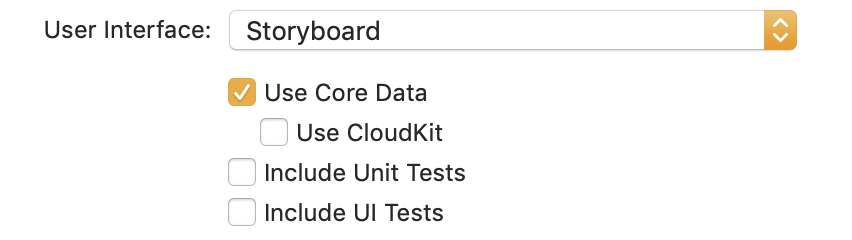
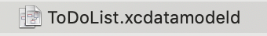
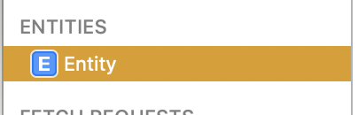
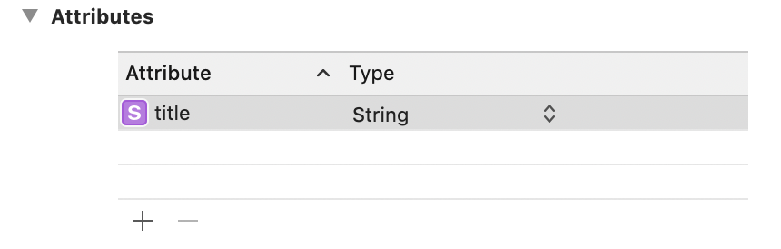
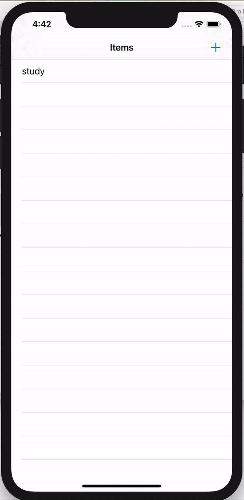

# TodoList using coredata

coredata 를 사용한 todo list app 을 만들어보자

1. Project setting 





Use Core Data 를 체크하면 ``` xcdatamodeld ``` 파일이 디렉토리에 생성됨을 확인할 수 있다.

<br/>

2. Data Setting





데이터 모델에 원하는 entity 와 attribute, type 을 지정한다   
entity 가 하나의 구성 요소, 모델의 역할을 한다.

<br/>

3. Save Data

```swift
import CoreData
```

```swift
var itemName: [NSManagedObject] = [] // todolist의 coredata 배열
```

```swift
    func save(alert: UIAlertAction!){
        let appDelegate = UIApplication.shared.delegate as! AppDelegate
        let context = appDelegate.persistentContainer.viewContext
        let entity = NSEntityDescription.entity(forEntityName: "Title", in: context)!
        let theTitle = NSManagedObject(entity: entity, insertInto: context)
        theTitle.setValue(titleTextField.text, forKey: "title") // attribute
        
        do {
            try context.save()
            itemName.append(theTitle)
        } catch {
            print("There was a error in saving..")
        }
        self.tableView.reloadData()
    }
```

```context``` 를 통해 간접적으로 접근한다. 

<br/>

4. Remove Data

```swift
func tableView(_ tableView: UITableView, commit editingStyle: UITableViewCell.EditingStyle, forRowAt indexPath: IndexPath) {
        if editingStyle == UITableViewCell.EditingStyle.delete {
            let appDelegate = UIApplication.shared.delegate as! AppDelegate
            let context = appDelegate.persistentContainer.viewContext
            context.delete(itemName[indexPath.row])
            itemName.remove(at: indexPath.row)
            
            do{
                try context.save()
            }catch {
                print("There was a error in deleting")
            }
        }
        self.tableView.reloadData()
    }
```
<br/>

5. Load Data (Fetch)

```swift
   override func viewWillAppear(_ animated: Bool) {
        super.viewWillAppear(animated)
        
        let appDelegate = UIApplication.shared.delegate as! AppDelegate
        let context = appDelegate.persistentContainer.viewContext
        let fetchRequest = NSFetchRequest<NSManagedObject>(entityName: "Title")
        
        do {
            itemName = try context.fetch(fetchRequest)
        } catch {
            print("Error in loading data")
        }
    }
```



