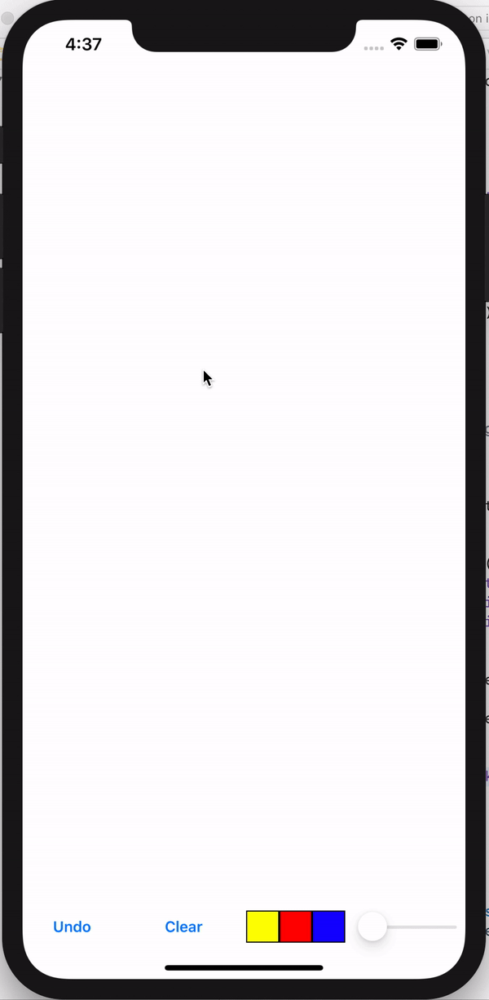
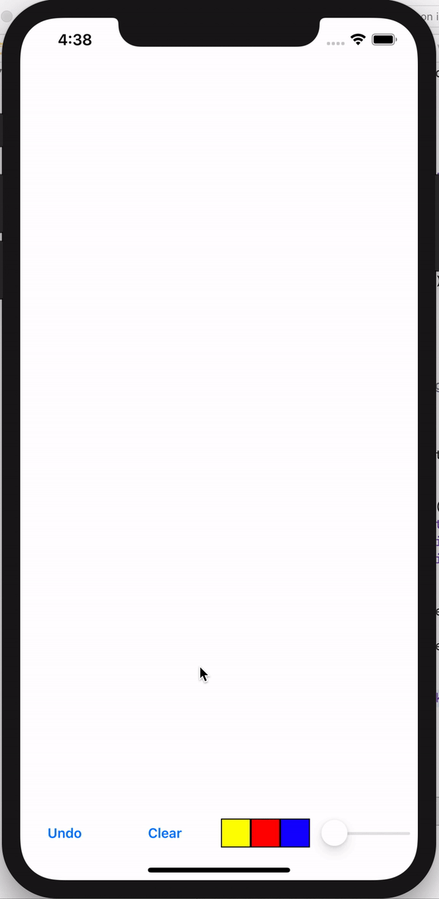
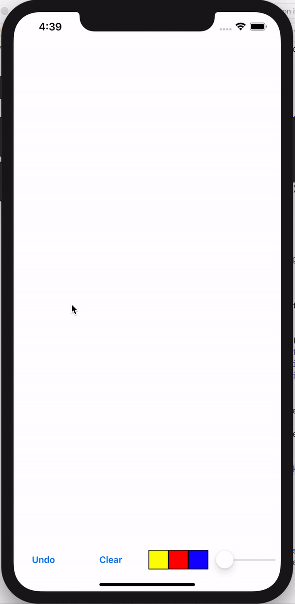

# Drawing with CanvasView 🎨

캔버스에 그림을 그려보자 ✍️

### 📌 Make CanvasView

```swift
class Canvas: UIView {
  
  override func draw(_ rect: CGRect){
     ...
  }
  
  override func touchesBegan(_ touches: Set<UITouch>, with event: UIEvent?) {
     ...
  }
     
  override func touchesMoved(_ touches: Set<UITouch>, with event: UIEvent?) {
     ...
  }

}
```

```swift
   override func loadView(){
        self.view = canvas
   }
   
    override func viewDidLoad() {
        super.viewDidLoad()
        canvas.backgroundColor = .white
    }
```

- ```loadView``` 란??

    > loadView : viewController.view 를 생성하는 곳이다. (아직 self.view 가 만들어지지 않음)   
    viewDidLoad 에 작성한다면 아래와 동일하다. 
    
    ```swift
      override func viewDidLoad(){
        view.addSubview(canvas)
        canvas.frame = view.frame
      }
    ```
    
<br/>   


### 📌 Line Model 

```swift
struct Line {
    let storkeWidth: Float
    let color: UIColor
    var points: [CGPoint]
}
```

```swift
  var lines = [Line]()
```

Line 구조체는 ```stokeWidth```, ```color``` ```points[]``` 정보를 가지고 있다.  
각각 정보는 선의 굵기, 색깔, 위치 정보를 나타낸다.

<br/>

### 📌 Draw Line

1. touchesBegan

```swift
    override func touchesBegan(_ touches: Set<UITouch>, with event: UIEvent?) {
        lines.append(Line.init(storkeWidth: strokeWidth, color: strokeColor, points: []))
    }
```
```touchesBegan``` 은 첫 터치할 때 호출되는 메소드이다.   
```lines``` 에 ```line``` 을 append 해준다. (위치정보 ```points``` 는 빈 배열이다.)

2. touchesMoved

```swift
    override func touchesMoved(_ touches: Set<UITouch>, with event: UIEvent?) {
        guard let point = touches.first?.location(in: nil) else { return }
        
        guard var lastLine = lines.popLast() else { return }
        lastLine.points.append(point)
        lines.append(lastLine)
        
        setNeedsDisplay()
    }
```

```touchesMoved``` 는 손가락의 움직임을 추적하는 메소드이다.   
```point``` 는 현재 터치 위치 정보를 나타낸다.   
지금 선을 그리고 있는 ```lastLine``` 의 ```points``` 배열에 ```point``` 를 append 한다. 

- ```setNeedsDisplay()``` 란?

  > View 의 컨텐츠가 변하면 이 View 가 변했다는 사실을 시스템에 알려준다.

3. Draw Line

```swift
   override func draw(_ rect: CGRect) {
        
        super.draw(rect)
        
        guard let context = UIGraphicsGetCurrentContext() else
        { return }
        
        lines.forEach { (line) in
            
            ...
            
            for (i,p) in line.points.enumerated() {
                if i==0{ // first index
                    context.move(to: p)
                } else {
                    context.addLine(to: p)
                }
            }
            context.strokePath()
        }
    }
```

```lines``` 를 foreach 로 돌며 line 을 그려준다.  
```i``` 는 index, ```p``` 는 point 를 의미한다. ```move()``` 와 ```addLine()```을 사용해 라인을 그려준다.

<br/>

### 📌 Undo & Clear

```swift
    func undo(){
        _ = lines.popLast()
        setNeedsDisplay()
    }
```

```swift
    func clear(){
        lines.removeAll()
        setNeedsDisplay()
    }
```

```undo``` 는 선 한 개를 그리기 취소하고, ```clear``` 는 모든 정보를 초기화한다.

<br/>

### 📌 Setting Color & Width

```swift
    @objc fileprivate func handleColorChange(button: UIButton){
        canvas.setStrokeColor(color: button.backgroundColor ?? .black)
    }
    
    @objc fileprivate func handleSliderChange(){
        canvas.setStrokeWidth(width: slider.value)
    }
```

위 메소드를 색상 변경 버튼과 UISlider에 addTarget 시켜준다.

- ```fileprivate``` 이란?

  > 자체 정의 소스 파일에 대한 엔티티 사용을 제한한다.
  해당 세부 정보가 전체 파일 내에서 사용 될 때 특정 기능의 구현 세부 정보를 숨길 수 있다. (같은 모듈 내에서도 같은 소스 파일 안에서만 사용이 가능하다.)


```swift
    fileprivate var strokeColor = UIColor.black
    fileprivate var strokeWidth: Float = 1
    
    func setStrokeWidth(width: Float){
        self.strokeWidth = width
    }
    
    func setStrokeColor(color: UIColor) {
        self.strokeColor = color
    }
```

전역 변수로 설정해둔 ```stokeColor```, ```strokeWidth``` 값을 update 해 준다.

```swift
        context.setStrokeColor(line.color.cgColor)
        context.setLineWidth(CGFloat(line.storkeWidth))
```

```draw()``` 메소드에서 선을 그릴 때 원하는 색상과 굵기를 지정해준다.    
이제 최종 완성 ‼️‼️

<br/>

### 📌 screenshots
  

