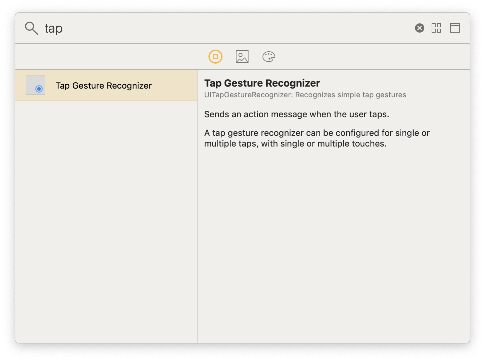
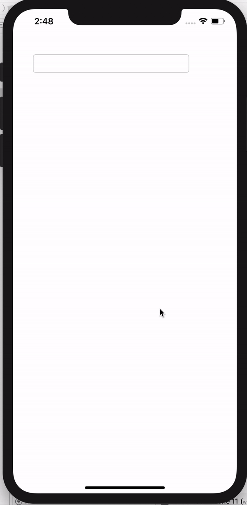

## Tap Gesture Recognizer
간단하지만 정말 활용도가 높은 gesture recognizer 에 대해서 알아보자~!

1. VC 에 Tap Gesture Recognizer 를 추가한다.
 

<br/>

2. delegate 시켜준다.

```swift
class ViewController: UIViewController, UIGestureRecognizerDelegate {

   ...
   
}

```

<br/>


3. gestureRecognizer 메소드를 작성한다.
    
```swift
    func gestureRecognizer(_ gestureRecognizer: UIGestureRecognizer, shouldReceive touch: UITouch) -> Bool {
        self.view.endEditing(true)
        return true
    }
```

<br/>

4. viewDidLoad 에 tap gesture 를 추가한다.

```swift
   let tapGesture: UITapGestureRecognizer = UITapGestureRecognizer()
   tapGesture.delegate = self
        
   self.view.addGestureRecognizer(tapGesture)
```

<br/>

5. 확인 

 


<br/>

---

### full code

```swift
import UIKit

class ViewController: UIViewController, UIGestureRecognizerDelegate {

    override func viewDidLoad() {
        super.viewDidLoad()
        
        let tapGesture: UITapGestureRecognizer = UITapGestureRecognizer()
        tapGesture.delegate = self
        
        self.view.addGestureRecognizer(tapGesture)
    }
    
    func gestureRecognizer(_ gestureRecognizer: UIGestureRecognizer, shouldReceive touch: UITouch) -> Bool {
        self.view.endEditing(true)
        return true
    }
}
```
